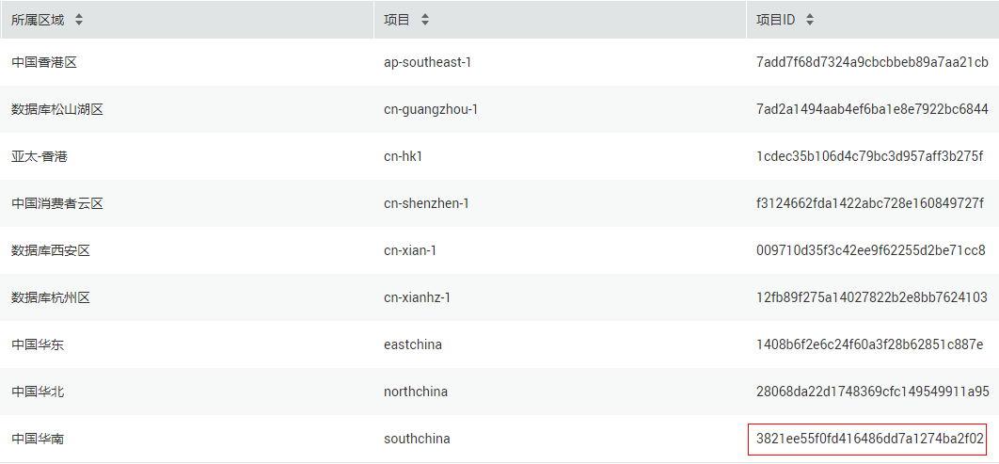
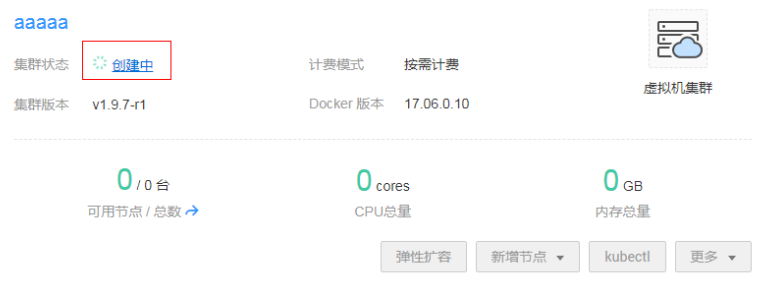
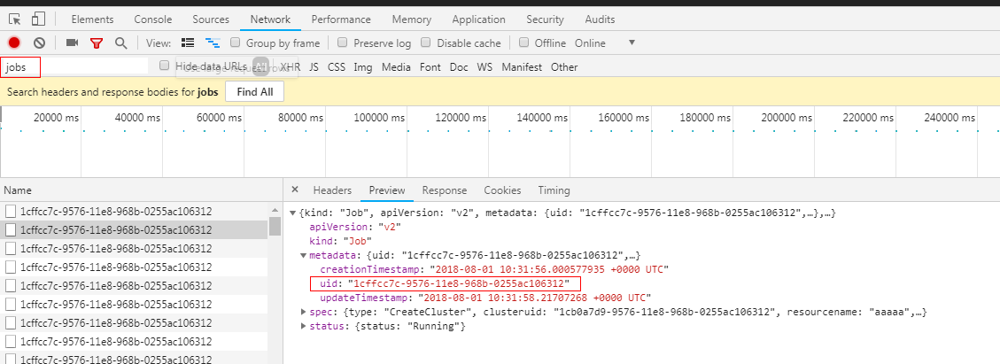

# 如何获取接口URI中参数

## project\_id

1.  登录CCE控制台，单击界面右上角的用户名，选择“我的凭证”。
2.  在“项目列表”页签，获取对应区域的项目ID。

    **图 1**  获取project\_id  
    

## cluster\_id

1.  登录CCE控制台，在左侧导航栏中单击“资源管理 \> 集群管理”。
2.  单击所创建集群的名称，进入集群详情页面，获取集群ID。

    **图 2**  获取cluster\_id  
    

## node\_id

1.  登录CCE控制台，在左侧导航栏中单击“资源管理 \> 节点管理”。
2.  单击对应节点的名称，进入节点详情页面，获取节点ID。

    **图 3**  获取node\_id  
    

## job\_id

1.  登录CCE控制台，在左侧导航栏中单击“资源管理 \> 集群管理”或“资源管理 \> 节点管理”。
2.  以集群管理为例，进入集群管理界面后，单击正在创建中的集群的集群状态，跳转到集群创建任务详情界面。

    **图 4**  创建集群  
    

3.  获取job\_id。

    以Chrome浏览器为例，F12打开浏览器Console，单击“Network”。在“Filter”栏里输入“jobs”，过滤出job列表，在左侧列表任意选择其中一条job，单击“Preview”，其中uid字段即为job的uid。

    **图 5**  获取job\_id  
    

