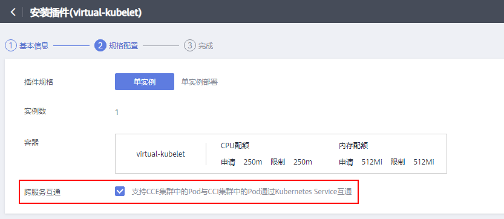
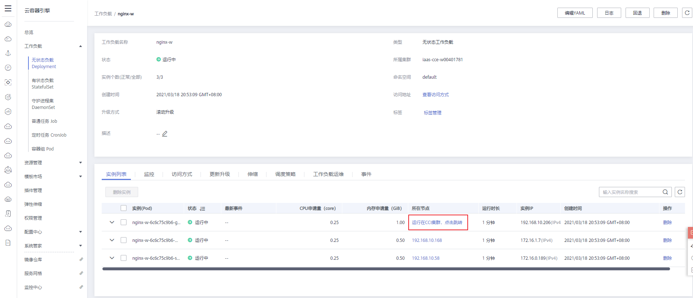
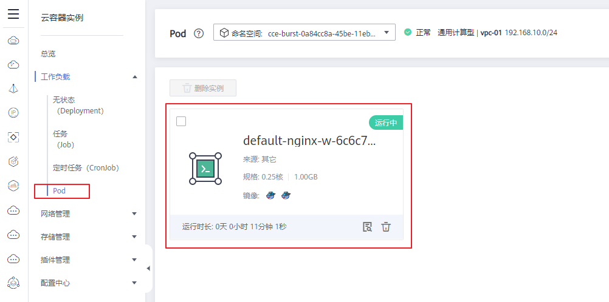
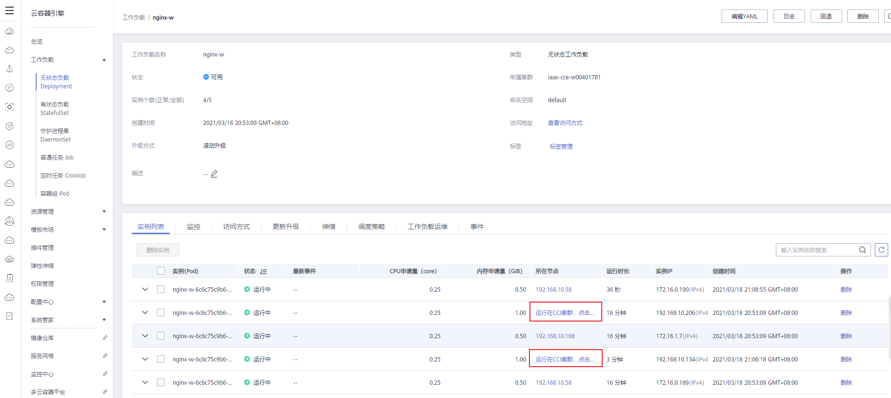
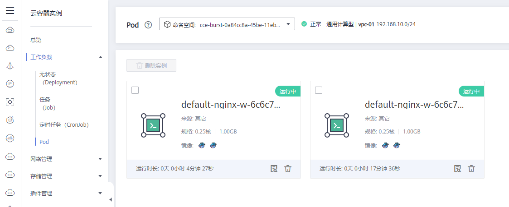

# CCE容器实例弹性伸缩到CCI服务<a name="cce_01_0295"></a>

Virtual Kubelet是基于社区Virtual Kubelet开源项目开发的插件，该插件支持用户在短时高负载场景下，将部署在CCE上的无状态负载（Deployment）、有状态负载（StatefulSet）、普通任务（Job）三种资源类型的容器实例（Pod），弹性创建到华为云云容器实例CCI服务上，以减少集群扩容带来的消耗。

具体功能如下：

-   支持容器实例实现秒级弹性伸缩：在集群资源不足时，无需新增节点，Virtual Kubelet插件将自动为您在云容器实例CCI侧创建容器实例，减少运维成本。
-   无缝对接华为云容器镜像服务SWR，支持使用公用镜像和私有镜像。
-   支持CCI容器实例的事件同步、监控、日志、exec、查看状态等操作。
-   支持查看虚拟弹性节点的节点容量信息。
-   支持CCE和CCI两侧实例的service网络互通。

## 使用约束<a name="zh-cn_topic_0287319085_section1925910435328"></a>

-   仅支持VPC网络模式的CCE集群，Virtual Kubelet仅限于v1.15及以下版本的集群安装使用。
-   调度到CCI的实例的存储类型只支持SFS、ConfigMap、Secret三种Volume类型。
-   暂不支持HostNetwork网络模式的容器实例（Pod）弹性到CCI。
-   实例的规格必须满足云容器实例CCI的容器规范。
    1.  Pod的CPU取值范围为：0.25核\~32核，另外还可选48核和64核，且单个容器的CPU必须为0.25核的整数倍。
    2.  Pod的内存取值范围为：1GB\~512GB，且内存必须为1GB的整数倍。
    3.  Pod的CPU/内存配比值必须在1:2到1:8之间。
    4.  一个Pod内最多支持5个容器，单个容器最小配置是0.25核、0.2GB，最大同容器实例的最大配置。
    5.  资源的requests等于limits。

-   使用插件前需要用户在CCI界面对CCI服务进行授信。

## 安装部署<a name="zh-cn_topic_0287319085_section1372419715333"></a>

**创建集群**

-   集群类型：CCE集群
-   集群版本：v1.11以上版本
-   Region：上海一、北京四
-   网络模型：VPC网络

**安装插件**

1.  在CCE控制台中，单击左侧导航栏的“插件管理”，在“插件市场”页签下，单击Virtual Kubelet插件下的“安装插件”。
2.  在“基本信息”步骤中，选择安装的集群和插件版本，单击“下一步：规格配置”。
3.  在“规格配置”步骤中，勾选“跨服务互通”后的选择框，可实现CCE集群中的Pod与CCI集群中的Pod通过Kubernetes Service互通。

    

4.  单击“安装”。

    待插件安装完成后，单击“返回插件管理”，在“插件实例”页签下，选择对应的集群，可查看到运行中的实例，这表明该插件已在当前集群的各节点中安装。


## 通过CCE控制台创建工作负载<a name="zh-cn_topic_0287319085_section1370151403414"></a>

1.  在CCE控制台中，单击左侧导航栏的“工作负载”。
2.  在创建无状态工作负载或Job时，在“工作负载基本信息”步骤中，勾选“CCI弹性承载”。

    **图 1**  创建工作负载<a name="zh-cn_topic_0287319085_fig10834174024918"></a>  
    

3.  单击“下一步：添加容器”。
4.  容器添加完成后，单击“下一步：工作负载访问设置”。
5.  单击“下一步：高级配置”，直接单击“创建”。
6.  等待工作负载创建完成后，返回工作负载列表页，查看创建的工作负载状态为“运行中”。
7.  单击工作负载名称，在打开的工作负载详情页下方的“实例列表”页签中查看实例所在的节点，如果显示“运行在CCI集群，点击跳转”说明实例已经弹性到CCI服务。

    **图 2**  查看实例是否弹性到CCI<a name="zh-cn_topic_0287319085_fig6401115214578"></a>  
    

8.  单击“所在节点”列中的“运行在CCI集群，点击跳转”，可跳转至CCI服务控制台，单击左侧栏目树中的“工作负载 \> Pod”即可看到从CCE中弹性伸缩到CCI的Pod实例，命名规则为：命名空间-实例名称，该实例名称即为CCE中的实例（Pod）名称。

    **图 3**  从CCE弹性到CCI中的Pod<a name="zh-cn_topic_0287319085_fig176718391140"></a>  
    

9.  在CCE中增加实例的个数，可以看到更多实例弹性到CCI的Pod中。

    **图 4**  增加示例个数<a name="zh-cn_topic_0287319085_fig283616391786"></a>  
    

    **图 5**  CCE中的更多Pod弹性到CCI中<a name="zh-cn_topic_0287319085_fig1145718561992"></a>  
    

    **图 6**  从CCE弹性到CCI中的多个Pod<a name="zh-cn_topic_0287319085_fig9231151114"></a>  
    


## 通过Yaml文件创建工作负载<a name="zh-cn_topic_0287319085_section1088133211315"></a>

示例模板

```
apiVersion: apps/v1
kind: Deployment
metadata:
  name: test-vk
  labels: {}
spec:
  replicas: 20
  selector:
    matchLabels:
      app: test-vk
  template:
    metadata:
      labels:
        virtual-kubelet.io/burst-to-cci: 'auto'
        app: test-vk
    spec:
      containers:
      - name: container-0
        image: centos:latest
        resources:
          limits:
            cpu: 500m
            memory: 1024Mi
          requests:
             cpu: 500m
             memory: 1024Mi
        command:
          - /bin/bash
          - '-c'
          - sleep 10000
      dnsPolicy: Default
```

> **说明：** 
>标红部分为添加labels。
>创建弹性至CCI的负载时需要在pod的labels中添加如下字段：
>```
>virtual-kubelet.io/burst-to-cci: "auto"
>```
>其中，value值支持以下选项：
>-   auto：CCE资源用完时自动弹性至CCI。
>-   enforce：强制调度至CCI。
>-   off：不调度至CCI。

## 卸载virtual kubelet<a name="zh-cn_topic_0287319085_section209521549145718"></a>

**清理CCI侧资源**

1.  缩容或者删除负载，使不再有pod调度到CCI侧。
2.  进入华为云CCI页面，删除该集群CLUSTER\_ID对应的命名空间（会自动删除命名空间下的所有资源，以确保不会有资源残留造成收费）。

**卸载插件**

1.  在CCE控制台中，单击左侧导航栏的“插件管理”，在“插件实例”页签下，选择对应的集群，单击virtual kubelet下的“卸载”。
2.  在弹出的窗口中，单击“确认”，可卸载该插件。

