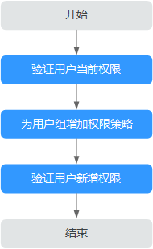
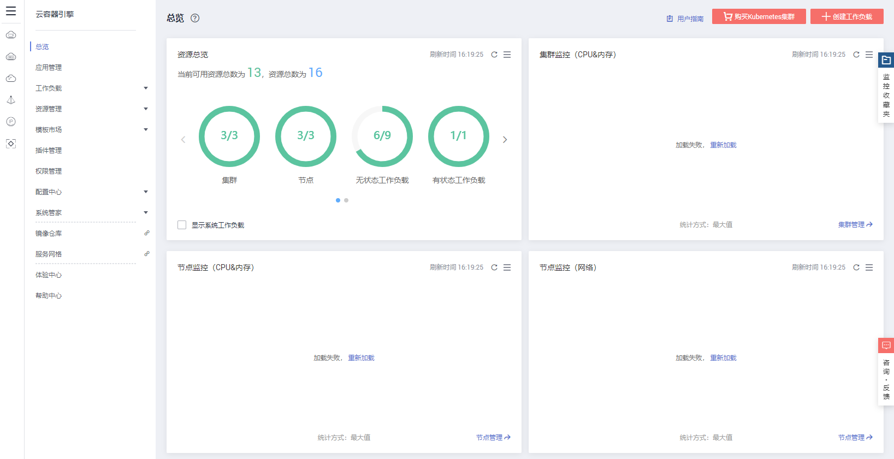
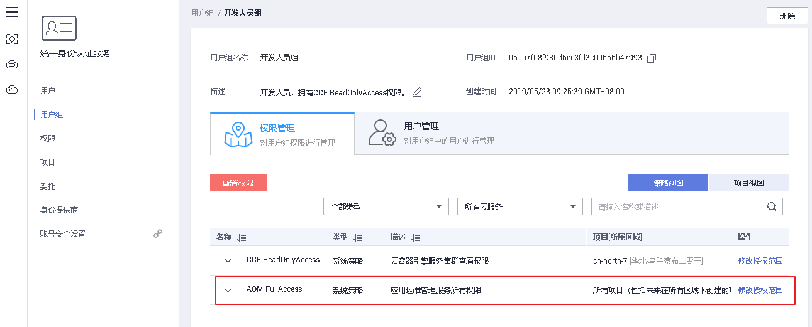

# CCE控制台的权限依赖

CCE对其他云服务有诸多依赖关系，因此在您开启IAM系统策略授权后，在CCE Console控制台中的各项功能需要配置相应的服务权限后才能正常查看或使用，详细说明如下：

> **说明：** 
>-   依赖服务的权限配置均基于您已设置了IAM系统策略授权的CCE FullAccess或CCE ReadOnlyAccess策略权限，详细设置方法请参见[设置集群权限](设置集群权限.md)。
>-   Tenant Guest权限在你开启IAM系统策略授权之后将不再生效，也不会再有全局只读的效果。
>-   1.11.7-r2及以上版本的集群，显示情况依赖于命名空间权限的设置情况，如果没有设置命名空间权限，则无法查看集群下的资源。
>    -   如果您设置了全部命名空间的view权限，则可以查看到对应集群的全部命名空间下的资源，但密钥 \( Secret \)除外，密钥 \( Secret \)需要在命名空间权限下设置admin或者edit权限才能查看。
>    -   CustomedHPA与HPA策略需要配置命名空间cluster-admin权限下才能生效。
>    -   如果您设置的是单一命名空间的view权限，则看到的只能是指定命名空间下的资源。

## 依赖服务的权限设置

如果IAM用户需要在CCE Console控制台中拥有相应功能的查看或使用权限，请确认已经对该用户所在的用户组设置了CCE Administrator、CCE FullAccess或CCE ReadOnlyAccess策略的集群权限，再按如下[表1](#table99001215575)增加依赖服务的角色或策略：

> **说明：** 
>企业项目能够实现企业不同项目间资源的分组和管理，重在资源隔离，而IAM可以实现细粒度授权，因此强烈推荐您使用IAM实现权限管理。
>若您使用企业项目设置子用户权限，会有如下功能限制：
>-   由于存储资源暂不支持企业项目，因此在CCE控制台中，企业项目子用户查看非“Default“企业项目下集群的存储资源相关页面，存储页面中各按钮均置灰，且资源不显示。
>-   在CCE控制台中，集群监控获取AOM监控的接口暂不支持企业项目，因此企业项目子用户将无法查看监控相关数据。
>-   在CCE控制台中，由于创建节点时的密钥对查询接口不支持企业项目，因此企业项目子用户将无法使用“密钥对“登录方式，您可以选择使用“密码“登录方式。
>-   为企业项目设置**CCE FullAccess**权限后 ，需要在IAM控制台界面中再配置  **ecs:availabilityZones:list**  权限，企业项目子用户创建节点才可以正常显示并创建，否则将提示没有 ecs:availabilityZones:list 权限。
>CCE支持细粒度的权限设置，但有如下限制说明：
>-   AOM不支持资源级别细粒度：当通过IAM集群资源细粒度设置特定资源操作权限之后，子账号在CCE控制台的总览界面查看集群监控时，将显示非细粒度关联集群的监控信息。
>-   在IAM页面设置**CCE FullAccess**或者**CCE ReadOnlyAccess**权限后，需要配置  **sfsturbo:\*:\***  权限才能使用使用极速文件存储卷，否则子账号在集群下查询极速文件存储卷将失败。

**表 1**  CCE Console中依赖服务的角色或策略

<table><thead align="left"><tr id="row16901181518712"><th class="cellrowborder" valign="top" width="21.872187218721873%" id="mcps1.2.4.1.1">
Console控制台功能

</th>
<th class="cellrowborder" valign="top" width="28.642864286428644%" id="mcps1.2.4.1.2">
依赖服务

</th>
<th class="cellrowborder" valign="top" width="49.48494849484948%" id="mcps1.2.4.1.3">
需配置角色/策略

</th>
</tr>
</thead>
<tbody><tr id="row1090114151176"><td class="cellrowborder" valign="top" width="21.872187218721873%" headers="mcps1.2.4.1.1 ">
总览

</td>
<td class="cellrowborder" valign="top" width="28.642864286428644%" headers="mcps1.2.4.1.2 ">
应用运维管理 AOM

</td>
<td class="cellrowborder" valign="top" width="49.48494849484948%" headers="mcps1.2.4.1.3 "><ul id="ul223369145920"><li>子账号设置了CCE Administrator权限后，需要增加AOM&nbsp;FullAccess权限后才能访问总览中的数据图表。</li><li>支持设置了IAM ReadOnlyAccess和CCE FullAccess或CCE ReadOnlyAccess权限的子账号直接访问总览中的数据图表。</li></ul>
</td>
</tr>
<tr id="row159021815871"><td class="cellrowborder" valign="top" width="21.872187218721873%" headers="mcps1.2.4.1.1 ">
应用管理

</td>
<td class="cellrowborder" valign="top" width="28.642864286428644%" headers="mcps1.2.4.1.2 ">
/

</td>
<td class="cellrowborder" valign="top" width="49.48494849484948%" headers="mcps1.2.4.1.3 ">
支持主账号、设置了CCE Administrator、CCE FullAccess或CCE ReadOnlyAccess等权限的子账号访问本功能。

</td>
</tr>
<tr id="row19902151514719"><td class="cellrowborder" valign="top" width="21.872187218721873%" headers="mcps1.2.4.1.1 ">
工作负载

</td>
<td class="cellrowborder" valign="top" width="28.642864286428644%" headers="mcps1.2.4.1.2 ">
弹性负载均衡 ELB

应用性能管理 APM

应用运维管理 AOM

NAT网关 NAT

对象存储服务 OBS

弹性文件服务 SFS

</td>
<td class="cellrowborder" valign="top" width="49.48494849484948%" headers="mcps1.2.4.1.3 ">
正常创建工作负载时不依赖其他服务的权限。

<ul id="ul8113732182016"><li>如果需要创建ELB类型的服务，需要设置ELB FullAccess或者ELB Administrator权限，以及VPC Administrator权限。</li><li>如果需要使用Java探针，需要设置AOM&nbsp;FullAccess和APM FullAccess权限。</li><li>如果需要NAT网关类型的服务，需要设置NAT Gateway Administrator权限。</li><li>如果使用对象存储，需要全局设置OBS Administrator权限。
 说明： 

由于缓存的存在，对用户、用户组以及企业项目授予OBS相关的RBAC策略后，大概需要等待13分钟RBAC策略才能生效；授予OBS相关的系统策略后，大概需要等待5分钟系统策略能生效。

</li><li>如果使用文件存储，需要设置SFS FullAccess权限。</li></ul>
</td>
</tr>
<tr id="row39021315071"><td class="cellrowborder" valign="top" width="21.872187218721873%" headers="mcps1.2.4.1.1 ">
集群管理

</td>
<td class="cellrowborder" valign="top" width="28.642864286428644%" headers="mcps1.2.4.1.2 ">
应用运维管理 AOM

费用中心 BSS

</td>
<td class="cellrowborder" valign="top" width="49.48494849484948%" headers="mcps1.2.4.1.3 "><ul id="ul772124115296"><li>如果需要弹性扩容权限，需要设置AOM&nbsp;FullAccess权限。</li><li>如果需要转包周期，需要设置BSS Administrator权限。</li></ul>
</td>
</tr>
<tr id="row790217151578"><td class="cellrowborder" valign="top" width="21.872187218721873%" headers="mcps1.2.4.1.1 ">
节点管理

</td>
<td class="cellrowborder" valign="top" width="28.642864286428644%" headers="mcps1.2.4.1.2 ">
弹性云服务器 ECS

</td>
<td class="cellrowborder" valign="top" width="49.48494849484948%" headers="mcps1.2.4.1.3 ">
当子账号权限为CCE Administrator时，如果创建和删除节点，需要配置ECS FullAccess或ECS Administrator权限，以及VPC Administrator权限。

</td>
</tr>
<tr id="row1890251514716"><td class="cellrowborder" valign="top" width="21.872187218721873%" headers="mcps1.2.4.1.1 ">
网络管理

</td>
<td class="cellrowborder" valign="top" width="28.642864286428644%" headers="mcps1.2.4.1.2 ">
弹性负载均衡 ELB

NAT网关 NAT

</td>
<td class="cellrowborder" valign="top" width="49.48494849484948%" headers="mcps1.2.4.1.3 ">
正常创建时不依赖其他服务的权限。

<ul id="ul5525210353"><li>如果需要创建ELB类型的服务，需要设置ELB FullAccess或者ELB Administrator权限，以及VPC Administrator权限。</li><li>如果需要NAT网关类型的服务，需要设置NAT Administrator权限。</li></ul>
</td>
</tr>
<tr id="row14486172213364"><td class="cellrowborder" valign="top" width="21.872187218721873%" headers="mcps1.2.4.1.1 ">
存储管理

</td>
<td class="cellrowborder" valign="top" width="28.642864286428644%" headers="mcps1.2.4.1.2 ">
对象存储服务 OBS

弹性文件服务 SFS

极速文件存储 EFS（SFS Turbo）

</td>
<td class="cellrowborder" valign="top" width="49.48494849484948%" headers="mcps1.2.4.1.3 "><ul id="ul146023714385"><li>如果使用对象存储，需要全局设置OBS Administrator。
 说明： 

由于缓存的存在，对用户、用户组以及企业项目授予OBS相关的RBAC策略后，大概需要等待13分钟RBAC策略才能生效；授予OBS相关的系统策略后，大概需要等待5分钟系统策略才能生效。

</li><li>如果使用文件存储，需要设置SFS Administrator权限。</li><li>如果使用极速文件存储，需要设置SFS Turbo Admin权限</li></ul>
</td>
</tr>
<tr id="row1488112216362"><td class="cellrowborder" valign="top" width="21.872187218721873%" headers="mcps1.2.4.1.1 ">
命名空间

</td>
<td class="cellrowborder" valign="top" width="28.642864286428644%" headers="mcps1.2.4.1.2 ">
/

</td>
<td class="cellrowborder" valign="top" width="49.48494849484948%" headers="mcps1.2.4.1.3 ">
无需其他依赖权限。

</td>
</tr>
<tr id="row748852253612"><td class="cellrowborder" valign="top" width="21.872187218721873%" headers="mcps1.2.4.1.1 ">
模板市场

</td>
<td class="cellrowborder" valign="top" width="28.642864286428644%" headers="mcps1.2.4.1.2 ">
/

</td>
<td class="cellrowborder" valign="top" width="49.48494849484948%" headers="mcps1.2.4.1.3 ">
当前仅支持主账号、设置了CCE Administrator权限的子账号访问。

</td>
</tr>
<tr id="row248812273618"><td class="cellrowborder" valign="top" width="21.872187218721873%" headers="mcps1.2.4.1.1 ">
插件管理

</td>
<td class="cellrowborder" valign="top" width="28.642864286428644%" headers="mcps1.2.4.1.2 ">
/

</td>
<td class="cellrowborder" valign="top" width="49.48494849484948%" headers="mcps1.2.4.1.3 ">
支持主账号、设置了CCE Administrator、CCE FullAccess或CCE ReadOnlyAccess等权限的子账号访问本功能。

</td>
</tr>
<tr id="row54891622173617"><td class="cellrowborder" valign="top" width="21.872187218721873%" headers="mcps1.2.4.1.1 ">
权限管理

</td>
<td class="cellrowborder" valign="top" width="28.642864286428644%" headers="mcps1.2.4.1.2 ">
/

</td>
<td class="cellrowborder" valign="top" width="49.48494849484948%" headers="mcps1.2.4.1.3 "><ul id="ul372099481"><li>支持主账号访问。</li><li>支持设置了CCE Administrator和Security Administrator（全局级策略）权限的子账号访问。</li><li>支持设置了IAM ReadOnlyAccess和CCE FullAccess或CCE ReadOnlyAccess权限的子账号访问。</li></ul>
</td>
</tr>
<tr id="row1588069154010"><td class="cellrowborder" valign="top" width="21.872187218721873%" headers="mcps1.2.4.1.1 ">
配置中心

</td>
<td class="cellrowborder" valign="top" width="28.642864286428644%" headers="mcps1.2.4.1.2 ">
/

</td>
<td class="cellrowborder" valign="top" width="49.48494849484948%" headers="mcps1.2.4.1.3 "><ul id="ul858844185010"><li>配置项 ( ConfigMap )无需其他依赖权限。</li><li>密钥 ( Secret )需要在命名空间权限下设置cluster-admin、admin或者edit权限才能查看，依赖服务需要添加DEW KeypairFullAccess或者DEW KeypairReadOnlyAccess权限。</li></ul>
</td>
</tr>
<tr id="row1090217151179"><td class="cellrowborder" valign="top" width="21.872187218721873%" headers="mcps1.2.4.1.1 ">
帮助中心

</td>
<td class="cellrowborder" valign="top" width="28.642864286428644%" headers="mcps1.2.4.1.2 ">
/

</td>
<td class="cellrowborder" valign="top" width="49.48494849484948%" headers="mcps1.2.4.1.3 ">
无需其他依赖权限。

</td>
</tr>
<tr id="row1853314583492"><td class="cellrowborder" valign="top" width="21.872187218721873%" headers="mcps1.2.4.1.1 ">
其他服务跳转

</td>
<td class="cellrowborder" valign="top" width="28.642864286428644%" headers="mcps1.2.4.1.2 ">
容器镜像服务 SWR

应用服务网格 ASM

应用运维管理 AOM

多云容器平台 MCP

云监控服务 Cloud Eye（存储管理与节点管理的“监控”跳转）

</td>
<td class="cellrowborder" valign="top" width="49.48494849484948%" headers="mcps1.2.4.1.3 ">
为便于您快速进入CCE相关服务的控制台，在<a href="https://console.huaweicloud.com/cce2.0/?utm_source=helpcenter" target="_blank" rel="noopener noreferrer">CCE控制台</a>中增加了其他服务的跳转链接，CCE默认没有这些服务的全部权限，如果IAM用户需要查看或使用其功能，请按照该服务的权限策略说明设置相应的权限策略。

</td>
</tr>
</tbody>
</table>

## 示例流程

本章节通过为IAM用户“James”增加CCE**“总览“**页面监控信息的查看权限为例进行演示。

IAM用户“James”在用户组“开发人员组”，“开发人员组”仅有CCE Administrator权限。而参照[表1](#table99001215575)可知，CCE总览页面的监控信息还需要增加“AOM FullAccess”策略才能正常查看。

**图 1**  依赖服务授权流程  

## 步骤一：验证用户当前权限

1.  使用IAM用户“James”登录[CCE控制台](https://console.huaweicloud.com/cce2.0/?utm_source=helpcenter)，IAM用户如何登录请参见[IAM用户登录](https://support.huaweicloud.com/usermanual-iam/iam_01_0552.html)。
2.  单击左侧导航栏中的“总览“，进入总览页面，可以看到该用户无权查看监控相关的模块信息。

    **图 2**  无权查看监控信息  
    

## 步骤二：为用户组增加系统策略

1.  IAM用户“James”退出登录，使用主账号登录[CCE控制台](https://console.huaweicloud.com/cce2.0/?utm_source=helpcenter)。
2.  在CCE控制台中，单击左侧导航栏中的“权限管理“，在“集群权限“页签下单击“开发人员组”后的“设置权限“。

    **图 3**  设置用户组权限  
    

3.  在弹出的“设置权限“窗口中，单击“去设置“。

    **图 4**  设置权限  
    

4.  进入统一身份认证服务的“用户组 \> 开发人员组“页面，在“用户组权限“页签下，单击“配置权限“。

    **图 5**  设置用户组策略  
    

5.  在弹出的“配置权限“窗口中，选择作用范围。此处选择“区域级项目“，并在下拉框中选择需要授权的区域。

    **图 6**  选择作用范围  
    

6.  在权限列表上方的搜索框中搜索“AOM“，单击“AOM FullAccess“策略并选中，单击“确定“。

    **图 7**  添加AOM FullAccess策略  
    

7.  在“权限管理“页签下可以看到已经增加“AOM FullAccess“策略。

    **图 8**  确认添加策略  
    

8.  返回[CCE控制台](https://console.huaweicloud.com/cce2.0/?utm_source=helpcenter)，在“权限管理“的“集群权限“页签下单击右上角的刷新图标，可以看到“AOM FullAccess“权限策略已添加成功。

    **图 9**  权限策略添加成功  
    

## 步骤三：验证用户新增权限

1.  使用IAM用户“James”登录[CCE控制台](https://console.huaweicloud.com/cce2.0/?utm_source=helpcenter)。
2.  单击左侧导航栏中的“总览“，进入总览页面，可以看到该用户已有权查看监控相关的模块信息。

    **图 10**  可正常查看总览页监控信息  
    

3.  为IAM用户“James”增加查看总览页监控相关的依赖服务权限完成，验证可正常查看。

