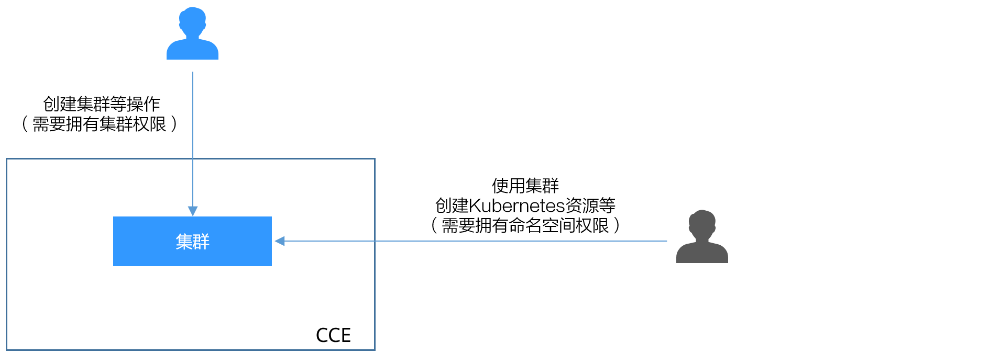

# CCE权限概述

CCE权限管理是在统一身份认证服务（IAM）与Kubernetes的角色访问控制（RBAC）的能力基础上，打造的细粒度权限管理功能，支持基于IAM的细粒度权限控制和IAM Token认证，支持集群级别、命名空间级别的权限控制，帮助用户便捷灵活的对租户下的IAM用户、用户组设定不同的操作权限。

如果您需要对华为云上购买的CCE集群及相关资源进行精细的权限管理，例如限制不同部门的员工拥有部门内资源的细粒度权限，您可以使用CCE权限管理提供的增强能力进行多维度的权限管理。

本章节将介绍CCE权限管理机制及其涉及到的基本概念。如果当前华为云帐号已经能满足您的要求，您可以跳过本章节，不影响您使用CCE服务的其它功能。

## CCE支持的权限管理能力

CCE的权限管理包括“集群权限”和“命名空间权限”两种能力，能够从集群和命名空间层面对用户组或用户进行细粒度授权，具体解释如下：

-   **[集群权限](集群权限（IAM授权）.md)：**是基于IAM系统策略的授权，可以通过用户组功能实现IAM用户的授权。用户组是用户的集合，通过集群权限设置可以让某些用户组操作集群（如创建/删除集群、节点、节点池、模板、插件等），而让某些用户组仅能查看集群。

    集群权限涉及CCE非Kubernetes API，支持IAM细粒度策略、企业项目管理相关能力。

-   **[命名空间权限](命名空间权限（Kubernetes-RBAC授权）.md)：**是基于Kubernetes RBAC（Role-Based Access Control，基于角色的访问控制）能力的授权，通过权限设置可以让不同的用户或用户组拥有操作不同Kubernetes资源的权限。同时CCE基于开源能力进行了增强，可以支持基于IAM用户或用户组粒度进行RBAC授权、IAM token直接访问API进行RBAC认证鉴权。

    命名空间权限涉及CCE Kubernetes API，基于Kubernetes RBAC能力进行增强，支持对接IAM用户/用户组进行授权和认证鉴权，但与IAM细粒度策略独立。

    CCE从v1.11.7-r2版本起的集群支持配置命名空间权限，1.11.7-r2之前的版本默认拥有全部命名空间权限。

CCE的权限可以从使用的阶段分为两个阶段来看，第一个阶段是创建和管理集群的权限，也就是拥有创建/删除集群、节点等资源的权限。第二个阶段是使用集群Kubernetes资源（如工作负载、Service等）的权限。

**图 1**  权限示例图  

清楚了集群权限和命名空间权限后，您就可以通过这两步授权，做到精细化的权限控制。

## 集群权限（IAM授权）与命名空间权限（Kubernetes RBAC授权）的关系

拥有不同集群权限（IAM授权）的用户，其拥有的命名空间权限（Kubernetes RBAC授权）不同。[表1](#table886210176509)给出了不同用户拥有的命名空间权限详情。

**表 1**  不同用户拥有的命名空间权限

<table><thead align="left"><tr id="row14863201719502"><th class="cellrowborder" valign="top" width="33.33333333333333%" id="mcps1.2.4.1.1">
用户类型

</th>
<th class="cellrowborder" valign="top" width="28.28282828282828%" id="mcps1.2.4.1.2">
1.11.7-r2以下版本的集群

</th>
<th class="cellrowborder" valign="top" width="38.38383838383838%" id="mcps1.2.4.1.3">
1.11.7-r2及以上版本的集群

</th>
</tr>
</thead>
<tbody><tr id="row138631617185012"><td class="cellrowborder" valign="top" width="33.33333333333333%" headers="mcps1.2.4.1.1 ">
拥有Tenant Administrator权限的用户（例如华为云账号）

</td>
<td class="cellrowborder" valign="top" width="28.28282828282828%" headers="mcps1.2.4.1.2 ">
全部命名空间权限

</td>
<td class="cellrowborder" valign="top" width="38.38383838383838%" headers="mcps1.2.4.1.3 "><ul id="ul988783620518"><li>在CCE控制台拥有全部命名空间权限</li><li>使用<a href="访问集群.md">kubectl</a>需要按Kubernetes RBAC授权</li></ul>

 说明： 

控制台访问时CCE会加上一个管理员用户组，所以有全部命名空间权限。

</td>
</tr>
<tr id="row138631317205019"><td class="cellrowborder" valign="top" width="33.33333333333333%" headers="mcps1.2.4.1.1 ">
拥有CCE Administrator权限的IAM用户

</td>
<td class="cellrowborder" valign="top" width="28.28282828282828%" headers="mcps1.2.4.1.2 ">
全部命名空间权限

</td>
<td class="cellrowborder" valign="top" width="38.38383838383838%" headers="mcps1.2.4.1.3 "><ul id="ul172151105617"><li>在CCE控制台拥有全部命名空间权限</li><li>使用<a href="访问集群.md">kubectl</a>需要按Kubernetes RBAC授权</li></ul>

 说明： 

控制台访问时CCE会加上一个管理员用户组，所以有全部命名空间权限。

</td>
</tr>
<tr id="row1386412176506"><td class="cellrowborder" valign="top" width="33.33333333333333%" headers="mcps1.2.4.1.1 ">
拥有CCE&nbsp;FullAccess或者CCE&nbsp;ReadOnlyAccess权限的IAM用户

</td>
<td class="cellrowborder" valign="top" width="28.28282828282828%" headers="mcps1.2.4.1.2 ">
全部命名空间权限

</td>
<td class="cellrowborder" valign="top" width="38.38383838383838%" headers="mcps1.2.4.1.3 ">
按Kubernetes RBAC授权

</td>
</tr>
<tr id="row28641117145019"><td class="cellrowborder" valign="top" width="33.33333333333333%" headers="mcps1.2.4.1.1 ">
拥有Tenant Guest权限的IAM用户

</td>
<td class="cellrowborder" valign="top" width="28.28282828282828%" headers="mcps1.2.4.1.2 ">
全部命名空间权限

</td>
<td class="cellrowborder" valign="top" width="38.38383838383838%" headers="mcps1.2.4.1.3 ">
按Kubernetes RBAC授权

</td>
</tr>
</tbody>
</table>

## kubectl权限说明

您可以通过[kubectl访问集群](通过kubectl连接集群.md)的Kubernetes资源，那kubectl拥有哪些Kubernetes资源的权限呢？

kubectl访问CCE集群是通过集群上生成的配置文件（kubeconfig.json）进行认证，kubeconfig.json文件内包含用户信息，CCE根据用户信息的权限判断kubectl有权限访问哪些Kubernetes资源。即哪个用户获取的kubeconfig.json文件，kubeconfig.json就拥有哪个用户的信息，这样使用kubectl访问时就拥有这个用户的权限。而用户拥有的权限就是[表1](#table886210176509)所示的权限。

