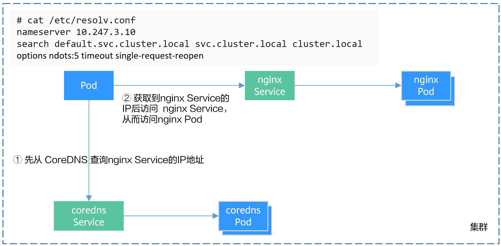

# DNS概述<a name="cce_01_0360"></a>

## CoreDNS介绍<a name="section092613718475"></a>

购买集群时会安装[CoreDNS插件](CoreDNS（系统资源插件-必装）.md)，CoreDNS是用来做集群内容域名解析。

在kube-system命名空间下可以查看到CoreDNS的Pod。

```
$ kubectl get po --namespace=kube-system
NAME                                      READY   STATUS    RESTARTS   AGE
coredns-7689f8bdf-295rk                   1/1     Running   0          9m11s
coredns-7689f8bdf-h7n68                   1/1     Running   0          11m
```

CoreDNS安装成功后会成为DNS服务器，当创建Service后，CoreDNS会将Service的名称与IP记录起来，这样Pod就可以通过向CoreDNS查询Service的名称获得Service的IP地址。

访问时通过nginx.<namespace\>.svc.cluster.local访问，其中nginx为Service的名称，<namespace\>为命名空间名称，svc.cluster.local为域名后缀，在实际使用中，在同一个命名空间下可以省略<namespace\>.svc.cluster.local，直接使用ServiceName即可。

使用ServiceName的方式有个主要的优点就是可以在开发应用程序时可以将ServiceName写在程序中，这样无需感知具体Service的IP地址。

CoreDNS插件安装后也有一个Service，在kube-system命名空间下，如下所示。

```
$ kubectl get svc -n kube-system
NAME               TYPE           CLUSTER-IP      EXTERNAL-IP                    PORT(S)                      AGE
coredns            ClusterIP      10.247.3.10     <none>                         53/UDP,53/TCP,8080/TCP       13d
```

默认情况下，其他Pod创建后，会将coredns Service的地址作为域名解析服务器的地址写在Pod的 /etc/resolv.conf 文件中，创建一个Pod，查看/etc/resolv.conf文件，如下所示。

```
$ kubectl exec test01-6cbbf97b78-krj6h -it -- /bin/sh
/ # cat /etc/resolv.conf
nameserver 10.247.3.10
search default.svc.cluster.local svc.cluster.local cluster.local
options ndots:5 timeout single-request-reopen
```

在Pod中访问nginx Pod的ServiceName:Port，会先从CoreDNS中解析出nginx Service的IP地址，然后再访问nginx Service的IP地址，从而访问到nginx Pod。

**图 1**  集群内域名解析示例图<a name="fig56221517187"></a>  


## 相关操作<a name="section15985263473"></a>

您还可以在工作负载中进行DNS配置，具体请参见[工作负载DNS配置说明](工作负载DNS配置说明.md)。

您还可以使用CoreDNS实现自定义域名解析，具体请参见[使用CoreDNS实现自定义域名解析](使用CoreDNS实现自定义域名解析.md)。

您还可以使用DNSCache提升DNS解析的性能，具体请参见[使用NodeLocal DNSCache提升DNS性能](使用NodeLocal-DNSCache提升DNS性能.md)。

