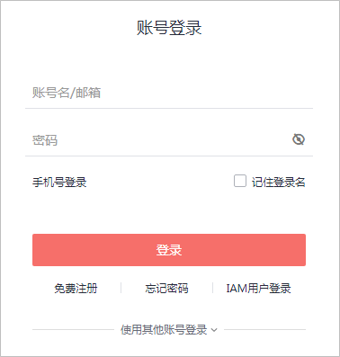
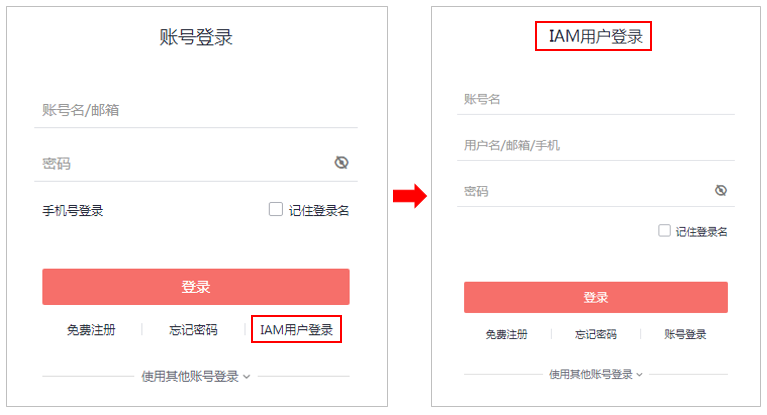

# IAM细粒度授权

本章节通过简单的用户组授权方法，将CCE服务的“CCE Viewer”角色授予“开发人员组”，并将子用户“James”添加至该用户组中，从而使“James”拥有对应的CCE只读权限，操作流程如[示例流程](#section41056841)所示。

> **须知：**   
>-   CCE提供了CCE Admin和CCE Viewer两种默认角色，建议您通过默认角色实现权限管理，关于CCE权限策略请参见[CCE系统策略](https://support.huaweicloud.com/productdesc-cce/cce_productdesc_0002.html)。  
>-   如果您需要使用自定义策略，请仔细阅读自定义策略中可以添加的授权项（Action），具体请参见[策略及授权项说明](https://support.huaweicloud.com/api-cce/cce_02_0327.html)，如遇问题[提交工单](https://console.huaweicloud.com/ticket/#/ticketindex/createIndex)处理。  

## 准备工作

-   本例中的“CCE Viewer”权限为细粒度策略，请先在IAM控制台中开通细粒度策略，开通方法请参见：[申请细粒度访问控制公测](https://support.huaweicloud.com/usermanual-iam/iam_01_019.html)。
-   给用户组授权之前，请您了解用户组可以添加的CCE系统策略，并结合实际需求进行选择，CCE支持的系统策略及策略间的对比，请参见[CCE系统策略](https://support.huaweicloud.com/productdesc-cce/cce_productdesc_0002.html)。若您需要对除CCE之外的其它服务授权，IAM支持服务的所有策略请参见[权限策略](https://support.huaweicloud.com/usermanual-permissions/zh-cn_topic_0063498930.html)。

## 配置说明

-   您需要拥有一个主账号，仅主账号或授予了CCE Administrator权限且全局设置了Security Administrator策略的子用户，才有权限进入CCE“权限管理“界面对其他子用户进行授权操作。
-   如果目标子用户涉及IAM读写权限变更，只能由主账号授权。
-   由于IAM的安全限制，当您通过[云容器引擎控制台](https://console.huaweicloud.com/cce2.0?locale=zh-cn)的授权配置涉及到账号IAM授权的修改时，需要您按照页面上给出的参考策略内容和操作说明，在IAM控制台进行目标子账号的手动授权。

## 示例流程

用户组是用户的集合，CCE通过IAM的用户组功能实现用户的授权。您在IAM中创建的子用户，需要加入特定用户组后，子用户才具备用户组所拥有的权限。

关于创建用户组并给子用户组授权的方法，可以参考如下操作：

**图 1**  IAM细粒度授权流程  

## 步骤一：创建用户组并授权

在“统一身份认证IAM“服务控制台创建用户组，并授予云容器引擎只读权限“CCE Viewer”。

用户组是用户的集合，IAM通过用户组功能实现用户的授权。您在IAM中创建的用户，需要加入特定用户组后，用户才具备用户组所拥有的权限。关于创建用户组并给用户组授权的方法，可以参考如下操作。

1.  使用注册的华为云账号登录华为云，登录时请选择“账号登录”。

    **图 2**  账号登录  
    

2.  在控制台首页菜单中单击“云容器引擎CCE“，进入[CCE控制台](https://console.huaweicloud.com/cce2.0/?utm_source=helpcenter)。

    **图 3**  从控制台首页进入CCE Console  
    

3.  单击CCE控制台左侧导航栏中的“权限管理“，单击“集群权限“页签下的“创建用户组“。

    **图 4**  创建用户组  
    

4.  进入“统一身份认证服务（IAM）“控制台的“创建用户组“界面，输入用户组名称（本例以“开发人员组”为例），单击“确定”。

    **图 5**  创建用户组  
    

    用户组创建完成，界面自动返回用户组列表，列表中显示新建的用户组。

5.  单击新建用户组右侧的“权限配置”，在“用户组权限”页签中单击“配置权限”。

    

6.  在“策略视图”下搜索“CCE”，策略名称列选择“CCE Viewer”为例，在“项目\[作用范围\]“列选择项目范围。CCE的系统策略说明，请参见：[CCE系统策略](https://support.huaweicloud.com/productdesc-cce/cce_productdesc_0002.html)。

    CCE为项目级服务，请确认用户需要使用CCE资源的项目，在对应项目中设置权限。设置完成后用户仅能访问授权项目中的CCE资源，无法访问其他项目中的CCE资源。

    

7.  单击“确定”，完成用户组授权。

## 步骤2：创建IAM用户

IAM用户与企业中的实际员工或是应用程序相对应，有唯一的安全凭证，可以通过加入一个或多个用户组来获得用户组的权限。关于IAM用户的创建方式请参见如下步骤。

1.  在统一身份认证服务，左侧导航窗格中，单击“用户”\>“创建用户”。
2.  在“创建用户”页面填写“用户信息”。如需一次创建多个用户，可以单击“添加用户”进行批量创建，每次最多可创建10个用户。

    **图 6**  创建用户-填写用户信息  
    

    -   用户名：用户登录华为云的用户名，以“James”为例。
    -   邮箱：IAM用户绑定的邮箱，仅“访问方式”选择“首次登录时设置”时必填，选择其他访问方式时选填。
    -   手机号（选填）：IAM用户绑定的手机号。
    -   描述（选填）：对用户的描述信息。

3.  在“创建用户”页面选择“访问方式”，完成后单击“下一步”。

    **图 7**  创建用户-选择访问方式  
    

    -   编程访问：创建用户完成后即可下载本次创建的所有用户的[访问密钥](https://support.huaweicloud.com/usermanual-ca/zh-cn_topic_0046606340.html)。
    -   华为云管理控制台访问：用户可以使用账号密码登录到华为云管理控制台。
        1.  控制台登录密码设置方式：当一次创建多个用户时，密码设置方式可选择“首次登录时设置”和“自定义”，不支持“自动生成”密码；当仅创建一个用户时，以上方式均可选择。
        2.  登录保护：为了您的账号安全，建议选择“开启登录保护”。后续如需开启或关闭登录保护，请参见：[登录保护](https://support.huaweicloud.com/usermanual-iam/zh-cn_topic_0079477316.html)。

4.  （可选）将用户加入到用户组，完成后单击“下一步”。
    -   选择新创建的用户组“开发人员组”。将用户加入用户组，用户将具备用户组的权限，这一过程即给该用户授权。其中“admin”为系统缺省提供的用户组，具有管理人员以及所有云服务资源的操作权限。
    -   如需创建新的用户组，可单击“创建用户组”，填写用户组名称和描述（可选），创建成功后即可将用户加入到新创建的用户组中。

5.  IAM用户创建成功，用户列表中显示新创建的IAM用户。如果在访问方式中勾选了“编程访问”，可在此页面下载访问密钥，后续也可以在“我的凭证”中[管理访问密钥](https://support.huaweicloud.com/usermanual-ca/zh-cn_topic_0046606340.html)。

    **图 8**  创建用户成功  
    

## 步骤三：使用IAM子用户登录并验证权限

IAM子用户创建完成后，可以使用新用户的用户名及身份凭证登录验证权限，即“CCE Viewer”权限。更多用户登录方法请参见[用户登录华为云方法](https://support.huaweicloud.com/qs-iam/iam_01_0031.html#section2)。

1.  在华为云登录页面，单击右下角的“IAM用户登录”。

    **图 9**  IAM用户登录  
    

2.  在“IAM用户登录”页面，输入账号名、用户名及用户密码，使用新创建的子用户登录。

    -   账号名为该IAM子用户所属华为云账号的名称。
    -   用户名和密码为账号在IAM创建子用户James时输入的用户名和密码，首次登录时需要重置密码。

    如果登录失败，您可以联系您的账号主体，确认用户名及密码是否正确，或是重置用户名及密码，重置方法请参见：[忘记IAM用户密码](https://support.huaweicloud.com/iam_faq/iam_01_0314.html#section1)。

3.  登录成功后，进入控制台，登录后默认区域为“华为-北京一”，请先切换至授权区域。

    

4.  在“服务列表”中选择“云容器引擎 CCE“，返回[CCE控制台](https://console.huaweicloud.com/cce2.0/?utm_source=helpcenter)主界面，对子用户James的集群权限进行验证。

