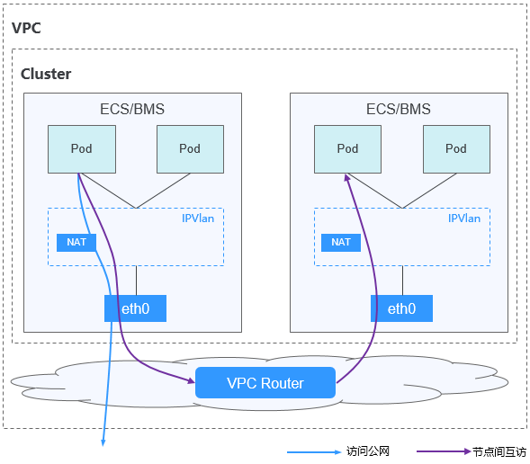

# VPC网络

-   [优缺点](#section207316301745)
-   [应用场景](#section474217381446)
-   [适用集群](#section10441454192410)

VPC网络采用VPC路由方式与底层网络深度整合，适用于高性能场景，节点数量受限于虚拟私有云VPC的路由配额。每个节点将会被分配固定大小的IP地址段。VPC网络由于没有隧道封装的消耗，容器网络性能相对于容器隧道网络有一定优势。VPC网络集群由于VPC路由中配置有容器网段与节点IP的路由，可以支持集群外直接访问容器实例等特殊场景。

**图 1**  VPC网络  

**说明如下：**

-   节点内容器间通信：通过ipvlan子接口分配给各个的容器，同节点的容器间通信直接通过ipvlan直接转发。
-   跨节点容器间通信：借助VPC的路由器的转发能力，所有跨节点容器间的通信全部默认路由到默认网关，借助VPC的路由能力，转发到对端节点上。

## 优缺点

优点：可利用VPC原生的网络功能，性能较高、功能丰富。

缺点：节点数量受限于虚拟私有云VPC的路由配额。每个节点将会被分配固定大小的IP地址段。

## 应用场景

适用于对网络时延、带宽要求高的高性能场景。

## 适用集群

-   混合集群
-   虚机集群

