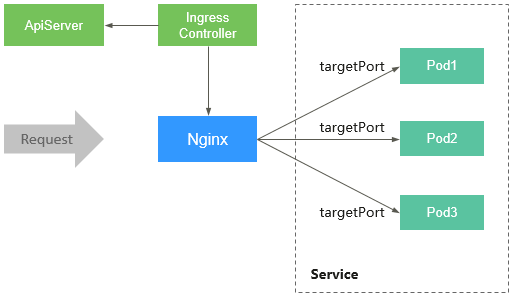

# nginx-ingress

-   [插件简介](#section26181722164712)
-   [工作原理](#section971014351338)
-   [使用约束](#section3200193614201)
-   [前提条件](#zh-cn_topic_0226102211_section92541494210)
-   [安装插件](#section3590245124519)
-   [升级插件](#section23441939916)
-   [卸载插件](#section85912459455)

## 插件简介

Kubernetes通过kube-proxy服务实现了Service的对外发布及负载均衡，它的各种方式都是基于传输层实现的。在实际的互联网应用场景中，不仅要实现单纯的转发，还有更加细致的策略需求，如果使用真正的负载均衡器更会增加操作的灵活性和转发性能。

基于以上需求，Kubernetes引入了资源对象Ingress，Ingress为Service提供了可直接被集群外部访问的虚拟主机、负载均衡、SSL代理、HTTP路由等应用层转发功能。

Kubernetes官方发布了基于Nginx的Ingress控制器，nginx-ingress是一款使用configmap来存储nginx配置的插件，nginx ingress controller会将ingress生成一段nginx的配置，将这个配置通过Kubernetes API写到Nginx的Pod中，然后reload完成nginx的配置修改和更新。

nginx-ingress插件直接使用社区模板与镜像，CCE不提供额外维护，不建议用于商用场景。

开源社区地址：[https://github.com/kubernetes/ingress-nginx](https://github.com/kubernetes/ingress-nginx)

> **说明：** 
>-   **nginx-ingress示例模板即将下线**，**如果您已经通过“模板市场“的“示例模板“安装过nginx-ingress，请务必卸载后再安装此插件。**
>-   安装该插件时，你可以通过“定义nginx配置“添加配置，此处的设置将会全局生效，该参数直接通过配置nginx.conf生成，将影响管理的全部Ingress，相关参数可通过[configmap](https://kubernetes.github.io/ingress-nginx/user-guide/nginx-configuration/configmap/)查找，如果您配置的参数不包含在[configmap](https://kubernetes.github.io/ingress-nginx/user-guide/nginx-configuration/configmap/)所列出的选项中将不会生效。
>-   安装该插件后，您在CCE控制台中[创建Ingress](基本功能操作.md)时可以开启“对接Nginx“按钮，并通过“Nginx配置“下的“自定义配置“将Kubernetes annotations添加到特定的Ingress对象，以自定义其行为，Kubernetes annotations字段详情请参见[Annotations](https://kubernetes.github.io/ingress-nginx/user-guide/nginx-configuration/annotations/)。
>-   请勿手动修改和删除CCE自动创建的ELB和监听器，否则将出现工作负载异常；若您已经误修改或删除，请卸载Nginx Ingress插件后重装。

## 工作原理

Nginx Ingress由资源对象Ingress、Ingress控制器、Nginx三部分组成，Ingress控制器用以将Ingress资源实例组装成Nginx配置文件（nginx.conf），并重新加载 Nginx使变更的配置生效。当它监听到Service中Pod变化时通过动态变更的方式实现Nginx上游服务器组配置的变更，无须重新加载Nginx进程。工作原理如[图1](#fig204075132570)所示。

-   Ingress：一组基于域名或URL把请求转发到指定Service实例的访问规则，是Kubernetes的一种资源对象，Ingress实例被存储在对象存储服务etcd中，通过接口服务被实现增、删、改、查的操作。
-   Ingress控制器（Ingress controller）：用以实时监控资源对象Ingress、Service、End-point、Secret（主要是TLS证书和Key）、Node、ConfigMap的变化，自动对Nginx进行相应的操作。
-   Nginx：实现具体的应用层负载均衡及访问控制。

**图 1**  Nginx Ingress工作原理  

## 使用约束

-   仅支持1.15及以上版本的集群安装此插件。
-   通过api调接口创建的Ingress annotation必须添加kubernetes.io/ingress.class: "nginx"，如果是对接老的Ingress，annotation需添加为kubernetes.io/ingress.class: "cce"。

## 前提条件

在创建容器工作负载前，您需要存在一个可用集群。若没有可用集群 ，请参照[购买混合集群](购买混合集群.md)中的步骤创建。

## 安装插件

1.  在[CCE控制台](https://console.huaweicloud.com/cce2.0/?utm_source=helpcenter)中，单击左侧导航栏的“插件管理“，在“插件市场“中，单击nginx-ingress插件下的“安装插件“。
2.  在安装插件页面，在“基本信息“步骤中选择集群和插件版本，单击“下一步：规格配置“。
3.  在“规格配置“步骤中，参照[表1](#table924319911495)设置服务选型参数，其中带“\*”的参数为必填参数。

    **表 1**  Nginx Ingress插件参数配置

    
    <table><thead align="left"><tr id="row42442974913"><th class="cellrowborder" valign="top" width="24%" id="mcps1.2.3.1.1">
参数

    </th>
    <th class="cellrowborder" valign="top" width="76%" id="mcps1.2.3.1.2">
参数说明

    </th>
    </tr>
    </thead>
    <tbody><tr id="row1137014404511"><td class="cellrowborder" valign="top" width="24%" headers="mcps1.2.3.1.1 ">
插件规格

    </td>
    <td class="cellrowborder" valign="top" width="76%" headers="mcps1.2.3.1.2 ">
请根据业务需求选择插件规格，可单实例部署、多实例部署或自定义资源规格部署。

    </td>
    </tr>
    <tr id="row83701240105118"><td class="cellrowborder" valign="top" width="24%" headers="mcps1.2.3.1.1 ">
实例数

    </td>
    <td class="cellrowborder" valign="top" width="76%" headers="mcps1.2.3.1.2 ">
选择上方插件规格后，显示插件中的实例数，此处仅作显示。

    </td>
    </tr>
    <tr id="row4370840165119"><td class="cellrowborder" valign="top" width="24%" headers="mcps1.2.3.1.1 ">
容器

    </td>
    <td class="cellrowborder" valign="top" width="76%" headers="mcps1.2.3.1.2 ">
选择插件规格后，显示插件容器的CPU和内存配额，此处仅作显示。

    
 说明： 
<ul id="ul7274951438"><li>需保证集群下节点资源充足，若资源不足，插件实例无法调度，只能重新安装插件。</li><li>申请值需小于等于限制值，否则无法成功创建。</li><li>建议填写时申请值与限制值相等，因为节点资源不足时优先清理申请值小于限制值的容器资源。</li><li>不同配置所对应的性能结果可参考<a href="https://www.nginx.com/blog/testing-performance-nginx-ingress-controller-kubernetes/" target="_blank" rel="noopener noreferrer">Nginx性能测试报告</a></li></ul>
    

    </td>
    </tr>
    <tr id="row524420346511"><td class="cellrowborder" valign="top" width="24%" headers="mcps1.2.3.1.1 ">
定义nginx配置

    </td>
    <td class="cellrowborder" valign="top" width="76%" headers="mcps1.2.3.1.2 ">
此处的设置将会全局生效，该参数直接通过配置nginx.conf生成，将影响管理的全部Ingress，相关参数可通过<a href="https://kubernetes.github.io/ingress-nginx/user-guide/nginx-configuration/configmap/" target="_blank" rel="noopener noreferrer">configmap</a>查找，如果您配置的参数不包含在<a href="https://kubernetes.github.io/ingress-nginx/user-guide/nginx-configuration/configmap/" target="_blank" rel="noopener noreferrer">configmap</a>所列出的选项中将不会生效。

    
示例如下：

    

    <ul id="ul1284612209318"><li>worker-processes：Worker进程数，定义了nginx对外提供web服务时的worker进程数，默认auto。</li><li>max-worker-connections：单个后台Worker进程的最大并发链接数，默认16384。</li><li>keep-alive：长连接超时，单位秒，默认 75s。</li></ul>
    </td>
    </tr>
    <tr id="row1624493410514"><td class="cellrowborder" valign="top" width="24%" headers="mcps1.2.3.1.1 ">
自定义请求头

    </td>
    <td class="cellrowborder" valign="top" width="76%" headers="mcps1.2.3.1.2 ">
nginx默认会将用户自定义的header过滤掉，此参数允许重新定义或者添加发往后端服务器的请求头。

    </td>
    </tr>
    <tr id="row224517348516"><td class="cellrowborder" valign="top" width="24%" headers="mcps1.2.3.1.1 ">
开启默认404服务

    </td>
    <td class="cellrowborder" valign="top" width="76%" headers="mcps1.2.3.1.2 ">
该插件默认提供了404后端服务，如果是用户自定义的404服务，输入格式示例如下：&lt;namespace/serviceName&gt;。

    </td>
    </tr>
    <tr id="row1824419144917"><td class="cellrowborder" valign="top" width="24%" headers="mcps1.2.3.1.1 ">
负载均衡

    </td>
    <td class="cellrowborder" valign="top" width="76%" headers="mcps1.2.3.1.2 ">
可选择已创建的公网或私网负载均衡实例，该功能可让公网或者私网的流量能转发到该插件的service上。

    
<strong id="b3679171492615">该参数一旦设置不可更改，请勿在ELB服务页面修改该ELB实例的任何配置，否则将导致服务异常。</strong>如果您已经误操作，请卸载Nginx Ingress插件后重装。

    
 说明： 
<ul id="ul84761555124515"><li>负载均衡实例需与当前集群处于相同VPC 且为公网类型</li><li>负载均衡实例需要拥有至少两个监听器配额，且端口80和443没有被监听器占用。</li></ul>
    

    </td>
    </tr>
    </tbody>
    </table>

4.  完成配置后单击“安装“按钮，待插件安装完成后，单击“返回插件管理“。

    **图 2**  安装nginx-ingress插件成功  
    

5.  在“插件实例“页签中单击右上角的集群选择框，选择安装的集群后可查看到运行中的插件，这表明该插件已在当前集群中安装成功。

    **图 3**  查看安装的插件  
    

## 升级插件

1.  登录[CCE控制台](https://console.huaweicloud.com/cce2.0/?utm_source=helpcenter)，在左侧导航栏中选择“插件管理“，在“插件实例“页签下，选择对应的集群，单击nginx-ingress下的“ 升级“。

    > **说明：** 
    >-   如果升级按钮处于冻结状态，则说明当前插件版本是最新的版本，不需要进行升级操作。
    >-   升级nginx-ingress插件时，会替换原先节点上的旧版本的nginx-ingress插件，安装最新版本的nginx-ingress插件以实现功能的快速升级。
    >-   插件升级后将重启nginx-ingress，可能导致相关业务无法访问，请在合适的时间段进行升级。

2.  在“基本信息“页面选择插件版本，单击“下一步“。
3.  在“规格配置“步骤中，参照[表1](#table924319911495)设置服务选型参数，其中带“\*”的参数为必填参数。
4.  完成配置参数后，单击“升级“即可升级nginx-ingress插件。

## 卸载插件

1.  在[CCE控制台](https://console.huaweicloud.com/cce2.0/?utm_source=helpcenter)中，单击左侧导航栏的“插件管理“，在“插件实例“页签中，选择对应的集群，单击nginx-ingress下的“卸载“。
2.  在弹出的窗口中，单击“确认“，可卸载该插件。

