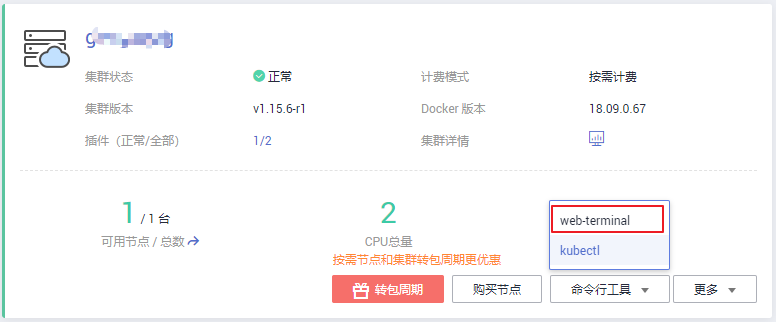

# web-terminal

web-terminal是一款支持在Web界面上使用Kubectl的插件。它支持使用WebSocket通过浏览器连接Linux，提供灵活的接口便于集成到独立系统中，可直接作为一个服务连接，通过cmdb获取信息并登陆服务器。

## 使用约束

集群为1.9及以上版本时，才支持此功能。

## 安装插件

1.  在[CCE控制台](https://console.huaweicloud.com/cce2.0/?utm_source=helpcenter)中，单击左侧导航栏的“ 插件管理“，在“插件市场“页签下，单击**web-terminal**插件下的“安装插件“。
2.  在安装插件页面，选择安装的集群和插件版本，单击“下一步：规格配置“。
3.  在规格配置页面，配置以下参数。
    -   用户名：默认为root，不可修改。
    -   密码：登录web-terminal的密码，请务必记住该密码。
    -   确认密码：重新准确输入该密码。
    -   访问类型：
        -   节点访问：该插件默认以NodePort形式提供访问，需为集群任意一个节点绑定弹性IP才能使用。若集群没有绑定弹性IP，需绑定弹性IP。
        -   负载均衡：选择弹性负载均衡实例。若无弹性负载均衡实例，需新建[增强型弹性负载均衡](https://console.huaweicloud.com/vpc/#/ulb/createUlb)，完成后点击刷新按钮。负载均衡实例需与当前集群处于相同VPC且为公网类型。

    -   端口配置：访问类型为负载均衡时，需端口配置。
        -   协议：请根据业务的协议类型选择。
        -   容器端口：容器镜像中工作负载实际监听端口，为默认值，无法更改。
        -   访问端口：容器端口最终映射到负载均衡服务地址的端口，用负载均衡服务地址访问工作负载时使用，端口范围为1-65535，可任意指定。

4.  单击“安装“。

    待插件安装完成后，单击“返回插件管理“，在“插件实例“页签下，选择对应的集群，可查看到运行中的实例，这表明该插件已在当前集群的各节点中安装。

## 使用web-terminal插件连接集群

**方式一：**

1.  在[CCE控制台](https://console.huaweicloud.com/cce2.0/?utm_source=helpcenter)中，单击左侧导航栏的“资源管理 \> 集群管理“。
2.  单击集群下方的“命令行工具 \> web-terminal“，即可登录。

    **图 1**  使用web-terminal连接集群  
    

**方式二：**

1.  在[CCE控制台](https://console.huaweicloud.com/cce2.0/?utm_source=helpcenter)中，单击左侧导航栏的“插件管理“。
2.  在“插件实例”中，正确选择插件所在的集群，单击“web-terminal”进入详情页。
3.  点击插件详情页中访问地址后的链接即可登录。

    **图 2**  web-terminal插件访问地址  
    

## 配置插件

> **说明：**   
>**该部分仅针对1.0.0版本的web-terminal进行说明**，使用最新版本的用户无需阅读该部分的说明，使用老版本的用户建议尽早升级到最新版本提升使用体验。  

成功安装web-tertimal后, 仍需完成如下步骤才能使用。

1.  为web-terminal添加service

    -   在“工作负载 \> 无状态负载 Deployment“界面单击“web-terminal”查看详情，然后单击“访问方式 \> 添加Service“进入Service添加界面。
    -   设置服务名称为“web-terminal-service”（可任取），选择“公网访问“作为访问方式，从“负载均衡“和“弹性IP“中选一种访问类型。
    -   端口配置中将容器端口设为3000，其余根据情况自行设定，确认设置后单击“创建“完成该步骤。

    现在您已可以通过service提供的访问地址和访问端口在浏览器上访问终端，对应地址为“https://访问地址:访问端口” 。为了能够在该终端使用kubectl，仍需为对应容器配置kubeconfig。

2.  为容器配置kubeconfig

    -   在集群管理界面选择想要操作的集群，单击“更多 \> kubectl“，在弹出页面中下载kubectl配置文件并打开，复制所有内容。
    -   根据上一步中的地址访问web-terminal，使用安装插件时设置的密码登录账户hwcloud\_cce，在初始目录"/home/hwcloud\_cce"使用vi指令创建文件config，将kubeconfig的所有内容通过ctrl+v粘贴到该文件，最后保存。

    至此您已可以在web-terminal提供的界面上使用kubectl。

## 卸载插件

1.  在[CCE控制台](https://console.huaweicloud.com/cce2.0/?utm_source=helpcenter)中，单击左侧导航栏的“ 插件管理“，在“插件实例“页签下，选择对应的集群，单击web-terminal下的“卸载“。
2.  在弹出的窗口中，单击“确认“，可卸载该插件。

