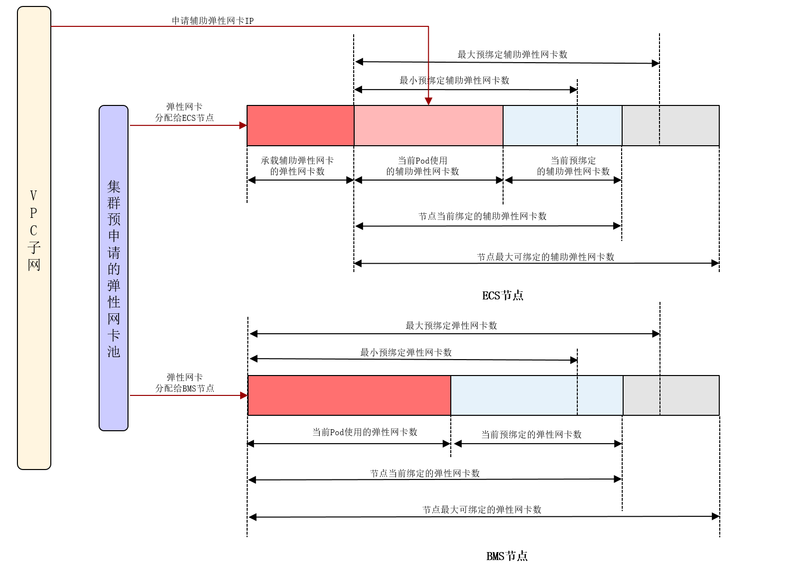
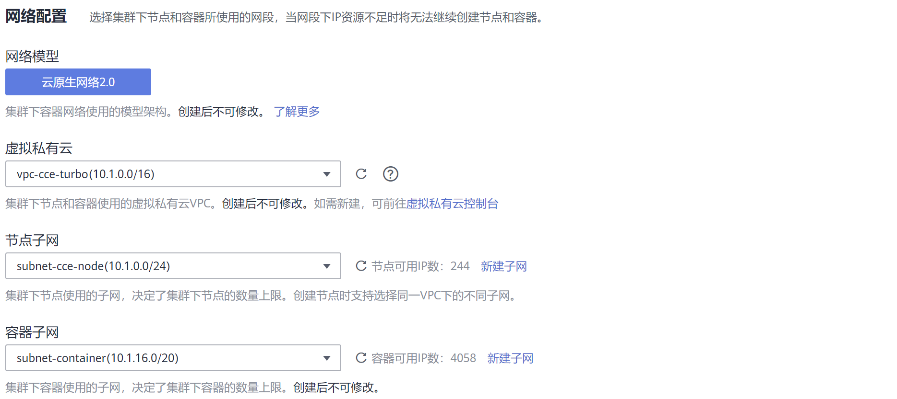
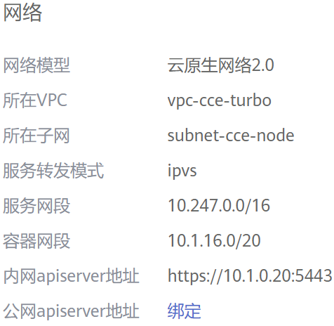
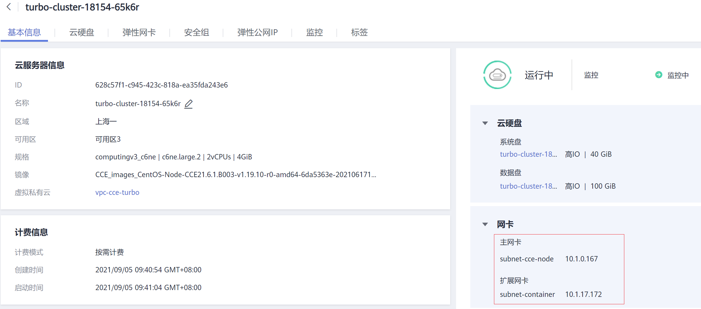

# 云原生网络2.0<a name="cce_01_0284"></a>

## 云原生网络2.0网络模型<a name="section18112145311217"></a>

云原生网络2.0是自研的新一代容器网络模型，深度整合了虚拟私有云VPC的弹性网卡（Elastic Network Interface，简称ENI）和辅助弹性网卡（Sub Network Interface，简称Sub-ENI）的能力，直接从VPC网段内分配容器IP地址，支持ELB直通容器，绑定安全组，绑定弹性公网IP，享有高性能。

**图 1**  云原生网络2.0<a name="zh-cn_topic_0146398798_fig117435555917"></a>  


**说明如下：**

-   节点内Pod间通信：直接通过VPC的弹性网卡/弹性辅助网卡进行流量转发。
-   跨节点Pod间通信：直接通过VPC的弹性网卡/弹性辅助网卡进行流量转发。

## 约束与限制<a name="section2548184716433"></a>

-   CCE Turbo集群使用云原生网络2.0。

## 优缺点<a name="section884011382223"></a>

**优点**

-   容器网络直接使用的VPC，网络问题易排查、性能最高。
-   支持VPC内的外部网络与容器IP直通。
-   可直接利用VPC提供的负载均衡、安全组、弹性公网IP等能力。

**缺点**

由于容器网络直接使用的VPC，消耗VPC的地址空间，创建集群前需要合理规划好容器网段。

## 适用场景<a name="section3723244144011"></a>

-   性能要求高，需要使用VPC其他网络能力的场景：由于云原生网络2.0直接使用的VPC网络，性能与VPC网络的性能几乎一致，所以适用于对带宽、时延要求极高的业务场景，比如：线上直播、电商秒杀等。
-   大规模组网：云原生网络2.0当前最大可支持2000个ECS节点，10万个容器。

## 容器IP地址管理<a name="section45181754101115"></a>

云原生网络2.0下的BMS节点和ECS节点分别使用的是弹性网卡和辅助弹性网卡，它们的IP地址管理如下图所示：

**图 2**  云原生网络2.0的IP地址管理<a name="fig187842468716"></a>  


-   Pod的IP地址从配置给容器子网的VPC子网上分配。
-   ECS节点上绑定的总的弹性网卡和辅助弹性网卡数： 用于承载辅助弹性网卡的弹性网卡数 + 当前Pod使用的辅助弹性网卡数 + 预绑定的辅助弹性网卡数 。
-   ECS节点上**当前预绑定辅助弹性网卡数 + 当前Pod使用的辅助弹性网卡数 < 最小预绑定辅助弹性网卡数**时，会绑定辅助弹性网卡使得**预绑定辅助弹性网卡数+当前Pod使用的辅助弹性网卡 = 最小预绑定辅助弹性网卡数**。
-   ECS节点上**当前预绑定辅助弹性网卡数 + 当前Pod使用的辅助弹性网卡数 \> 最大预绑定辅助弹性网卡数**，会定时释放弹性辅助网卡（约2分钟一次），直到**预绑定辅助弹性网卡数+当前Pod使用的辅助弹性网卡 = 最大预绑定辅助弹性网卡数**。
-   BMS节点上绑定的弹性网卡数：当前Pod使用的弹性网卡数 +  预绑定的弹性网卡数 。
-   BMS节点上**当前预绑定弹性网卡数 + 当前Pod使用的弹性网卡数 < 最小预绑定弹性网卡数**时，会绑定弹性网卡使得**预绑定弹性网卡数 + 当前Pod使用的弹性网卡数 = 最小预绑定弹性网卡数**。
-   BMS节点上**当前预绑定弹性网卡数 + 当前Pod使用的弹性网卡数 \> 最大预绑定弹性网卡数**，会定时释放弹性网卡（约2分钟一次），直到**预绑定弹性网卡数 + 当前Pod使用的弹性网卡数 = 最大预绑定弹性网卡数**。

## 网段规划建议<a name="section08181419115517"></a>

在[集群网络构成](网络概述.md#section1131733719195)中介绍集群中网络地址可分为节点网络、容器网络、服务网络三块，在规划网络地址时需要从如下方面考虑：

-   **三个网段不能重叠**，否则会导致冲突。
-   保证**每个网段有足够的IP地址可用**。
    -   节点网段的IP地址要与集群规模相匹配，否则会因为IP地址不足导致无法创建节点。
    -   容器网段的IP地址要与业务规模相匹配，否则会因为IP地址不足导致无法创建Pod。


云原生网络2.0模型下，由于容器网段与节点网段共同使用VPC下的网络地址，建议容器子网与节点子网不要使用同一个子网，否则容易出现IP资源不足导致容器或节点创建失败的情况。

另外云原生网络2.0模型下容器网段支持在创建集群后增加子网，扩展可用IP数量，此时需要注意增加的子网不要与容器网段其他子网存在网络冲突。

**图 3**  网段配置<a name="fig16639123813259"></a>  


## 云原生网络2.0访问示例<a name="section161713314914"></a>

创建一个CCE Turbo集群，集群包含3个ECS节点。

**图 4**  集群网络<a name="fig34706594193"></a>  


**图 5**  节点列表<a name="fig12441149202012"></a>  


进入其中一个节点，可以看到节点有一个主网卡和扩展网卡，这两个网卡都是弹性网卡，其中扩展网卡是属于容器网络网段，用于给Pod挂载辅助弹性网卡Sub-ENI。

**图 6**  节点网卡<a name="fig9242131819209"></a>  


在集群中创建一个Deployment。

```
kind: Deployment
apiVersion: apps/v1
metadata:
  name: example
  namespace: default
spec:
  replicas: 6
  selector:
    matchLabels:
      app: example
  template:
    metadata:
      labels:
        app: example
    spec:
      containers:
        - name: container-0
          image: 'nginx:perl'
          resources:
            limits:
              cpu: 250m
              memory: 512Mi
            requests:
              cpu: 250m
              memory: 512Mi
      imagePullSecrets:
        - name: default-secret
```

创建后查询Pod。

```
$ kubectl get pod -owide
NAME                       READY   STATUS    RESTARTS   AGE   IP            NODE         NOMINATED NODE   READINESS GATES
example-5bdc5699b7-54v7g   1/1     Running   0          7s    10.1.18.2     10.1.0.167   <none>           <none>
example-5bdc5699b7-6dzx5   1/1     Running   0          7s    10.1.18.216   10.1.0.186   <none>           <none>
example-5bdc5699b7-gq7xs   1/1     Running   0          7s    10.1.16.63    10.1.0.144   <none>           <none>
example-5bdc5699b7-h9rvb   1/1     Running   0          7s    10.1.16.125   10.1.0.167   <none>           <none>
example-5bdc5699b7-s9fts   1/1     Running   0          7s    10.1.16.89    10.1.0.144   <none>           <none>
example-5bdc5699b7-swq6q   1/1     Running   0          7s    10.1.17.111   10.1.0.167   <none>           <none>
```

这里Pod的IP都是Sub-ENI，挂载在节点的ENI上（扩展网卡）。

例如10.1.0.167节点对应的扩展网卡是10.1.17.172。在弹性网卡控制台上可以看到10.1.17.172这块扩展网卡挂载3个Sub-ENI，正是Pod的IP。

**图 7**  Pod网卡<a name="fig03652819204"></a>  


在VPC中直接访问Pod的IP，能够正常访问。

## 最佳实践<a name="section18716143811272"></a>

[CCE Turbo共池BMS节点容器网卡多队列配置](https://support.huaweicloud.com/bestpractice-cce/cce_bestpractice_0017.html)

## 常见问题<a name="section152643614445"></a>

[CCE Turbo裸机BMS节点上Pod启动慢，如何排查？](https://support.huaweicloud.com/cce_faq/cce_faq_00310.html)

