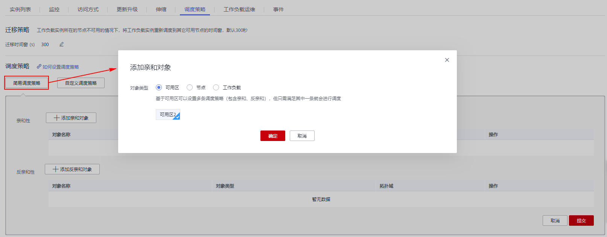
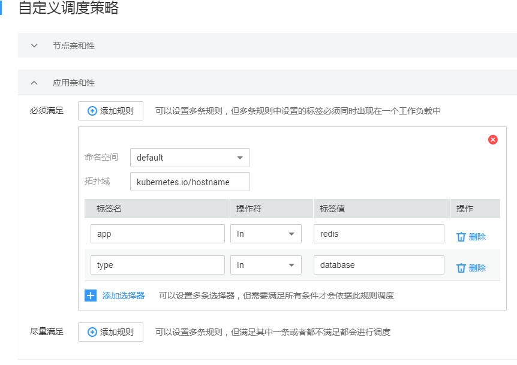
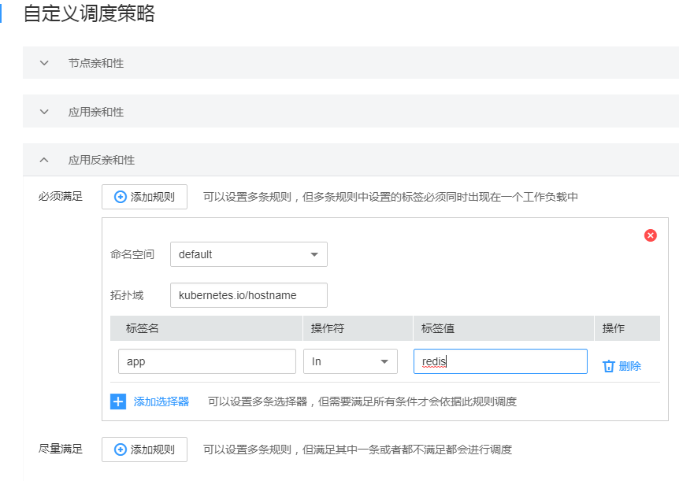

# 亲和/反亲和性调度<a name="cce_01_0051"></a>

CCE支持“简易调度策略“和“自定义调度策略“。简易调度策略提供简单便捷以及足够功能的调度方式；自定义调度策略开放节点亲和、应用亲和以及应用反亲和调度策略的配置，以满足用户的更高需求。

## 简易调度策略<a name="section10806164114720"></a>

简易调度策略提供工作负载和可用区的亲和性、工作负载和节点的亲和性以及工作负载间的亲和性调度，用户可根据业务需求进行相应的设置部署应用。

> **注意：**   
>在设置“工作负载间的亲和性”和“工作负载和节点的亲和性”时，需确保不要出现互斥情况，否则工作负载会部署失败。例如如下互斥情况，工作负载将会部署失败：  
>-   APP1、APP2设置了工作负载间的反亲和，例如APP1部署在Node1，APP2部署在Node2。  
>-   APP3部署上线时，既希望与APP2亲和，又希望可以部署在不同节点如Node3上，这就造成了工作负载亲和和节点亲和间的互斥，导致最终工作负载部署失败。  

-   **工作负载和可用区的亲和性：**
    -   **与可用区的亲和性**：即[工作负载部署在指定可用区](#section1670445644717)。
    -   **与可用区的反亲和性**：即[工作负载不部署在指定可用区](#section7719165624711)。

-   **工作负载和节点的亲和性：**
    -   **与节点的亲和性**：即[工作负载部署到指定节点](#section107823064914)。
    -   **与节点的反亲和性**：即[工作负载不部署到指定节点](#section36717556589)。

-   **工作负载间的亲和性：**决定应用部署在相同或不同拓扑域中。
    -   **与工作负载的亲和性**：即[指定工作负载部署在相同节点](#section3573169125915)。用户可根据业务需求进行工作负载的就近部署，容器间通信就近路由，减少网络消耗。例如Workload1、Workload2、Workload3和Workload4部署在相同节点上，为亲和性部署。

        **图 1**  工作负载间亲和<a name="fig3017424713"></a>  
        

    -   **与工作负载的反亲和性**：即[指定工作负载部署在不同节点](#section2548114113210)。同个工作负载的多个实例反亲和部署，减少宕机影响；互相干扰的应用反亲和部署，避免干扰。

        如，Workload1、Workload2、Workload3和Workload4分别部署在不同节点上，这四个工作负载为反亲和性部署。

        **图 2**  工作负载间反亲和<a name="fig1505421971"></a>  
        


## 工作负载部署在指定可用区<a name="section1670445644717"></a>

**方式一**：

1.  参照[创建无状态工作负载](创建无状态工作负载.md)或[创建有状态工作负载](创建有状态工作负载.md)，在“高级设置“的“调度策略“下，单击“工作负载和可用区的亲和性 \> 与可用区的亲和性“前的。

    **图 3**  调度策略<a name="fig113294320272"></a>  
    

2.  单击工作负载希望部署到的可用区。

    当前创建的工作负载会部署到已选择的可用区中。


**方式二**：

1.  登录CCE控制台，选择左侧导航栏“工作负载 \> 无状态（Deployment）”或“工作负载 \> 有状态（StatefulSet）”。
2.  单击工作负载名称进入详情页，单击“调度策略 \> 简易调度策略\>添加亲和对象”。

    **图 4**  添加亲和对象<a name="fig136091542817"></a>  
    

3.  对象类型选为“可用区”，单击工作负载希望部署到的可用区，当前创建的工作负载会部署到已选择的可用区中。

    > **说明：**   
    >该方法可新增、编辑和删除调度策略。  


## 工作负载部署在指定可用区-yaml示例<a name="section4201420133117"></a>

本节以nginx为例，说明kubectl命令创建工作负载的方法。

**前提条件**

请参见[通过Kubectl连接集群](通过Kubectl连接集群.md)配置kubectl命令，使弹性云服务器连接集群。

**操作步骤**

参见[通过kubectl命令行创建无状态工作负载](创建无状态工作负载.md#section155246177178)或[通过kubectl命令行创建有状态工作负载](创建有状态工作负载.md#section113441881214)，工作负载和可用区亲和性的yaml示例如下：

```
apiVersion: extensions/v1beta1
kind: Deployment
metadata:
  name: az-in-deployment
spec:
  replicas: 1
  selector:
    matchLabels:
      app: az-in-deployment
  strategy:
    type: RollingUpdate
  template:
    metadata:
      labels:
        app: az-in-deployment
    spec:
      containers:
      - image: nginx 
        imagePullPolicy: Always
        name: nginx
      imagePullSecrets:
      - name: default-secret
      affinity:
        nodeAffinity:
          requiredDuringSchedulingIgnoredDuringExecution:
            nodeSelectorTerms:
            - matchExpressions:
              - key: kubernetes.io/availablezone #node中lable的key
                operator: In        
                values:
                - az1                              #node中对应key的value
```

## 工作负载不部署在指定可用区<a name="section7719165624711"></a>

**方式一：**

1.  参照[创建无状态工作负载](创建无状态工作负载.md)或[创建有状态工作负载](创建有状态工作负载.md)，在“高级设置“的“调度策略“下，单击“工作负载和可用区的亲和性 \> 与可用区的反亲和性“前的。

    **图 5**  调度策略<a name="fig15240556122815"></a>  
    

2.  单击工作负载不希望部署到的可用区。

    当前创建的工作负载不会部署到已选择的可用区中。


**方式二：**

1.  登录CCE控制台，选择左侧导航栏“工作负载 \> 无状态（Deployment）”或“工作负载 \> 有状态（StatefulSet）”。
2.  单击工作负载名称进入详情页，单击“调度策略 \> 简易调度策略\>添加反亲和对象”。

    **图 6**  添加反亲和对象<a name="fig2029255193016"></a>  
    

3.  对象类型选为“可用区”，单击工作负载不希望部署到的可用区，当前创建的工作负载不会部署到已选择的可用区中。

    > **说明：**   
    >该方法可新增、编辑和删除调度策略。  


## 工作负载不部署在指定可用区-yaml示例<a name="section102822029173111"></a>

本节以nginx为例，说明kubectl命令创建工作负载的方法。

**前提条件**

请参见[通过Kubectl连接集群](通过Kubectl连接集群.md)配置kubectl命令，使弹性云服务器连接集群。

**操作步骤**

参见[通过kubectl命令行创建无状态工作负载](创建无状态工作负载.md#section155246177178)或[通过kubectl命令行创建有状态工作负载](创建有状态工作负载.md#section113441881214)，工作负载和可用区反亲和性的yaml示例如下：

```
apiVersion: extensions/v1beta1
kind: Deployment
metadata:
  name: nginx
spec:
  replicas: 1
  selector:
    matchLabels:
      app: nginx
  strategy:
    type: RollingUpdate
  template:
    metadata:
      labels:
        app: nginx
    spec:
      containers:
      - image: nginx 
        imagePullPolicy: Always
        name: nginx
      imagePullSecrets:
      - name: default-secret
      affinity:
        nodeAffinity:
          requiredDuringSchedulingIgnoredDuringExecution:
            nodeSelectorTerms:
            - matchExpressions:
              - key: kubernetes.io/availablezone       #node中lable的key   
                operator: NotIn        
                values:
                - az1                                   #node中对应key的value
```

## 工作负载部署到指定节点<a name="section107823064914"></a>

1.  参照[创建无状态工作负载](创建无状态工作负载.md)或[创建有状态工作负载](创建有状态工作负载.md)，在“高级设置“的“调度策略“下，单击“工作负载和节点的亲和性 \> 与节点的亲和性”下的“添加“。
2.  勾选工作负载需要部署到的节点，单击“确定“。

    若勾选多个节点，部署工作负载时会在这些勾选的节点中自动指定。


## 工作负载部署到指定节点-yaml示例<a name="section711574271117"></a>

本节以nginx为例，说明kubectl命令创建工作负载的方法。

**前提条件**

请参见[通过Kubectl连接集群](通过Kubectl连接集群.md)配置kubectl命令，使弹性云服务器连接集群。

**操作步骤**

参见[通过kubectl命令行创建无状态工作负载](创建无状态工作负载.md#section155246177178)或[通过kubectl命令行创建有状态工作负载](创建有状态工作负载.md#section113441881214)，工作负载和节点亲和性的yaml示例如下：

```
apiVersion: extensions/v1beta1
kind: Deployment
metadata:
  name: nginx
spec:
  replicas: 1
  selector:
    matchLabels:
      app: nginx
  strategy:
    type: RollingUpdate
  template:
    metadata:
      labels:
        app: nginx
    spec:
      containers:
      - image: nginx 
        imagePullPolicy: Always
        name: nginx
      imagePullSecrets:
      - name: default-secret
      affinity:
        nodeAffinity:
          requiredDuringSchedulingIgnoredDuringExecution:
            nodeSelectorTerms:
            - matchExpressions:
              - key: nodeName          #node中lable的key
                operator: In
                values:
                - test-node-1          #node中对应key的value
```

## 工作负载不部署到指定节点<a name="section36717556589"></a>

1.  参照[创建无状态工作负载](创建无状态工作负载.md)或[创建有状态工作负载](创建有状态工作负载.md)，在“高级设置“的“调度策略“下，单击“工作负载和节点的亲和性 \> 与节点的反亲和性”下的“添加“。
2.  勾选工作负载不希望部署到的节点，单击“确定“。

    若勾选多个节点，工作负载将不会部署到这些节点上。


## 工作负载不部署到指定节点-yaml示例<a name="section1361482522712"></a>

本节以nginx为例，说明kubectl命令创建工作负载的方法。

**前提条件**

请参见[通过Kubectl连接集群](通过Kubectl连接集群.md)配置kubectl命令，使弹性云服务器连接集群。

**操作步骤**

参见[通过kubectl命令行创建无状态工作负载](创建无状态工作负载.md#section155246177178)或[通过kubectl命令行创建有状态工作负载](创建有状态工作负载.md#section113441881214)，工作负载和节点反亲和性的yaml示例如下：

```
apiVersion: extensions/v1beta1
kind: Deployment
metadata:
  name: nginx
spec:
  replicas: 1
  selector:
    matchLabels:
      app: nginx
  strategy:
    type: RollingUpdate
  template:
    metadata:
      labels:
        app: nginx
    spec:
      containers:
      - image: nginx 
        imagePullPolicy: Always
        name: nginx
      imagePullSecrets:
      - name: default-secret
      affinity:
        nodeAffinity:
          requiredDuringSchedulingIgnoredDuringExecution:
            nodeSelectorTerms:
            - matchExpressions:
              - key: nodeName          #node中lable的key
                operator: NotIn        #notin说明不部署
                values:
                - test-node-1          #node中对应key的value
```

## 指定工作负载部署在相同节点<a name="section3573169125915"></a>

1.  参照[创建无状态工作负载](创建无状态工作负载.md)或[创建有状态工作负载](创建有状态工作负载.md)，在“高级设置“的“调度策略“下，单击“工作负载间的亲和性 \> 与工作负载的亲和性”下的“添加“。
2.  勾选希望部署到相同节点的工作负载，单击“确定“。

    当前创建的工作负载会和已勾选的工作负载部署在相同节点上。


## 指定工作负载部署在相同节点-yaml示例<a name="section5140193643912"></a>

本节以nginx为例，说明kubectl命令创建工作负载的方法。

**前提条件**

请参见[通过Kubectl连接集群](通过Kubectl连接集群.md)配置kubectl命令，使弹性云服务器连接集群。

**操作步骤**

参见[通过kubectl命令行创建无状态工作负载](创建无状态工作负载.md#section155246177178)或[通过kubectl命令行创建有状态工作负载](创建有状态工作负载.md#section113441881214)，工作负载间亲和性的yaml示例如下：

```
apiVersion: extensions/v1beta1
kind: Deployment
metadata:
  name: nginx
spec:
  replicas: 1
  selector:
    matchLabels:
      app: nginx
  strategy:
    type: RollingUpdate
  template:
    metadata:
      labels:
        app: nginx
    spec:
      containers:
      - image: nginx 
        imagePullPolicy: Always
        name: nginx
      imagePullSecrets:
      - name: default-secret
      affinity:
        podAffinity:
          requiredDuringSchedulingIgnoredDuringExecution:
            nodeSelectorTerms:
            - matchExpressions:
              - key: app          #工作负载中lable的key
                operator: In        
                values:
                - test     #工作负载中对应lable的value
```

## 指定工作负载部署在不同节点<a name="section2548114113210"></a>

1.  参照[创建无状态工作负载](创建无状态工作负载.md)或[创建有状态工作负载](创建有状态工作负载.md)，在“高级设置“的“调度策略“下，单击“工作负载间的亲和性 \> 与工作负载的反亲和性“下的“添加“。
2.  勾选不希望部署到相同节点的工作负载，单击“确定“。

    当前创建的工作负载会和已勾选的工作负载部署在不同节点上。


## 指定工作负载部署在不同节点-yaml示例<a name="section1894310152317"></a>

本节以nginx为例，说明kubectl命令创建工作负载的方法。

**前提条件**

请参见[通过Kubectl连接集群](通过Kubectl连接集群.md)配置kubectl命令，使弹性云服务器连接集群。

**操作步骤**

参见[通过kubectl命令行创建无状态工作负载](创建无状态工作负载.md#section155246177178)或[通过kubectl命令行创建有状态工作负载](创建有状态工作负载.md#section113441881214)，工作负载间反亲和性的yaml示例如下：

```
apiVersion: extensions/v1beta1
kind: Deployment
metadata:
  name: nginx
spec:
  replicas: 1
  selector:
    matchLabels:
      app: nginx
  strategy:
    type: RollingUpdate
  template:
    metadata:
      labels:
        app: nginx
    spec:
      containers:
      - image: nginx 
        imagePullPolicy: Always
        name: nginx
      imagePullSecrets:
      - name: default-secret
      affinity:
        podAffinity:
          requiredDuringSchedulingIgnoredDuringExecution:
            nodeSelectorTerms:
            - matchExpressions:
              - key: app          #工作负载中lable的key
                operator: NotIn        
                values:
                - test     #工作负载中对应lable的value
```

## 自定义调度策略<a name="section2169530191212"></a>

在自定义调度策略中用户可以设置“节点亲和性“、“应用亲和性“和“应用反亲和性“，详情详见[Affinity and anti-affinity](https://kubernetes.io/docs/concepts/configuration/assign-pod-node/?spm=a2c4g.11186623.2.34.7f4d38f6C1WPWj#affinity-and-anti-affinity)

> **说明：**   
>亲和性调度中需要设置的标签依赖节点的标签和和Pod的标签，用户可以使用内置的标签进行设置，或者可以根据需求自定义节点和Pod的标签并使用。  

## 节点亲和性<a name="section102901228191520"></a>

1.  在“工作负载详情“页面下单击“调度策略“页签中“自定义调度策略“按钮添加节点亲和性。
2.  在节点亲和性设置中，依据节点中的标签进行业务需求的设置。

    **图 7**  节点亲和性调度策略<a name="fig10452649115317"></a>  
    


> **说明：**   
>节点亲和性调度支持必须满足和尽量满足（硬约束Required/软约束Preferred），以及可以设置相应的匹配关系（In, NotIn, Exists, DoesNotExist, Gt, and Lt）：  
>-   **必须满足：**即硬约束，设置必须要满足的条件，对应于requiredDuringSchedulingIgnoredDuringExecution，您可以添加多条必须满足的规则，多条规则间是一种“或”的关系，即只需要满足一条规则即会进行调度。  
>-   **尽量满足：**即软约束，设置尽量满足的条件，对应于preferredDuringSchedulingIgnoredDuringExecution，您可以添加多条尽量满足的规则，无论是满足其中一条或者是都不满足都会进行调度。另外可以为规则设置权重值，权重值越高会被优先调度。  
>-   **选择器：**对应于matchExpressions，您可以添加多条选择器，多条选择器之间是一种“与”的关系，即需要满足全部选择器才能依据此条规则进行调度。  
>-   **标签名：**对应节点的标签，可以使用默认的标签也可以用户自定义标签。  
>-   **匹配关系：**即操作符，可以设置六种匹配关系（In, NotIn, Exists, DoesNotExist. Gt, and Lt）。In和NotIn操作符可以添加单个值或者多个value值（多值使用；进行划分），Exists和DoesNotExist判断某个label是否存在，不需设置value值。Gt和Lt判断label的值大于或者小于某个值（value值要求整数）。  

## 工作负载节点亲和性-yaml实例<a name="section9155952131619"></a>

本节以nginx为例，说明创建节点亲和性。如[图7](#fig10452649115317)

**前提条件**

已有使用nginx容器的工作负载和节点。

**操作步骤**

使用内置节点标签kubernetes.io/hostname，并添加相应的节点，同时设置操作符为In，最后单击“确定“提交。

**设置后的工作负载节点亲和性所得的yaml如下：**

```
apiVersion: extensions/v1beta1
kind: Deployment
metadata:
  name: nginx
  namespace: default
spec:
  replicas: 2
  selector:
    matchLabels:
      app: nginx
  template:
    metadata:
      labels:
        app: nginx
    spec:
      imagePullSecrets:
        - name: default-secret
      affinity:
        nodeAffinity:
          requiredDuringSchedulingIgnoredDuringExecution:
            nodeSelectorTerms:
              - matchExpressions:
                  - key: kubernetes.io/hostname
                    operator: In
                    values:
                      - 192.168.6.174
```

## 应用亲和性<a name="section16941232203617"></a>

决定工作负载的Pod和哪些工作负载的Pod部署在同一个拓扑域。

1.  在“工作负载详情“页面下单击“调度策略“页签中“自定义调度策略“按钮添加应用亲和性。
2.  在应用亲和性设置中，依据工作负载的Pod标签，同时配置命名空间和拓扑域进行业务需求的设置。

    **图 8**  应用亲和性调度策略<a name="fig16475132103614"></a>  
    


> **说明：**   
>应用亲和性调度支持必须满足和尽量满足（硬约束Required/软约束Preferred），以及可以设置相应的匹配关系（In, NotIn, Exists, DoesNotExist）：  
>-   **必须满足：**即硬约束，设置必须要满足的条件，对应于requiredDuringSchedulingIgnoredDuringExecution，您可以添加多条必须满足的规则。在规则中还需要设置命名空间和拓扑域。  
>-   **尽量满足：**即软约束，设置尽量满足的条件，对应于preferredDuringSchedulingIgnoredDuringExecution，您可以添加多条尽量满足的规则，无论是满足其中一条或者是都不满足都会进行调度。另外可以为规则设置权重值，权重值越高会被优先调度。  
>-   **命名空间：**即namespaces，默认情况下使用和当前应用相同的命名空间，您可以设置其他的已有的命名空间。  
>-   **拓扑域：**即topologyKey，拓扑域通过设置Node节点的标签，包含默认和自定义标签，用于指定调度时作用域。  
>-   **选择器：**对应于matchExpressions，您可以添加多条选择器，多条选择器之间是一种“与”的关系，即需要满足全部选择器才能依据此条规则进行调度。  
>-   **标签名：**对应工作负载的标签，您可以使用默认标签app或者使用自定义标签。  
>-   **匹配关系：**即操作符，可以设置四种匹配关系（In, NotIn, Exists, DoesNotExist）。In和NotIn操作符可以添加单个值或者多个value值（多值使用；进行划分），Exists和DoesNotExist判断某个label是否存在，不需设置value值。  

## 工作负载应用亲和性-yaml实例<a name="section69149192383"></a>

本节以nginx为例，说明创建应用亲和性。如[图8](#fig16475132103614)

**前提条件**

已有使用nginx容器的工作负载和节点。

**操作步骤**

使用默认的命名空间default，拓扑域使用内置的节点标签kubernetes.io/hostname用于表示以节点为区分范围，设置标签app和type，标签值为redis和database。同时设置操作符为In，最后单击“确定“提交。

**设置后的应用亲和性所得的yaml如下：**

```
apiVersion: extensions/v1beta1
kind: Deployment
metadata:
  name: nginx
  namespace: default
spec:
  replicas: 2
  selector:
    matchLabels:
      app: nginx
  template:
    metadata:
      labels:
        app: nginx
    spec:
      imagePullSecrets:
        - name: default-secret
      affinity:
        podAffinity:
          requiredDuringSchedulingIgnoredDuringExecution:
            - labelSelector:
                matchExpressions:
                  - key: app
                    operator: In
                    values:
                      - redis
                      - key: type
                    operator: In
                    values:
                      - database
                    namespaces:
                      - default
              topologyKey: kubernetes.io/hostname
```

> **注意：**   
>上例中只有当某个工作负载同时具有app和type两个标签的时候，工作负载nginx才能调度成功，会将工作负载nginx调度到此工作负载的节点上。  

## 应用反亲和性<a name="section143033311545"></a>

决定工作负载的Pod不和哪些工作负载的Pod部署在同一个拓扑域。

1.  在“工作负载详情“页面下单击“调度策略“页签中“自定义调度策略“按钮添加应用反亲和性。
2.  在应用反亲和性设置中，依据工作负载中标签同时还可以配置命名空间和拓扑域进行业务需求的设置。

    **图 9**  应用反亲和性调度策略<a name="fig16479133213617"></a>  
    


> **说明：**   
>应用反亲和性调度支持必须满足和尽量满足（硬约束Required/软约束Preferred），以及可以设置相应的匹配关系（In, NotIn, Exists, DoesNotExist）：  
>-   **必须满足：**即硬约束，设置必须要满足的条件，对应于requiredDuringSchedulingIgnoredDuringExecution，您可以添加多条必须满足的规则。在规则中还需要设置命名空间和拓扑域。  
>-   **尽量满足：**即软约束，设置尽量满足的条件，对应于preferredDuringSchedulingIgnoredDuringExecution，您可以添加多条尽量满足的规则，无论是满足其中一条或者是都不满足都会进行调度。另外可以为规则设置权重值，权重值越高会被优先调度。  
>-   **命名空间：**即namespaces，默认情况下使用和当前应用相同的命名空间，您可以设置其他的已有的命名空间。  
>-   **拓扑域：**即topologyKey，拓扑域通过设置Node节点的标签，包含默认和自定义标签，用于指定调度时作用域。  
>-   **选择器：**对应于matchExpressions，您可以添加多条选择器，多条选择器之间是一种“与”的关系，即需要满足全部选择器才能依据此条规则进行调度。  
>-   **标签名：**对应工作负载的标签，您可以使用默认标签app或者使用自定义标签。  
>-   **匹配关系：**即操作符，可以设置四种匹配关系（In, NotIn, Exists, DoesNotExist）。In和NotIn操作符可以添加单个值或者多个value值（多值使用；进行划分），Exists和DoesNotExist判断某个label是否存在，不需设置value值。  

## 工作负载应用反亲和性-yaml实例<a name="section93428308559"></a>

本节以nginx为例，说明创建应用反亲和性。如[图9](#fig16479133213617)

**前提条件**

已有使用nginx容器的工作负载和节点。

**操作步骤**

使用默认的命名空间default，拓扑域使用内置的节点标签kubernetes.io/hostname用于表示以节点为区分范围，设置标签app，标签值为redis。同时设置操作符为In，最后单击“确定“提交。

**设置后的应用反亲和性所得的yaml如下：**

```
apiVersion: extensions/v1beta1
kind: Deployment
metadata:
  name: nginx
  namespace: default
spec:
  replicas: 2
  selector:
    matchLabels:
      app: nginx
  template:
    metadata:
      labels:
        app: nginx
    spec:
      imagePullSecrets:
        - name: default-secret
      affinity:
        podAntiAffinity:
          requiredDuringSchedulingIgnoredDuringExecution:
            - labelSelector:
                matchExpressions:
                  - key: app
                    operator: In
                    values:
                      - redis
              namespaces:
                - default
              topologyKey: kubernetes.io/hostname
```

