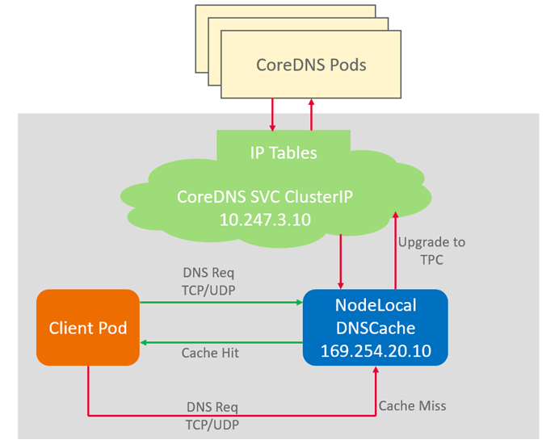

# 使用NodeLocal DNSCache提升DNS性能<a name="cce_01_0362"></a>

## 应用现状<a name="section1374833194817"></a>

集群在做DNS解析时，如果请求量大，那CoreDNS将承受压力，会有如下影响。

-   查询变慢，影响业务性能。
-   为保证性能，CoreDNS需要更高规格的配置。

## 解决方案<a name="section184982553516"></a>

NodeLocal DNSCache 通过在集群节点上运行 DNS缓存代理来提高集群 DNS 性能。

启用NodeLocal DNSCache之后，DNS查询所遵循的路径如下图所示。

**图 1**  NodeLocal DNSCache查询路径<a name="fig36421622164815"></a>  


## 约束与限制<a name="section14526182184014"></a>

本文方法暂时仅适用CCE集群。CCE Turbo集群方法后续提供。

## 安装NodeLocal DNSCache<a name="section11787193017350"></a>

NodeLocal DNSCache定义地址为[https://github.com/kubernetes/kubernetes/blob/master/cluster/addons/dns/nodelocaldns/nodelocaldns.yaml](https://github.com/kubernetes/kubernetes/blob/master/cluster/addons/dns/nodelocaldns/nodelocaldns.yaml)

该文件包含如下几个资源：

-   名为node-local-dns的ServiceAccount
-   名为kube-dns-upstream的Service
-   名为node-local-dns的ConfigMap
-   名为node-local-dns的DaemonSet

其中几个关键字段的含义：

-   \_\_PILLAR\_\_DNS\_\_SERVER\_\_ ：表示 coredns 这个 Service 的 ClusterIP，可以通过命令 kubectl get svc -n kube-system -l k8s-app=coredns -o jsonpath='\{$.items\[\*\].spec.clusterIP\}' 获取，一般是10.247.3.10
-   \_\_PILLAR\_\_LOCAL\_\_DNS\_\_：表示 DNSCache 本地的 IP，默认为 169.254.20.10
-   \_\_PILLAR\_\_DNS\_\_DOMAIN\_\_：表示集群域，默认就是 cluster.local
-   \_\_PILLAR\_\_CLUSTER\_\_DNS\_\_: 表示集群内查询的上游服务器
-   \_\_PILLAR\_\_UPSTREAM\_\_SERVERS\_\_: 表示为外部查询的上游服务器

在CCE中安装需要做如下修改：

1.  由于CCE中使用CoreDNS而非kube-dns，所以这里名为kube-dns-upstream的service可以删除。
2.  iptables模式按如下命令替换

    ```
    sed 's/__PILLAR__DNS__SERVER__/10.247.3.10/g
      s/__PILLAR__LOCAL__DNS__/169.254.20.10/g
      s/__PILLAR__DNS__DOMAIN__/cluster.local/g' nodelocaldns.yaml
    ```

3.  IPVS模式下按如下命令替换

    ```
    sed 's/__PILLAR__CLUSTER__DNS__/10.247.3.10/g
      s/__PILLAR__LOCAL__DNS__/169.254.20.10/g
      s/[ |,]__PILLAR__DNS__SERVER__//g
      s/__PILLAR__DNS__DOMAIN__/cluster.local/g' nodelocaldns.yaml
    ```

4.  daemonset启动命令替换如下。

    _args: \[ "-localip", "169.254.20.10", "-conf", "/etc/Corefile", "-upstreamsvc", "coredns" \]_

5.  添加CCE默认的imagePullSecrets。
6.  国内Region无法拉取 k8s.gcr.io/dns/k8s-dns-node-cache:1.17.0 的镜像，建议现在海外region（如新加坡）拉取后再上传到SWR，然后修改YAML中镜像地址。

iptables模式下修改后完整的YAML内容如下：

```
apiVersion: v1
kind: ServiceAccount
metadata:
  name: node-local-dns
  namespace: kube-system
  labels:
    kubernetes.io/cluster-service: "true"
    addonmanager.kubernetes.io/mode: Reconcile
---
apiVersion: v1
kind: ConfigMap
metadata:
  name: node-local-dns
  namespace: kube-system
  labels:
    addonmanager.kubernetes.io/mode: Reconcile
data:
  Corefile: |
    __PILLAR__DNS__DOMAIN__:53 {
        errors
        cache {
                success 9984 30
                denial 9984 5
        }
        reload
        loop
        bind __PILLAR__LOCAL__DNS__ __PILLAR__DNS__SERVER__
        forward . __PILLAR__CLUSTER__DNS__ {
                force_tcp
        }
        prometheus :9253
        health __PILLAR__LOCAL__DNS__:8080
        }
    in-addr.arpa:53 {
        errors
        cache 30
        reload
        loop
        bind __PILLAR__LOCAL__DNS__ __PILLAR__DNS__SERVER__
        forward . __PILLAR__CLUSTER__DNS__ {
                force_tcp
        }
        prometheus :9253
        }
    ip6.arpa:53 {
        errors
        cache 30
        reload
        loop
        bind __PILLAR__LOCAL__DNS__ __PILLAR__DNS__SERVER__
        forward . __PILLAR__CLUSTER__DNS__ {
                force_tcp
        }
        prometheus :9253
        }
    .:53 {
        errors
        cache 30
        reload
        loop
        bind __PILLAR__LOCAL__DNS__ __PILLAR__DNS__SERVER__
        forward . __PILLAR__UPSTREAM__SERVERS__
        prometheus :9253
        }
---
apiVersion: apps/v1
kind: DaemonSet
metadata:
  name: node-local-dns
  namespace: kube-system
  labels:
    k8s-app: node-local-dns
    kubernetes.io/cluster-service: "true"
    addonmanager.kubernetes.io/mode: Reconcile
spec:
  updateStrategy:
    rollingUpdate:
      maxUnavailable: 10%
  selector:
    matchLabels:
      k8s-app: node-local-dns
  template:
    metadata:
      labels:
        k8s-app: node-local-dns
      annotations:
        prometheus.io/port: "9253"
        prometheus.io/scrape: "true"
    spec:
      imagePullSecrets:
      - name: default-secret
      priorityClassName: system-node-critical
      serviceAccountName: node-local-dns
      hostNetwork: true
      dnsPolicy: Default  # Don't use cluster DNS.
      tolerations:
      - key: "CriticalAddonsOnly"
        operator: "Exists"
      - effect: "NoExecute"
        operator: "Exists"
      - effect: "NoSchedule"
        operator: "Exists"
      containers:
      - name: node-cache
        image: k8s.gcr.io/dns/k8s-dns-node-cache:1.17.0
        resources:
          requests:
            cpu: 25m
            memory: 5Mi
        args: [ "-localip", "169.254.20.10", "-conf", "/etc/Corefile", "-upstreamsvc", "coredns" ]
        securityContext:
          privileged: true
        ports:
        - containerPort: 53
          name: dns
          protocol: UDP
        - containerPort: 53
          name: dns-tcp
          protocol: TCP
        - containerPort: 9253
          name: metrics
          protocol: TCP
        livenessProbe:
          httpGet:
            host: __PILLAR__LOCAL__DNS__
            path: /health
            port: 8080
          initialDelaySeconds: 60
          timeoutSeconds: 5
        volumeMounts:
        - mountPath: /run/xtables.lock
          name: xtables-lock
          readOnly: false
        - name: config-volume
          mountPath: /etc/coredns
        - name: kube-dns-config
          mountPath: /etc/kube-dns
      volumes:
      - name: xtables-lock
        hostPath:
          path: /run/xtables.lock
          type: FileOrCreate
      - name: kube-dns-config
        configMap:
          name: kube-dns
          optional: true
      - name: config-volume
        configMap:
          name: node-local-dns
          items:
            - key: Corefile
              path: Corefile.base
---
apiVersion: v1
kind: Service
metadata:
  annotations:
    prometheus.io/port: "9253"
    prometheus.io/scrape: "true"
  labels:
    k8s-app: node-local-dns
  name: node-local-dns
  namespace: kube-system
spec:
  clusterIP: None
  ports:
    - name: metrics
      port: 9253
      targetPort: 9253
  selector:
    k8s-app: node-local-dns
```

IPVS模式下修改后完整的YAML内容如下：

```
apiVersion: v1
kind: ServiceAccount
metadata:
  name: node-local-dns
  namespace: kube-system
  labels:
    kubernetes.io/cluster-service: "true"
    addonmanager.kubernetes.io/mode: Reconcile
---
apiVersion: v1
kind: ConfigMap
metadata:
  name: node-local-dns
  namespace: kube-system
  labels:
    addonmanager.kubernetes.io/mode: Reconcile
data:
  Corefile: |
    cluster.local:53 {
        errors
        cache {
                success 9984 30
                denial 9984 5
        }
        reload
        loop
        bind 169.254.20.10 
        forward . 10.247.3.10 {
                force_tcp
        }
        prometheus :9253
        health 169.254.20.10:8080
        }
    in-addr.arpa:53 {
        errors
        cache 30
        reload
        loop
        bind 169.254.20.10 
        forward . 10.247.3.10 {
                force_tcp
        }
        prometheus :9253
        }
    ip6.arpa:53 {
        errors
        cache 30
        reload
        loop
        bind 169.254.20.10 
        forward . 10.247.3.10 {
                force_tcp
        }
        prometheus :9253
        }
    .:53 {
        errors
        cache 30
        reload
        loop
        bind 169.254.20.10 
        forward . __PILLAR__UPSTREAM__SERVERS__
        prometheus :9253
        }
---
apiVersion: apps/v1
kind: DaemonSet
metadata:
  name: node-local-dns
  namespace: kube-system
  labels:
    k8s-app: node-local-dns
    kubernetes.io/cluster-service: "true"
    addonmanager.kubernetes.io/mode: Reconcile
spec:
  updateStrategy:
    rollingUpdate:
      maxUnavailable: 10%
  selector:
    matchLabels:
      k8s-app: node-local-dns
  template:
    metadata:
      labels:
        k8s-app: node-local-dns
      annotations:
        prometheus.io/port: "9253"
        prometheus.io/scrape: "true"
    spec:
      imagePullSecrets:
      - name: default-secret
      priorityClassName: system-node-critical
      serviceAccountName: node-local-dns
      hostNetwork: true
      dnsPolicy: Default  # Don't use cluster DNS.
      tolerations:
      - key: "CriticalAddonsOnly"
        operator: "Exists"
      - effect: "NoExecute"
        operator: "Exists"
      - effect: "NoSchedule"
        operator: "Exists"
      containers:
      - name: node-cache
        image: k8s.gcr.io/dns/k8s-dns-node-cache:1.17.0
        resources:
          requests:
            cpu: 25m
            memory: 5Mi
        args: [ "-localip", "169.254.20.10", "-conf", "/etc/Corefile", "-upstreamsvc", "coredns" ]
        securityContext:
          privileged: true
        ports:
        - containerPort: 53
          name: dns
          protocol: UDP
        - containerPort: 53
          name: dns-tcp
          protocol: TCP
        - containerPort: 9253
          name: metrics
          protocol: TCP
        livenessProbe:
          httpGet:
            host: 169.254.20.10
            path: /health
            port: 8080
          initialDelaySeconds: 60
          timeoutSeconds: 5
        volumeMounts:
        - mountPath: /run/xtables.lock
          name: xtables-lock
          readOnly: false
        - name: config-volume
          mountPath: /etc/coredns
        - name: kube-dns-config
          mountPath: /etc/kube-dns
      volumes:
      - name: xtables-lock
        hostPath:
          path: /run/xtables.lock
          type: FileOrCreate
      - name: kube-dns-config
        configMap:
          name: kube-dns
          optional: true
      - name: config-volume
        configMap:
          name: node-local-dns
          items:
            - key: Corefile
              path: Corefile.base
---
# A headless service is a service with a service IP but instead of load-balancing it will return the IPs of our associated Pods.
# We use this to expose metrics to Prometheus.
apiVersion: v1
kind: Service
metadata:
  annotations:
    prometheus.io/port: "9253"
    prometheus.io/scrape: "true"
  labels:
    k8s-app: node-local-dns
  name: node-local-dns
  namespace: kube-system
spec:
  clusterIP: None
  ports:
    - name: metrics
      port: 9253
      targetPort: 9253
  selector:
    k8s-app: node-local-dns
```

## 配置验证<a name="section7827141432013"></a>

创建一个Pod，将dnsconfig配置为169.254.20.10。

```
apiVersion: v1
kind: Pod
metadata:
  name: nginx
spec:
  containers:
  - image: nginx:alpine
    name: container-0
  dnsConfig:
    nameservers:
    - 169.254.20.10
    searches:
    - default.svc.cluster.local
    - svc.cluster.local
    - cluster.local
    options:
    - name: ndots
      value: '2'
  imagePullSecrets:
  - name: default-secret
```

进入容器，访问外部域名或内部Service域名，如果能正常访问，则说明NodeLocal DNSCache连接了CoreDNS，访问域名正常。

```
# kubectl exec nginx -it -- /bin/sh
/ # ping www.baidu.com
PING www.baidu.com (110.242.68.3): 56 data bytes
64 bytes from 110.242.68.3: seq=0 ttl=45 time=10.911 ms
64 bytes from 110.242.68.3: seq=1 ttl=45 time=10.908 ms
64 bytes from 110.242.68.3: seq=2 ttl=45 time=10.960 ms
......
/ # curl hello.default.svc.cluster.local:80
hello world
```

