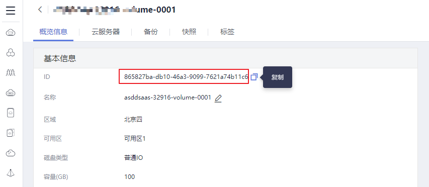

# 使用已有的EVS创建PVC<a name="cce_01_0256"></a>

CCE支持使用已有的EVS云硬盘创建PersistentVolume。创建成功后，通过创建相应的PersistentVolumeClaim绑定当前PersistentVolume使用。

1.  登录EVS控制台，创建一个EVS云硬盘，记录云硬盘的VolumeID、容量和磁盘类型。
2.  请参见[通过kubectl或web-terminal插件连接CCE集群](通过kubectl或web-terminal插件连接CCE集群.md)配置kubectl命令。
3.  新建一个yaml文件，用于创建PersistentVolume，假设文件名为**pv-evs-example.yaml**。

    **touch pv-evs-example.yaml**

    **vi pv-evs-example.yaml**

    -   **1.15及以上版本的集群，yaml文件配置示例如下：**

        ```
        apiVersion: v1
        kind: PersistentVolume
        metadata:
          labels:
            failure-domain.beta.kubernetes.io/region: cn-north-7
            failure-domain.beta.kubernetes.io/zone: cn-north-7b
          annotations:
            pv.kubernetes.io/provisioned-by: everest-csi-provisioner
          name: pv-evs-example
        spec:
          accessModes:
          - ReadWriteOnce
          capacity:
            storage: 10Gi
          csi:
            driver: disk.csi.everest.io
            fsType: ext4
            volumeAttributes:
              everest.io/disk-mode: SCSI
              everest.io/disk-volume-type: SATA
              storage.kubernetes.io/csiProvisionerIdentity: everest-csi-provisioner
            volumeHandle: 0992dbda-6340-470e-a74e-4f0db288ed82
          persistentVolumeReclaimPolicy: Delete
          storageClassName: csi-disk
        ```

        其中：

        -   failure-domain.beta.kubernetes.io/region：云硬盘所在region。
        -   failure-domain.beta.kubernetes.io/zone：云硬盘所在可用区，必须和工作负载规划的节点可用区保持一致。具体请参见[地区和终端节点](https://developer.huaweicloud.com/endpoint)。
        -   driver：挂载依赖的存储驱动，EVS云硬盘配置为“disk.csi.everest.io”。
        -   volumeHandle：云硬盘的volumeID。

            获取方法：在CCE控制台中，单击左侧栏目树中的“资源管理-存储管理“，在“云硬盘存储卷“页签下单击PVC的名称，在PVC详情页中复制“PVC UID“后的内容即可。

        -   everest.io/disk-mode：云硬盘磁盘模式，取值支持SCSI。
        -   storage：云硬盘的容量，单位为Gi。
        -   everest.io/disk-volume-type：云硬盘类型，当前支持高I/O（SAS）、超高I/O（SSD）和普通I/O（SATA）。
        -   storageClassName：存储卷动态供应关联的k8s storage class名称；云硬盘需使用“csi-disk”。

    -   **1.11.7以上以及1.13版本集群，yaml文件配置示例如下：**

        ```
        apiVersion: v1 
        kind: PersistentVolume 
        metadata: 
          labels: 
            failure-domain.beta.kubernetes.io/region: cn-north-4
            failure-domain.beta.kubernetes.io/zone:  cn-north-4a
          annotations:
            pv.kubernetes.io/provisioned-by: flexvolume-huawei.com/fuxivol
          name: pv-evs-example 
        spec: 
          accessModes: 
          - ReadWriteMany 
          capacity: 
            storage: 10Gi 
          flexVolume: 
            driver: huawei.com/fuxivol 
            fsType: ext4 
            options:
              disk-mode: SCSI
              fsType: ext4 
              volumeID: 0992dbda-6340-470e-a74e-4f0db288ed82 
          persistentVolumeReclaimPolicy: Delete 
          storageClassName: sata
        ```

        其中：

        -   failure-domain.beta.kubernetes.io/region：云硬盘所在region。
        -   failure-domain.beta.kubernetes.io/zone：云硬盘所在可用区，必须和工作负载规划的节点可用区保持一致。具体请参见[地区和终端节点](https://developer.huaweicloud.com/endpoint)。
        -   driver：挂载依赖的存储驱动，EVS云硬盘配置为“huawei.com/fuxivol”。
        -   volumeID：云硬盘的volumeID。

            获取方法：在CCE控制台中，单击左侧栏目树中的“资源管理-存储管理“，在“云硬盘存储卷“页签下单击PVC的名称，在PVC详情页中复制“PVC UID“后的内容即可。

        -   disk-mode：云硬盘磁盘模式，取值可以是VBD和SCSI。v1.11.7之前的CCE集群，该字段无需填写，默认都是VBD。CCE v1.11.7+以及v1.13的Linux x86混合集群要求该字段值必须存在，且基于PVC触发动态创建的都是EVS SCSI模式的卷，因此这里静态PV形式优先选用SCSI模式的云硬盘；同时支持升级后的老集群中VBD卷能够继续正常使用。
        -   storage：云硬盘的容量，单位为Gi。
        -   storageClassName：云硬盘类型，当前支持高I/O（sas）、超高I/O（ssd）和普通I/O（sata）。

    -   **1.11.7之前的1.11版本集群，yaml文件配置示例如下：**

        ```
        apiVersion: v1 
        kind: PersistentVolume 
        metadata: 
          labels: 
            failure-domain.beta.kubernetes.io/region: cn-north-4
            failure-domain.beta.kubernetes.io/zone:  cn-north-4a
          name: pv-evs-example 
        spec: 
          accessModes: 
          - ReadWriteMany 
          capacity: 
            storage: 10Gi 
          flexVolume: 
            driver: huawei.com/fuxivol 
            fsType: ext4 
            options:
              fsType: ext4 
              volumeID: 0992dbda-6340-470e-a74e-4f0db288ed82 
          persistentVolumeReclaimPolicy: Delete 
          storageClassName: sata
        ```

        其中：

        -   failure-domain.beta.kubernetes.io/region：云硬盘所在region。
        -   failure-domain.beta.kubernetes.io/zone：云硬盘所在可用区，必须和工作负载规划的节点可用区保持一致。具体请参见[地区和终端节点](https://developer.huaweicloud.com/endpoint)。
        -   driver：挂载依赖的存储驱动，EVS云硬盘配置为“huawei.com/fuxivol”。
        -   volumeID：云硬盘的volumeID。

            获取方法：在CCE控制台中，单击左侧栏目树中的“资源管理-存储管理“，在“云硬盘存储卷“页签下单击PVC的名称，在PVC详情页中复制“PVC UID“后的内容即可。

        -   disk-mode：云硬盘磁盘模式，取值可以是VBD和SCSI。v1.11.7之前的CCE集群，该字段无需填写，默认都是VBD。CCE v1.11.7+以及v1.13的Linux x86混合集群要求该字段值必须存在，且基于PVC触发动态创建的都是EVS SCSI模式的卷，因此这里静态PV形式优先选用SCSI模式的云硬盘；同时支持升级后的老集群中VBD卷能够继续正常使用。
        -   storage：云硬盘的容量，单位为Gi。
        -   storageClassName：云硬盘类型，当前支持高I/O（sas）、超高I/O（ssd）和普通I/O（sata）。

    -   **1.9版本集群，yaml文件配置示例如下：**

        ```
        apiVersion: v1 
        kind: PersistentVolume 
        metadata: 
          labels: 
            failure-domain.beta.kubernetes.io/region: cn-north-4
            failure-domain.beta.kubernetes.io/zone:  cn-north-4a
          name: pv-evs-example 
          namespace: default 
        spec: 
          accessModes: 
          - ReadWriteMany 
          capacity: 
            storage: 10Gi 
          flexVolume: 
            driver: huawei.com/fuxivol 
            fsType: ext4 
            options: 
              fsType: ext4 
              kubernetes.io/namespace: default 
              volumeID: 0992dbda-6340-470e-a74e-4f0db288ed82 
          persistentVolumeReclaimPolicy: Delete 
          storageClassName: sata
        ```

        其中：

        -   failure-domain.beta.kubernetes.io/region：云硬盘所在region。
        -   failure-domain.beta.kubernetes.io/zone：云硬盘所在可用区，必须和工作负载规划的节点可用区保持一致。具体请参见[地区和终端节点](https://developer.huaweicloud.com/endpoint)。
        -   driver：挂载依赖的存储驱动，EVS云硬盘配置为“huawei.com/fuxivol”。
        -   volumeID：云硬盘的volumeID。

            获取方法：在CCE控制台中，单击左侧栏目树中的“资源管理-存储管理“，在“云硬盘存储卷“页签下单击PVC的名称，在PVC详情页中复制“PVC UID“后的内容即可。

        -   disk-mode：云硬盘磁盘模式，取值可以是VBD和SCSI。v1.11.7之前的CCE集群，该字段无需填写，默认都是VBD。CCE v1.11.7+以及v1.13的Linux x86混合集群要求该字段值必须存在，且基于PVC触发动态创建的都是EVS SCSI模式的卷，因此这里静态PV形式优先选用SCSI模式的云硬盘；同时支持升级后的老集群中VBD卷能够继续正常使用。
        -   storage：云硬盘的容量，单位为Gi。
        -   storageClassName：云硬盘类型，当前支持高I/O（sas）、超高I/O（ssd）和普通I/O（sata）。

4.  创建PV。

    **kubectl create -f pv-evs-example.yaml**

5.  （可选）增加集群关联的metadata，确保在删除节点或集群时避免删除已挂载的静态PV关联的EVS盘。

    > **注意：** 
    >若不执行本步骤或创建静态PV/PVC时没有执行过本步骤，请务必确保删除节点前，提前将静态PV关联的云硬盘从节点上卸载。

    1.  <a name="li6891526204113"></a>获取租户Token，详情请参见[获取用户Token](https://support.huaweicloud.com/api-cce/cce_02_0102.html)。
    2.  <a name="li17017349418"></a>获取EVS访问地址EVS\_ENDPOINT，详情请参见[区域和终端节点](https://developer.huaweicloud.com/endpoint?EVS)。

        

    3.  给EVS静态PV关联的EVS盘补充集群关联的metadata。

        ```
        curl -X POST ${EVS_ENDPOINT}/v2/${project_id}/volumes/${volume_id}/metadata --insecure \
            -d '{"metadata":{"cluster_id": "${cluster_id}", "namespace": "${pvc_namespace}"}}' \
            -H 'Accept:application/json' -H 'Content-Type:application/json;charset=utf8' \
            -H 'X-Auth-Token:${TOKEN}'
        ```

        其中：

        -   EVS\_ENDPOINT：EVS访问地址，配置为[b](#li17017349418)中获取的值。
        -   project\_id：项目ID，获取方法请参见[查看项目ID](https://support.huaweicloud.com/api-cce/cce_02_0341.html)。
        -   volume\_id：关联EVS盘的ID，配置为[2](使用kubectl创建云硬盘.md#li19947131075915)待创建静态PV中的volume\_id，也可在EVS控制台，单击待导入的云硬盘名称，在磁盘详情界面的“概览信息”中获取ID的值。

            **图 1**  获取磁盘ID<a name="fig186361614133614"></a>  
            

        -   cluster\_id：待创建EVS PV的集群ID。在CCE控制台中单击“资源管理 \> 集群管理”。单击待关联集群的名称，在集群详情页面，即可获取集群ID。

            **图 2**  获取cluster\_id<a name="fig3188153914187"></a>  
            

        -   pvc\_namespace：待绑定PVC的namespace名称。
        -   TOKEN：用户Token，配置为[a](#li6891526204113)中获取的值。

        例如，执行如下命令：

        ```
        curl -X POST https://evs.cn-north-4.myhuaweicloud.com:443/v2/060576866680d5762f52c0150e726aa7/volumes/69c9619d-174c-4c41-837e-31b892604e14/metadata --insecure \
            -d '{"metadata":{"cluster_id": "71e8277e-80c7-11ea-925c-0255ac100442", "namespace": "default"}}' \
            -H 'Accept:application/json' -H 'Content-Type:application/json;charset=utf8' \
            -H 'X-Auth-Token:MIIPe******IsIm1ldG
        ```

        请求执行完成后，执行如下命令，可查看EVS盘是否已关联集群的metadata。

        ```
        curl -X GET ${EVS_ENDPOINT}/v2/${project_id}/volumes/${volume_id}/metadata --insecure \
            -H 'X-Auth-Token:${TOKEN}'
        ```

        例如，执行如下命令：

        ```
        curl -X GET https://evs.cn-north-4.myhuaweicloud.com/v2/060576866680d5762f52c0150e726aa7/volumes/69c9619d-174c-4c41-837e-31b892604e14/metadata --insecure \
            -H 'X-Auth-Token:MIIPeAYJ***9t1c31ASaQ=='
        ```

        在回显中就可以看到该EVS盘当前的metadata。

        ```
        {
            "metadata": {
                "namespace": "default",
                "cluster_id": "71e8277e-80c7-11ea-925c-0255ac100442",
                "hw:passthrough": "true"
            }
        }
        ```

6.  创建一个yaml文件，用于创建PVC，假设文件名为**pvc-evs-example.yaml**。

    **touch pvc-evs-example.yaml**

    **vi pvc-evs-example.yaml**

    -   **1.15及以上版本的集群，yaml文件配置示例如下：**

        ```
        apiVersion: v1  
        kind: PersistentVolumeClaim
        metadata:
          labels:
            failure-domain.beta.kubernetes.io/region: cn-north-7
            failure-domain.beta.kubernetes.io/zone: cn-north-7b
          annotations:
            everest.io/disk-volume-type: SATA
            volume.beta.kubernetes.io/storage-provisioner: everest-csi-provisioner
          name: pvc-evs-example
          namespace: default
        spec:
          accessModes:
          - ReadWriteOnce
          resources:
            requests:
              storage: 10Gi
          volumeName:  pv-evs-example
          storageClassName: csi-disk
        ```

        其中：

        -   everest.io/disk-volume-type：云硬盘存储类型，支持SAS, SSD 和 SATA。必须和已有PV保持一致。
        -   failure-domain.beta.kubernetes.io/region：集群所在region。
        -   failure-domain.beta.kubernetes.io/zone：EVS云硬盘所在可用区，必须和工作负载规划的节点可用区保持一致。具体请参见[地区和终端节点](https://developer.huaweicloud.com/endpoint)。
        -   storage：PVC申请容量，必须和已有PV的storage大小保持一致。
        -   volumeName：PV的名称。
        -   storageClassName：指定k8s storage class名称；云硬盘需使用“csi-disk”。

    -   **1.11及1.13版本集群的yaml文件配置示例如下：**

        ```
        apiVersion: v1  
        kind: PersistentVolumeClaim  
        metadata:  
          annotations:  
            volume.beta.kubernetes.io/storage-class: sata
            volume.beta.kubernetes.io/storage-provisioner: flexvolume-huawei.com/fuxivol 
          labels: 
            failure-domain.beta.kubernetes.io/region: cn-north-4
            failure-domain.beta.kubernetes.io/zone: cn-north-4a     
          name: pvc-evs-example 
          namespace: default  
        spec:  
          accessModes:  
          - ReadWriteMany  
          resources:  
            requests:  
              storage: 10Gi
          volumeName: pv-evs-example
        ```

        其中：

        -   volume.beta.kubernetes.io/storage-class：存储类型，支持sas, ssd 和 sata。必须和已有PV保持一致。
        -   volume.beta.kubernetes.io/storage-provisioner：必须使用flexvolume-huawei.com/fuxivol。
        -   failure-domain.beta.kubernetes.io/region：集群所在region。
        -   failure-domain.beta.kubernetes.io/zone：EVS云硬盘所在可用区，必须和工作负载规划的节点可用区保持一致。具体请参见[地区和终端节点](https://developer.huaweicloud.com/endpoint)。
        -   storage：PVC申请容量，必须和已有PV的storage大小保持一致。
        -   volumeName：PV的名称。

    -   **1.9版本集群的yaml文件配置示例如下：**

        ```
        apiVersion: v1  
        kind: PersistentVolumeClaim  
        metadata:  
          annotations:  
            volume.beta.kubernetes.io/storage-class: sata
            volume.beta.kubernetes.io/storage-provisioner: flexvolume-huawei.com/fuxivol 
          labels: 
            failure-domain.beta.kubernetes.io/region: cn-north-4
            failure-domain.beta.kubernetes.io/zone: cn-north-4a
          name: pvc-evs-example 
          namespace: default  
        spec:  
          accessModes:  
          - ReadWriteMany  
          resources:  
            requests:  
              storage: 10Gi
          volumeName: pv-evs-example
          volumeNamespace: default
        ```

        其中：

        -   volume.beta.kubernetes.io/storage-class：存储类型，支持sas, ssd 和 sata。必须和已有PV保持一致。
        -   volume.beta.kubernetes.io/storage-provisioner：必须使用flexvolume-huawei.com/fuxivol。
        -   failure-domain.beta.kubernetes.io/region：集群所在region。
        -   failure-domain.beta.kubernetes.io/zone：EVS云硬盘所在可用区，必须和工作负载规划的节点可用区保持一致。具体请参见[地区和终端节点](https://developer.huaweicloud.com/endpoint)。
        -   storage：PVC申请容量，必须和已有PV的storage大小保持一致。
        -   volumeName：PV的名称。

7.  创建PVC。

    **kubectl create -f pvc-evs-example.yaml**

    执行成功后，可以在“资源管理 \> 存储管理”的云硬盘存储中查看创建的PVC，也可以在EVS页面根据名称查看EVS云硬盘。


