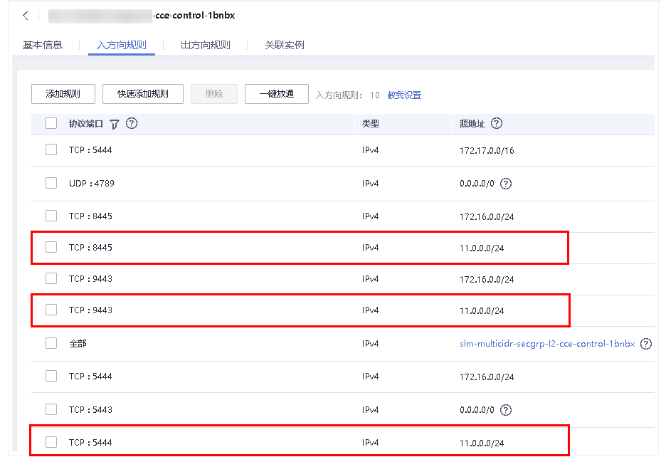

# 使用裸金属节点

CCE集群支持虚拟机与裸金属服务器混合部署场景及独立裸金属场景，您可以通过在已创建的CCE集群中增加裸金属节点，实现基于裸金属服务提供高计算和高网络性能的kubernetes容器集群。

-   [约束与限制](#section993065813412)
-   [前提条件](#section15394125210466)
-   [创建集群](#section463761220269)
-   [相关操作](#section826111591454)

## 约束与限制

**CCE集群中支持创建裸金属节点，需要满足以下条件：**

-   集群创建完成之后才可以添加裸金属节点。
-   网络模式选择“容器隧道网络“时，只能添加同一类型的节点，即全部为虚拟机节点或全部为裸金属节点，且集群版本需要选择v1.13.10或以上。
-   网络模式选择“VPC网络“时，支持同时管理虚拟机节点和裸金属节点，集群版本需要选择v1.11.7或以上。
-   集群为非IPv6模式。
-   节点计费模式为包年/包月。

## 前提条件

-   已创建至少一个集群，请参见[购买CCE集群](购买CCE集群.md)。
-   您需要新建一个密钥对，用于远程登录节点时的身份认证。

    若使用密码登录节点，请跳过此操作。创建方法请参见[创建密钥对](https://support.huaweicloud.com/usermanual-ecs/zh-cn_topic_0014250631.html)。

-   已购买裸金属服务，具体步骤请参见[创建裸金属服务器](https://support.huaweicloud.com/usermanual-bms/zh-cn_topic_0035100414.html)。
-   已创建高速网络，具体步骤请参见[这里](https://support.huaweicloud.com/usermanual-bms/zh-cn_topic_0053537013.html)。高速网络是“裸金属服务器（简称BMS）“的内部网络，为同一可用区内的BMS之间提供带宽不受限制的网络。

## 创建集群

1.  登录[CCE控制台](https://console.huaweicloud.com/cce2.0/?utm_source=helpcenter)，可通过如下两种方式进入“购买节点“页面：

    -   在左侧导航栏中选择“资源管理 \> 节点管理”，选择裸金属节点所在的集群后，在节点列表页面单击上方的“购买节点”按钮。

        **图 1**  购买节点-1  
        

    -   在左侧导航栏中选择“资源管理 \> 集群管理”，在集群列表页面单击需要添加裸金属节点集群下方的“购买节点”按钮。

        **图 2**  购买节点-2  
        

    在“购买节点“页面中，参照如下参数配置节点。

2.  计费模式：仅支持“包年/包月“类型。
3.  选择区域和可用区。
    -   **当前区域：**节点实例所在的物理位置。
    -   **可用区：**请根据业务需要进行选择。可用区是在同一区域下，电力、网络隔离的物理区域，可用区之间内网互通，不同可用区之间物理隔离。

        如果您需要提高工作负载的高可靠性，建议您在创建集群后将云服务器部署在不同的可用区，购买集群时节点只能部署在一个可用区。

        **图 3**  工作节点创建在不同可用区  
        

4.  配置节点规格。
    -   **节点类型：**选择“裸金属节点“。
    -   **节点名称：**自定义节点名称。长度范围为1-56个字符，以小写字母开头，支持小写字母、数字、中划线\(-\)，不能以中划线\(-\)结尾。

        创建后如需修改请参考[修改云服务器名称](https://support.huaweicloud.com/usermanual-ecs/ecs_03_0145.html)，修改后需要[同步节点信息](同步节点信息.md)。

    -   **节点规格：**请根据业务需求选择相应的裸金属节点规格，支持的机型规格请参见[约束与限制](#section993065813412)。

        **图 4**  选择节点规格  
        

        为确保节点稳定性，系统会自动预留部分资源，用于运行必须的系统组件。详细请参见[节点预留资源计算公式](节点预留资源计算公式.md)。

    -   **操作系统：**部分Region不显示下方分类，请直接选择节点对应的操作系统。

        -   公共镜像：请选择节点对应的操作系统。

            公共镜像是常见的标准操作系统镜像，所有用户可见，包括操作系统以及预装的公共应用，更多介绍请参见[公共镜像概述](https://support.huaweicloud.com/productdesc-ecs/ecs_01_0049.html)。

        -   私有镜像（公测中）：包含操作系统或业务数据、预装的公共应用以及用户的私有应用的镜像，仅用户个人可见。**该功能仅支持v1.15及以上版本集群。**

            若没有私有镜像可选择，请参照[如何使用私有镜像制作工作节点镜像？（公测）](https://support.huaweicloud.com/bestpractice-cce/cce_bestpractice_00026.html)进行制作。

        -   共享镜像：由其他用户共享而来的私有镜像。更多关于共享镜像的使用，请参见[共享镜像](https://support.huaweicloud.com/usermanual-ims/ims_01_0305.html)。

        重装操作系统或修改操作系统配置将导致节点不可用，请务必谨慎操作，具体请参见[高危操作及解决方案](高危操作及解决方案.md)。

    -   **系统盘：**设置工作节点的系统盘空间。您可以设置系统盘的规格为40GB-1024GB之间的数值，缺省值为40GB。

        在默认情况下，系统盘可提供高IO、超高IO两种基本的云硬盘类型，关于云硬盘的详细信息请参见[云硬盘概述](https://support.huaweicloud.com/usermanual-ecs/ecs_03_0301.html)。

        加密：数据盘加密功能可为您的数据提供强大的安全防护，加密磁盘生成的快照及通过这些快照创建的磁盘将自动继承加密功能。**目前仅在部分Region显示此选项，具体以界面为准。**

        -   默认不加密。
        -   点选“加密“后，可在弹出的“加密设置“对话框中，选择已有的密钥，若没有可选的密钥，请单击后方的链接创建新密钥，完成创建后单击刷新按钮。

    -   **数据盘：**设置工作节点的数据盘空间。您可以设置数据盘的规格为100GB-32678GB之间的数值，缺省值为100GB。数据盘可提供的云硬盘类型与系统盘一致，此处不再赘述，详情参见系统盘中的云硬盘类型介绍。

        > **注意：** 
        >若数据盘卸载或损坏，会导致docker服务异常，最终导致节点不可用。建议不要删除该数据盘。

        -   LVM管理：CCE数据盘使用LVM（Logical Volume Manager）进行磁盘管理，开启后您可以通过空间分配调整数据盘中不同资源的空间占比。第一块盘默认选中不可更改，新增数据盘后可开启或关闭该功能：
            -   默认选中，开启LVM管理。
            -   取消选中，关闭LVM管理。

                > **注意：** 
                >-   开启LVM管理的数据盘将按照设置的比例进行统一分配。
                >-   1.13.10及更高版本的集群创建节点时，若未开启LVM管理的数据盘，请参考[为CCE节点添加第二块数据盘](https://support.huaweicloud.com/bestpractice-cce/cce_bestpractice_00190.html)填写安装前执行脚本进行格式化，否则该数据盘仍会被LVM管理。
                >-   1.13.10之前版本的集群创建节点时，若未开启LVM管理的数据盘请务必格式化，否则会与第一块数据盘进行二选一被LVM管理，进而导致与预期不符的情况。

        -   加密：数据盘加密功能可为您的数据提供强大的安全防护，加密磁盘生成的快照及通过这些快照创建的磁盘将自动继承加密功能。**该功能仅在部分Region的1.13.10及以上版本的集群中支持，**1.13.10之前版本的集群不显示此选项。
            -   默认不加密。
            -   点选“加密“后，可在弹出的“加密设置“对话框中，选择已有的密钥，若没有可选的密钥，请单击后方的链接创建新密钥，完成创建后单击刷新按钮。

        -   新增数据盘：当前仅支持挂载两块数据盘，您可以在节点创建完成后前往ECS添加更多数据盘。
        -   数据盘空间分配：单击后方的，可以对数据盘中的“k8s空间“和“用户空间“占比进行自定义设置。
            -   k8s空间：您可以自定义数据盘中Docker和Kubelet的资源占比。Docker资源包含Docker工作目录、Docker镜像数据以及镜像元数据；Kubelet资源包含Pod配置文件、密钥以及临时存储EmptyDir等挂载数据。
            -   用户空间：定义本地盘中不分配给kubernetes使用的空间大小和用户空间挂载路径。

                > **说明：** 
                >请注意“挂载路径“不能设置为根目录“/”，否则将导致挂载失败。挂载路径一般设置为：
                >-   /opt/xxxx（但不能为/opt/cloud）
                >-   /mnt/xxxx（但不能为/mnt/paas）
                >-   /tmp/xxx
                >-   /var/xxx （但不能为/var/lib、/var/script、/var/paas等关键目录）
                >-   /xxxx（但不能和系统目录冲突，例如bin、lib、home、root、boot、dev、etc、lost+found、mnt、proc、sbin、srv、tmp、var、media、opt、selinux、sys、usr等）
                >注意不能设置为/home/paas、/var/paas、/var/lib、/var/script、/mnt/paas、/opt/cloud，否则会导致系统或节点安装失败。

    -   **虚拟私有云：**不可修改，仅用于展示当前集群所在的虚拟私有云，该参数仅在v1.13.10-r0及以上版本的集群中显示。
    -   **所在子网：**通过子网提供与其他网络隔离的、可以独享的网络资源，以提高网络安全。可选择该集群虚拟私有云下的任意子网，集群节点支持跨子网。

        该参数仅在v1.13.10-r0及以上版本的集群中显示，请务必**确保子网下的DNS服务器可以解析OBS服务域名**，否则无法创建节点。

        已有集群添加节点时，如果子网对应的VPC新增了扩展网段且子网是扩展网段，要在控制节点安全组（即集群名称-cce-control-随机数）中添加如下三条安全组规则，以保证集群添加的节点功能可用（新建集群时如果VPC已经新增了扩展网段则不涉及此场景）：

        

5.  **弹性IP：**独立申请的公网IP地址，若节点有互联网访问的需求，请选择“现在购买“或“使用已有“。**集群开启IPv6时，不显示该参数。**

    弹性公网IP提供外网访问能力，可以灵活绑定及解绑，随时修改带宽。未绑定弹性公网IP的云服务器无法直接访问外网，无法直接对外进行互相通信。详情请查看[弹性公网IP介绍](https://support.huaweicloud.com/usermanual-eip/eip_0007.html)。

    -   暂不使用：若新增节点未绑定弹性IP，则在该节点上运行的工作负载将不能被外网访问，仅可作为私有网络中部署业务或者集群所需云服务器进行使用。
    -   自动创建：选中后将根据您的配置购买弹性IP，并自动为每个节点进行分配。当购买的弹性IP数量小于节点个数时，会将弹性IP随机绑定到节点上。

        请根据业务需求和界面提示，选择弹性IP的规格、计费模式、带宽类型、带宽大小等。创建弹性云服务器时，请确保弹性IP配额充足。

    -   使用已有：请选择已有的弹性IP，将为当前节点分配已有弹性IP。

    > **说明：** 
    >CCE默认不启用VPC的SNAT。若VPC启用了SNAT，可以不使用EIP去访问外网。SNAT具体请参见[自定义策略](集群权限.md#section1437818291149)。

6.  **共享带宽：**请选择“暂不使用”或“使用已有”。**仅在集群开启IPv6时，显示该参数。**

    弹性公网IP提供外网访问能力，可以灵活绑定及解绑，随时修改带宽。未绑定弹性公网IP的云服务器无法直接访问外网，无法直接对外进行互相通信。

7.  **登录方式：**支持密码和密钥对。
    -   选择“密码“：用户名默认为“root”，请输入登录节点的密码，并确认密码。

        登录节点时需要使用该密码，请妥善管理密码，系统无法获取您设置的密码内容。

    -   选择“密钥对“：选择用于登录本节点的密钥对，支持选择共享密钥。

        密钥对用于远程登录节点时的身份认证。若没有密钥对，可单击选项框右侧的“创建密钥对”来新建，创建密钥对操作步骤请参见[创建密钥对](https://support.huaweicloud.com/usermanual-ecs/zh-cn_topic_0014250631.html)。

        > **须知：** 
        >如果子用户创建节点选择密钥对创建，这个密钥只对创建这个密钥的子用户有效，即使其他子用户在同一个组也无法选择，也无法使用。例如：A用户创建的密钥，B用户无法使用这个密钥对创建节点，并且Console也选不到。

        **图 5**  密钥对  
        

8.  **云服务器高级设置：**（可选），单击展开后可对节点进行如下高级功能配置：
    -   **资源标签：**通过为资源添加标签，可以对资源进行自定义标记，实现资源的分类。

        您可以在TMS中创建“预定义标签“，预定义标签对所有支持标签功能的服务资源可见，通过使用预定义标签可以提升标签创建和迁移效率。具体请参见[创建预定义标签](https://support.huaweicloud.com/usermanual-tms/zh-cn_topic_0144368884.html)。

        CCE服务会自动帮您创建CCE-Dynamic-Provisioning-Node=节点id的标签，允许增加5个标签。

    -   **安装前执行脚本：**请输入脚本命令，大小限制为0\~1000字符。

        脚本将在Kubernetes软件安装前执行，可能导致Kubernetes软件无法正常安装，需谨慎使用。常用于格式化数据盘等场景。

    -   **安装后执行脚本：**请输入脚本命令，大小限制为0\~1000字符。

        脚本将在Kubernetes软件安装后执行，不影响Kubernetes软件安装。常用于修改Docker配置参数等场景。

    -   **子网IP：**可选择“自动分配IP地址“和“手动分配IP地址“，推荐使用“自动分配IP地址“。

9.  **Kubernetes高级设置：**（可选），单击展开后可对集群进行如下高级功能配置：
    -   **最大实例数：**节点最大允许创建的实例数\(Pod\)，该数量包含系统默认实例，取值范围为16\~128。

        该设置的目的为防止节点因管理过多实例而负载过重，请根据您的业务需要进行设置。

    -   **单容器可用数据空间：**该参数用于设置一个容器可用的数据空间大小，设置范围10G到80G。如果设置的参数超过数据盘中Docker可占用的实际数据空间（由数据盘设置项中的资源分配自定义参数指定，默认为数据盘大小的90%），将以Docker的实际空间大小为主。该参数仅在v1.13.10-r0及以上版本的集群中显示。

10. **节点购买数量：**此处设置的节点数不能超过集群管理的最大节点规模，请根据业务需求和界面提示进行选择，单击后方的可查看影响能添加节点数的因素（取决于最小值）。如需申请更多配额，请单击[申请扩大配额](https://console.huaweicloud.com/quota/?locale=zh-cn#/quota)。
11. **购买时长：**若选择“包年包月“的计费模式购买节点时，请设置购买时长。
12. 单击“下一步：配置确认“，确认订单无误后，单击“提交“。

    若计费模式为“包年包月“，在确认订单无误后，请单击“去支付”，请根据界面提示进行付款。

    系统将自动跳转到节点列表页面，待节点状态为“可用“，表示节点添加成功。添加节点预计需要6-10分钟左右，请耐心等待。

    > **说明：** 
    >-   若创建节点时，提示弹性IP配额不足，请参照[如何解决新增节点时提示弹性IP不足的问题？](https://support.huaweicloud.com/cce_faq/cce_faq_00027.html)方法解决。
    >-   添加节点时会自动创建云服务器。若创建失败，该失败回滚过程会根据云服务器的统一收费策略来收取费用。若出现失败回滚类的收费，请到[费用中心](https://account.huaweicloud.com/usercenter/#/userindex/retreatManagement)执行退订操作。
    >-   集群创建时自动创建的安全组以及安全组规则禁止删除，否则会导致集群异常。

13. 单击“返回节点列表“，待状态为可用，表示节点创建成功。

## 相关操作

-   通过命令行工具连接集群：请参见[通过kubectl或web-terminal插件操作CCE集群](通过kubectl或web-terminal插件操作CCE集群.md)。
-   添加节点：集群创建完成后，若您需要为集群添加更多节点，请参见[购买节点](购买节点.md)。
-   登录节点：请参见[登录节点](登录节点.md)。

-   创建命名空间：同个集群内可创建多个命名空间，形成逻辑上的不同分组，便于不同的分组在共享使用集群资源时还能被分别管理。若您需要为集群创建命名空间，请参见[命名空间](命名空间.md)。
-   创建工作负载：集群创建完成后，您可以使用镜像创建一个可公网访问的应用，请参见[创建无状态负载\(Deployment\)](创建无状态负载(Deployment).md)或[创建有状态负载\(StatefulSet\)](创建有状态负载(StatefulSet).md)。
-   单击已成功创建的集群名称，进入“集群详情“页可查看集群详情。

    **表 1**  已创建的集群详情

    
    <table><thead align="left"><tr id="cce_01_0028_row1264365516359"><th class="cellrowborder" valign="top" width="20%" id="mcps1.2.3.1.1">
页签类别

    </th>
    <th class="cellrowborder" valign="top" width="80%" id="mcps1.2.3.1.2">
说明

    </th>
    </tr>
    </thead>
    <tbody><tr id="cce_01_0028_row5975069716956"><td class="cellrowborder" valign="top" width="20%" headers="mcps1.2.3.1.1 ">
集群详情

    </td>
    <td class="cellrowborder" valign="top" width="80%" headers="mcps1.2.3.1.2 ">
可查看该集群的详情及运行状态等。

    </td>
    </tr>
    <tr id="cce_01_0028_row106431055133510"><td class="cellrowborder" valign="top" width="20%" headers="mcps1.2.3.1.1 ">
监控

    </td>
    <td class="cellrowborder" valign="top" width="80%" headers="mcps1.2.3.1.2 ">
可查看集群下全部节点的CPU和内存分配率（即分配量的最大值），以及控制节点的CPU和内存使用率、控制节点规格等信息。

    </td>
    </tr>
    <tr id="cce_01_0028_row1464335593515"><td class="cellrowborder" valign="top" width="20%" headers="mcps1.2.3.1.1 ">
事件

    </td>
    <td class="cellrowborder" valign="top" width="80%" headers="mcps1.2.3.1.2 "><ul id="cce_01_0028_ul42186174161243"><li>可以直接在“事件”页签下查看集群的事件。</li><li>可以设置查询条件，比如设置事件产生的时间段或搜索事件名称，查看相关事件。</li></ul>
    </td>
    </tr>
    <tr id="cce_01_0028_row506129238"><td class="cellrowborder" valign="top" width="20%" headers="mcps1.2.3.1.1 ">
弹性扩容

    </td>
    <td class="cellrowborder" valign="top" width="80%" headers="mcps1.2.3.1.2 ">
您可以根据实际业务需要对集群的工作节点进行扩容和缩容，详情请参见<a href="集群弹性扩容.md">集群弹性扩容</a>。

    
v1.17版本的集群不再支持AOM提供的弹性伸缩机制，请使用节点池功能进行弹性伸缩，详情请参见<a href="节点池概述.md">节点池概述</a>。

    </td>
    </tr>
    <tr id="cce_01_0028_row651036112414"><td class="cellrowborder" valign="top" width="20%" headers="mcps1.2.3.1.1 ">
kubectl

    </td>
    <td class="cellrowborder" valign="top" width="80%" headers="mcps1.2.3.1.2 ">
若您需要从客户端计算机连接到kubernetes集群，请使用kubernetes命令行客户端<a href="https://kubernetes.io/docs/user-guide/kubectl/" target="_blank" rel="noopener noreferrer">kubectl</a>，详情请参见<a href="通过kubectl或web-terminal插件操作CCE集群.md">通过kubectl或web-terminal插件操作CCE集群</a>。

    </td>
    </tr>
    <tr id="cce_01_0028_row1442823812251"><td class="cellrowborder" valign="top" width="20%" headers="mcps1.2.3.1.1 ">
资源标签

    </td>
    <td class="cellrowborder" valign="top" width="80%" headers="mcps1.2.3.1.2 ">
通过为资源添加标签，可以对资源进行自定义标记，实现资源的分类。

    
您可以在TMS中创建“预定义标签”，预定义标签对所有支持标签功能的服务资源可见，通过使用预定义标签可以提升标签创建和迁移效率。具体请参见<a href="https://support.huaweicloud.com/usermanual-tms/zh-cn_topic_0144368884.html" target="_blank" rel="noopener noreferrer">创建预定义标签</a>。

    
CCE服务会自动帮您创建CCE-Dynamic-Provisioning-Node=节点id的标签，允许增加5个标签。

    </td>
    </tr>
    <tr id="cce_01_0028_row2701721182419"><td class="cellrowborder" valign="top" width="20%" headers="mcps1.2.3.1.1 ">
Istioctl

    </td>
    <td class="cellrowborder" valign="top" width="80%" headers="mcps1.2.3.1.2 ">
在集群开启istio服务网格功能后，您使用Istio命令行工具Istioctl配置多种路由策略，从而管理服务流量，包括流量转移、故障注入、限流熔断等。详情请参见<a href="通过Istioctl配置路由策略.md">通过Istioctl配置路由策略</a>。

    </td>
    </tr>
    </tbody>
    </table>

