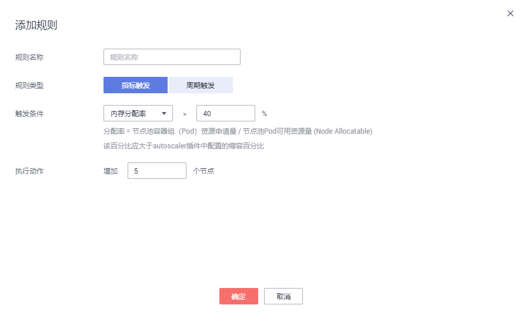
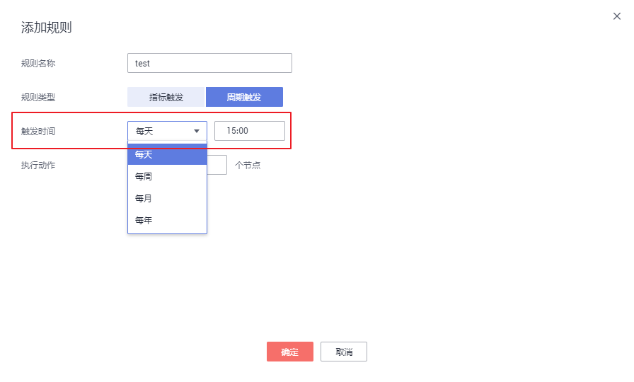
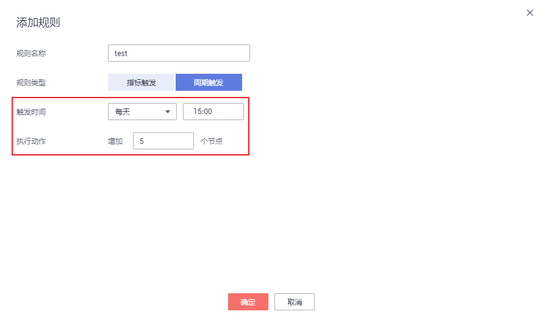

# 创建节点伸缩策略<a name="cce_01_0209"></a>

CCE的自动伸缩能力是通过节点自动伸缩组件[autoscaler](autoscaler.md)实现的，可以按需弹出节点实例，支持多可用区、多实例规格、多种伸缩模式，满足不同的节点伸缩场景。

当节点伸缩中创建的策略和autoscaler插件中的配置同时生效时（比如不可调度和指标规则同时满足时），将优先执行不可调度扩容。

-   若不可调度执行成功，则会跳过指标规则逻辑，进入下一次循环。
-   若不可调度执行失败，将执行指标规则逻辑。

## 前提条件<a name="section194973810277"></a>

使用节点伸缩功能前，需要安装[autoscaler](autoscaler.md)插件，插件版本要求1.13.8及以上。

## 操作步骤<a name="section4444195220142"></a>

1.  在CCE控制台中，单击左侧导航栏的“弹性伸缩“，在“节点伸缩“页签下，单击“创建节点伸缩策略“按钮。
2.  进入创建节点伸缩策略页面，在“插件检测“步骤中：
    -   若插件名称后方显示，请单击插件后方的“现在安装“按钮，根据业务需求配置插件参数后单击“立即安装“，等待插件安装完成。
    -   若插件名称后方显示，则说明插件已安装成功。

3.  确认插件已安装成功后，单击“下一步：策略配置“。

    > **说明：** 
    >如果插件已提前安装成功，单击“创建节点伸缩策略”按钮后，在“插件检测“步骤中经过短暂检测后将直接进入“策略配置“步骤。

4.  在打开的“创建节点伸缩策略“页面中，参照如下参数设置策略。
    -   策略名称：新建策略的名称，请自定义。
    -   关联节点池：请单击“添加节点池“后选择要操作的节点池。您可以关联多个节点池，以使用相同的伸缩策略。

        > **说明：** 
        >节点池新增了优先级功能，弹性扩容时CCE将按照如下策略来选择节点池进行扩容：
        >1.  通过预判算法判断节点池是否能满足让Pending的Pod正常调度的条件，包括节点资源大于Pod的request值、nodeSelect、nodeAffinity和taints等是否满足Pod正常调度的条件；另外还会过滤掉扩容失败（因为资源不足等原因）还处于15min冷却时间的节点池。
        >2.  有多个节点池满足条件时，判断节点池设置的优先级（优先级默认值为0，取值范围为0-100，其中100为最高，0为最低），选择优先级最高的节点池扩容。
        >3.  如果有多个节点池处于相同的优先级，或者都没有配置优先级时，通过最小浪费原则，根据节点池里设置的虚拟机规格，计算刚好能满足Pending的Pod正常调度，且浪费资源最少的节点池。
        >4.  如果还是有多个节点池的虚拟机规格都一样，只是AZ不同，那么会随机选择其中一个节点池触发扩容。
        >5.  如果出现优先选择的节点池资源不足，会按照优先级顺序自动选择下一个节点池。
        >节点池优先级功能详情请参见[弹性扩缩容](创建节点池.md#li153215432027)。

    -   执行规则：单击“添加规则“，在弹出的添加规则窗口中设置如下参数：

        **规则名称：**请输入规则名称，可自定义。

        **规则类型：**可选择“指标触发“或“周期触发“，两种类型区别如下：

        -   **指标触发：**
            -   触发条件：请选择“CPU分配率“或“内存分配率“，输入百分比的值。该百分比应大于autoscaler插件中配置的缩容百分比。

                > **说明：** 
                >-   分配率 = 节点池容器组（Pod）资源申请量 / 节点池Pod可用资源量 \(Node Allocatable\) 。
                >-   **如果多条规则同时满足条件，会有如下两种执行的情况：**
                >    如果同时配置了“CPU分配率“和“内存分配率“的规则，两种或多种规则同时满足扩容条件时，执行扩容节点数更多的规则。
                >    如果同时配置了“CPU分配率“和“周期触发“的规则，当达到“周期触发“的时间值时CPU也满足扩容条件时，较早执行的A规则会将节点池状态置为伸缩中状态，导致B规则无法正常执行。待A规则执行完毕，节点池状态恢复正常后，B规则也不会执行。
                >-   配置了“CPU分配率“和“内存分配率“的规则后，策略的检测周期会因autoscaler每次循环的处理逻辑而变动。只要一次检测出满足条件就会触发扩容（当然还要满足冷却时间、节点池状态等约束条件）。

            -   执行动作：与上述“触发条件“相对应，达到触发条件值后所要执行的动作。如[图1](#fig8972202013283)中所示，当内存分配率超过40%时将增加5个节点。

                **图 1**  指标触发-执行动作<a name="fig8972202013283"></a>  
                

        -   **周期触发：**
            -   触发时间：可选择每天、每周、每月或每年的具体时间点，如[图2](#fig997262013281)所示，则为每天15:00触发。

                **图 2**  周期触发时间<a name="fig997262013281"></a>  
                

            -   执行动作：与上述“触发时间“相对应，达到触发时间值后所要执行的动作。如[图3](#fig1697214203288)中所示，即每天15:00时将执行增加5个节点的动作。

                **图 3**  定时触发-执行动作<a name="fig1697214203288"></a>  
                


        您可以单击“添加规则“，设置多条节点伸缩策略。您最多可以添加1条CPU使用率指标规则、1条内存使用率指标规则，且规则总数小于等于10条。

5.  设置完成后，单击“创建“，在“完成“步骤中若显示“创建节点伸缩策略\*\*\*任务提交成功“，可单击“返回节点策略“。
6.  在“节点伸缩“页签下，可以看到刚创建的节点伸缩策略。

    **图 4**  节点伸缩策略<a name="fig196162491011"></a>  
    


## 缩容说明<a name="section1713483143810"></a>

节点伸缩策略中不能直接设置缩容策略，你可以在安装[autoscaler插件](autoscaler.md)时进行设置。

节点缩容仅支持资源分配率缩容机制，当集群下CPU和内存分配率低于您设置的门限（在安装/编辑autoscaler插件时设置）时将对节点池下节点启动缩容（该功能可以关闭），如[图5](#fig9643195391116)。

**图 5**  自动缩容设置<a name="fig9643195391116"></a>  


## Yaml样例<a name="section3613595209"></a>

节点伸缩策略Yaml样例如下：

```
apiVersion: autoscaling.cce.io/v1alpha1
kind: HorizontalNodeAutoscaler
metadata:
  creationTimestamp: "2020-02-13T12:47:49Z"
  generation: 1
  name: xxxx
  namespace: kube-system
  resourceVersion: "11433270"
  selfLink: /apis/autoscaling.cce.io/v1alpha1/namespaces/kube-system/horizontalnodeautoscalers/xxxx
  uid: c2bd1e1d-60aa-47b5-938c-6bf3fadbe91f
spec:
  disable: false
  rules:
  - action:
      type: ScaleUp
      unit: Node
      value: 1
    cronTrigger:
      schedule: 47 20 * * *
    disable: false
    ruleName: cronrule
    type: Cron
  - action:
      type: ScaleUp
      unit: Node
      value: 2
    disable: false
    metricTrigger:
      metricName: Cpu
      metricOperation: '>'
      metricValue: "40"
      unit: Percent
    ruleName: metricrule
    type: Metric
  targetNodepoolIds:
  - 7d48eca7-3419-11ea-bc29-0255ac1001a8
```

**表 1**  关键参数说明

<a name="table18763092201"></a>
<table><thead align="left"><tr id="row12761209132012"><th class="cellrowborder" valign="top" width="39.43394339433943%" id="mcps1.2.4.1.1"><p id="p10761892207"><a name="p10761892207"></a><a name="p10761892207"></a>参数</p>
</th>
<th class="cellrowborder" valign="top" width="16.121612161216124%" id="mcps1.2.4.1.2"><p id="p07611972013"><a name="p07611972013"></a><a name="p07611972013"></a>参数类型</p>
</th>
<th class="cellrowborder" valign="top" width="44.44444444444445%" id="mcps1.2.4.1.3"><p id="p2761179192020"><a name="p2761179192020"></a><a name="p2761179192020"></a>描述</p>
</th>
</tr>
</thead>
<tbody><tr id="row876119932015"><td class="cellrowborder" valign="top" width="39.43394339433943%" headers="mcps1.2.4.1.1 "><p id="p157612932014"><a name="p157612932014"></a><a name="p157612932014"></a>spec.disable</p>
</td>
<td class="cellrowborder" valign="top" width="16.121612161216124%" headers="mcps1.2.4.1.2 "><p id="p187611398202"><a name="p187611398202"></a><a name="p187611398202"></a>Bool</p>
</td>
<td class="cellrowborder" valign="top" width="44.44444444444445%" headers="mcps1.2.4.1.3 "><p id="p1476115922010"><a name="p1476115922010"></a><a name="p1476115922010"></a>伸缩策略开关，会对策略中的所有规则生效</p>
</td>
</tr>
<tr id="row18761199152019"><td class="cellrowborder" valign="top" width="39.43394339433943%" headers="mcps1.2.4.1.1 "><p id="p1076179202019"><a name="p1076179202019"></a><a name="p1076179202019"></a>spec.rules</p>
</td>
<td class="cellrowborder" valign="top" width="16.121612161216124%" headers="mcps1.2.4.1.2 "><p id="p1176199132018"><a name="p1176199132018"></a><a name="p1176199132018"></a>Array</p>
</td>
<td class="cellrowborder" valign="top" width="44.44444444444445%" headers="mcps1.2.4.1.3 "><p id="p4761209152012"><a name="p4761209152012"></a><a name="p4761209152012"></a>伸缩策略中的所有规则</p>
</td>
</tr>
<tr id="row1876119912207"><td class="cellrowborder" valign="top" width="39.43394339433943%" headers="mcps1.2.4.1.1 "><p id="p976116910202"><a name="p976116910202"></a><a name="p976116910202"></a>spec.rules[x].ruleName</p>
</td>
<td class="cellrowborder" valign="top" width="16.121612161216124%" headers="mcps1.2.4.1.2 "><p id="p1576179142015"><a name="p1576179142015"></a><a name="p1576179142015"></a>String</p>
</td>
<td class="cellrowborder" valign="top" width="44.44444444444445%" headers="mcps1.2.4.1.3 "><p id="p2076179192017"><a name="p2076179192017"></a><a name="p2076179192017"></a>规则名称</p>
</td>
</tr>
<tr id="row776129162011"><td class="cellrowborder" valign="top" width="39.43394339433943%" headers="mcps1.2.4.1.1 "><p id="p976109102012"><a name="p976109102012"></a><a name="p976109102012"></a>spec.rules[x].type</p>
</td>
<td class="cellrowborder" valign="top" width="16.121612161216124%" headers="mcps1.2.4.1.2 "><p id="p17761899200"><a name="p17761899200"></a><a name="p17761899200"></a>String</p>
</td>
<td class="cellrowborder" valign="top" width="44.44444444444445%" headers="mcps1.2.4.1.3 "><p id="p97615952019"><a name="p97615952019"></a><a name="p97615952019"></a>规则类型，当前支持“Cron”和“Metric”两种类型</p>
</td>
</tr>
<tr id="row1376119102017"><td class="cellrowborder" valign="top" width="39.43394339433943%" headers="mcps1.2.4.1.1 "><p id="p1976119911207"><a name="p1976119911207"></a><a name="p1976119911207"></a>spec.rules[x].disable</p>
</td>
<td class="cellrowborder" valign="top" width="16.121612161216124%" headers="mcps1.2.4.1.2 "><p id="p107613972014"><a name="p107613972014"></a><a name="p107613972014"></a>Bool</p>
</td>
<td class="cellrowborder" valign="top" width="44.44444444444445%" headers="mcps1.2.4.1.3 "><p id="p197611696205"><a name="p197611696205"></a><a name="p197611696205"></a>规则开关，当前仅支持“false”</p>
</td>
</tr>
<tr id="row16761119142014"><td class="cellrowborder" valign="top" width="39.43394339433943%" headers="mcps1.2.4.1.1 "><p id="p57616910204"><a name="p57616910204"></a><a name="p57616910204"></a>spec.rules[x].action.type</p>
</td>
<td class="cellrowborder" valign="top" width="16.121612161216124%" headers="mcps1.2.4.1.2 "><p id="p476129122013"><a name="p476129122013"></a><a name="p476129122013"></a>String</p>
</td>
<td class="cellrowborder" valign="top" width="44.44444444444445%" headers="mcps1.2.4.1.3 "><p id="p1476116972016"><a name="p1476116972016"></a><a name="p1476116972016"></a>规则操作类型，当前仅支持“ScaleUp”</p>
</td>
</tr>
<tr id="row87621197201"><td class="cellrowborder" valign="top" width="39.43394339433943%" headers="mcps1.2.4.1.1 "><p id="p17611910205"><a name="p17611910205"></a><a name="p17611910205"></a>spec.rules[x].action.unit</p>
</td>
<td class="cellrowborder" valign="top" width="16.121612161216124%" headers="mcps1.2.4.1.2 "><p id="p1476214918204"><a name="p1476214918204"></a><a name="p1476214918204"></a>String</p>
</td>
<td class="cellrowborder" valign="top" width="44.44444444444445%" headers="mcps1.2.4.1.3 "><p id="p167625982016"><a name="p167625982016"></a><a name="p167625982016"></a>规则操作单位，当前仅支持“Node”</p>
</td>
</tr>
<tr id="row1476213962014"><td class="cellrowborder" valign="top" width="39.43394339433943%" headers="mcps1.2.4.1.1 "><p id="p157625922019"><a name="p157625922019"></a><a name="p157625922019"></a>spec.rules[x].action.value</p>
</td>
<td class="cellrowborder" valign="top" width="16.121612161216124%" headers="mcps1.2.4.1.2 "><p id="p0762179122011"><a name="p0762179122011"></a><a name="p0762179122011"></a>Integer</p>
</td>
<td class="cellrowborder" valign="top" width="44.44444444444445%" headers="mcps1.2.4.1.3 "><p id="p187622962018"><a name="p187622962018"></a><a name="p187622962018"></a>规则操作数值</p>
</td>
</tr>
<tr id="row18762793203"><td class="cellrowborder" valign="top" width="39.43394339433943%" headers="mcps1.2.4.1.1 "><p id="p137624952012"><a name="p137624952012"></a><a name="p137624952012"></a>spec.rules[x].cronTrigger</p>
</td>
<td class="cellrowborder" valign="top" width="16.121612161216124%" headers="mcps1.2.4.1.2 "><p id="p67625918202"><a name="p67625918202"></a><a name="p67625918202"></a>/</p>
</td>
<td class="cellrowborder" valign="top" width="44.44444444444445%" headers="mcps1.2.4.1.3 "><p id="p11762892207"><a name="p11762892207"></a><a name="p11762892207"></a>可选，仅在周期规则中有效</p>
</td>
</tr>
<tr id="row5762597202"><td class="cellrowborder" valign="top" width="39.43394339433943%" headers="mcps1.2.4.1.1 "><p id="p5762189122014"><a name="p5762189122014"></a><a name="p5762189122014"></a>spec.rules[x].cronTrigger.schedule</p>
</td>
<td class="cellrowborder" valign="top" width="16.121612161216124%" headers="mcps1.2.4.1.2 "><p id="p15762199112011"><a name="p15762199112011"></a><a name="p15762199112011"></a>String</p>
</td>
<td class="cellrowborder" valign="top" width="44.44444444444445%" headers="mcps1.2.4.1.3 "><p id="p67621932020"><a name="p67621932020"></a><a name="p67621932020"></a>周期规则的cron表达式</p>
</td>
</tr>
<tr id="row37621496208"><td class="cellrowborder" valign="top" width="39.43394339433943%" headers="mcps1.2.4.1.1 "><p id="p157621398201"><a name="p157621398201"></a><a name="p157621398201"></a>spec.rules[x].metricTrigger</p>
</td>
<td class="cellrowborder" valign="top" width="16.121612161216124%" headers="mcps1.2.4.1.2 "><p id="p17762394209"><a name="p17762394209"></a><a name="p17762394209"></a>/</p>
</td>
<td class="cellrowborder" valign="top" width="44.44444444444445%" headers="mcps1.2.4.1.3 "><p id="p3762189152010"><a name="p3762189152010"></a><a name="p3762189152010"></a>可选，仅在指标规则中有效</p>
</td>
</tr>
<tr id="row776299102010"><td class="cellrowborder" valign="top" width="39.43394339433943%" headers="mcps1.2.4.1.1 "><p id="p576289152018"><a name="p576289152018"></a><a name="p576289152018"></a>spec.rules[x].metricTrigger.metricName</p>
</td>
<td class="cellrowborder" valign="top" width="16.121612161216124%" headers="mcps1.2.4.1.2 "><p id="p13762139192010"><a name="p13762139192010"></a><a name="p13762139192010"></a>String</p>
</td>
<td class="cellrowborder" valign="top" width="44.44444444444445%" headers="mcps1.2.4.1.3 "><p id="p1176218992015"><a name="p1176218992015"></a><a name="p1176218992015"></a>指标规则对应的指标，当前支持“Cpu”和“Memory”两种类型</p>
</td>
</tr>
<tr id="row876217919201"><td class="cellrowborder" valign="top" width="39.43394339433943%" headers="mcps1.2.4.1.1 "><p id="p187626913202"><a name="p187626913202"></a><a name="p187626913202"></a>spec.rules[x].metricTrigger.metricOperation</p>
</td>
<td class="cellrowborder" valign="top" width="16.121612161216124%" headers="mcps1.2.4.1.2 "><p id="p87622098209"><a name="p87622098209"></a><a name="p87622098209"></a>String</p>
</td>
<td class="cellrowborder" valign="top" width="44.44444444444445%" headers="mcps1.2.4.1.3 "><p id="p07621298205"><a name="p07621298205"></a><a name="p07621298205"></a>指标规则的比较符，当前仅支持“&gt;”</p>
</td>
</tr>
<tr id="row77631922017"><td class="cellrowborder" valign="top" width="39.43394339433943%" headers="mcps1.2.4.1.1 "><p id="p1762693205"><a name="p1762693205"></a><a name="p1762693205"></a>spec.rules[x].metricTrigger.metricValue</p>
</td>
<td class="cellrowborder" valign="top" width="16.121612161216124%" headers="mcps1.2.4.1.2 "><p id="p776219920206"><a name="p776219920206"></a><a name="p776219920206"></a>String</p>
</td>
<td class="cellrowborder" valign="top" width="44.44444444444445%" headers="mcps1.2.4.1.3 "><p id="p4762159162010"><a name="p4762159162010"></a><a name="p4762159162010"></a>指标规则的阈值，支持1-100之间的所有整数，需以字符串表示</p>
</td>
</tr>
<tr id="row12763169172011"><td class="cellrowborder" valign="top" width="39.43394339433943%" headers="mcps1.2.4.1.1 "><p id="p57639982014"><a name="p57639982014"></a><a name="p57639982014"></a>spec.rules[x].metricTrigger.Unit</p>
</td>
<td class="cellrowborder" valign="top" width="16.121612161216124%" headers="mcps1.2.4.1.2 "><p id="p19763189122011"><a name="p19763189122011"></a><a name="p19763189122011"></a>String</p>
</td>
<td class="cellrowborder" valign="top" width="44.44444444444445%" headers="mcps1.2.4.1.3 "><p id="p14763298203"><a name="p14763298203"></a><a name="p14763298203"></a>指标规则阈值的单位，当前仅支持“%”</p>
</td>
</tr>
<tr id="row1276313914203"><td class="cellrowborder" valign="top" width="39.43394339433943%" headers="mcps1.2.4.1.1 "><p id="p157634914202"><a name="p157634914202"></a><a name="p157634914202"></a>spec.targetNodepoolIds</p>
</td>
<td class="cellrowborder" valign="top" width="16.121612161216124%" headers="mcps1.2.4.1.2 "><p id="p2076314918202"><a name="p2076314918202"></a><a name="p2076314918202"></a>Array</p>
</td>
<td class="cellrowborder" valign="top" width="44.44444444444445%" headers="mcps1.2.4.1.3 "><p id="p127636972016"><a name="p127636972016"></a><a name="p127636972016"></a>伸缩策略关联的所有节点池</p>
</td>
</tr>
<tr id="row1776316942015"><td class="cellrowborder" valign="top" width="39.43394339433943%" headers="mcps1.2.4.1.1 "><p id="p19763199132011"><a name="p19763199132011"></a><a name="p19763199132011"></a>spec.targetNodepoolIds[x]</p>
</td>
<td class="cellrowborder" valign="top" width="16.121612161216124%" headers="mcps1.2.4.1.2 "><p id="p4763390209"><a name="p4763390209"></a><a name="p4763390209"></a>String</p>
</td>
<td class="cellrowborder" valign="top" width="44.44444444444445%" headers="mcps1.2.4.1.3 "><p id="p157631591201"><a name="p157631591201"></a><a name="p157631591201"></a>伸缩策略关联节点池的uid</p>
</td>
</tr>
</tbody>
</table>

