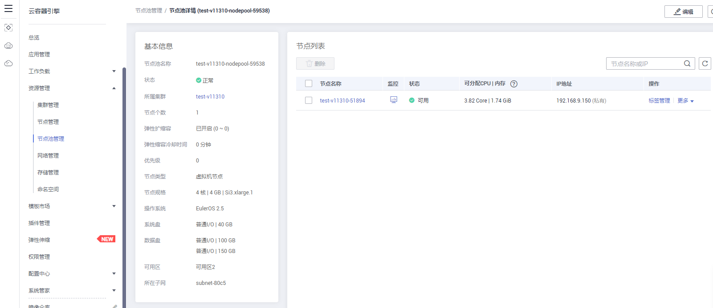

# 创建节点池

介绍了如何添加运行CCE集群的节点池以及对节点池执行操作。要了解节点池的工作原理，请参阅[节点池概述](节点池概述.md)。

## 操作步骤

将节点池添加到现有集群。

1.  登录[CCE控制台](https://console.huaweicloud.com/cce2.0/?utm_source=helpcenter)，在左侧导航栏中选择“资源管理 \> 节点池管理“。
2.  单击右上角的“创建节点池“。
3.  在创建节点池页面中，参照[表1](#table8638121213265)设置节点池选型参数，其中带“\*”的参数为必填参数。

    **表 1**  添加节点池参数配置

    
    <table><thead align="left"><tr id="row10638181262612"><th class="cellrowborder" valign="top" width="20.02%" id="mcps1.2.3.1.1">
参数

    </th>
    <th class="cellrowborder" valign="top" width="79.97999999999999%" id="mcps1.2.3.1.2">
参数说明

    </th>
    </tr>
    </thead>
    <tbody><tr id="row1922964644615"><td class="cellrowborder" valign="top" width="20.02%" headers="mcps1.2.3.1.1 ">
* 计费模式

    </td>
    <td class="cellrowborder" valign="top" width="79.97999999999999%" headers="mcps1.2.3.1.2 ">
节点池仅支持“按需计费”的计费模式，该模式将根据实际使用的资源按小时计费。

    </td>
    </tr>
    <tr id="row42961494311"><td class="cellrowborder" valign="top" width="20.02%" headers="mcps1.2.3.1.1 ">
* 当前区域

    </td>
    <td class="cellrowborder" valign="top" width="79.97999999999999%" headers="mcps1.2.3.1.2 ">
指节点实例所在的物理位置。

    
请就近选择靠近您业务的区域，可减少网络时延，提高访问速度；不同区域的云服务产品之间内网互不相通。

    </td>
    </tr>
    <tr id="row1063812126263"><td class="cellrowborder" valign="top" width="20.02%" headers="mcps1.2.3.1.1 ">
* 节点池名称

    </td>
    <td class="cellrowborder" valign="top" width="79.97999999999999%" headers="mcps1.2.3.1.2 ">
新建节点池的名称，默认按“集群名-nodepool-随机数”生成名称，可自定义。

    </td>
    </tr>
    <tr id="row6649879161231"><td class="cellrowborder" valign="top" width="20.02%" headers="mcps1.2.3.1.1 ">
* 节点类型

    </td>
    <td class="cellrowborder" valign="top" width="79.97999999999999%" headers="mcps1.2.3.1.2 ">
目前仅支持虚拟机节点。

    </td>
    </tr>
    <tr id="row572593234714"><td class="cellrowborder" valign="top" width="20.02%" headers="mcps1.2.3.1.1 ">
* 节点购买数量

    </td>
    <td class="cellrowborder" valign="top" width="79.97999999999999%" headers="mcps1.2.3.1.2 ">
该节点池下购买的节点数量，此处设置的节点数不能超过集群管理的最大节点规模，请根据业务需求和界面提示选择，如需更多配额，请单击<a href="https://console.huaweicloud.com/console/#/quota" target="_blank" rel="noopener noreferrer">提交工单</a>申请扩大配额。

    </td>
    </tr>
    <tr id="row1763991215268"><td class="cellrowborder" valign="top" width="20.02%" headers="mcps1.2.3.1.1 ">
弹性扩缩容

    </td>
    <td class="cellrowborder" valign="top" width="79.97999999999999%" headers="mcps1.2.3.1.2 ">
默认不开启。

    
单击开启“弹性扩缩容”后，节点池将根据业务需求自动创建或删除节点池内的节点，参数设置如下：

    <ul id="ul15733045165119"><li>节点数上限和节点数下限：您可设置节点数的上限和下限，保证节点数在合理的范围内伸缩。</li><li>弹性缩容冷却时间：请设置时间，单位为分钟。弹性缩容冷却时间是指当前节点池扩容出的节点多长时间不能被缩容。</li></ul>
    
为保证功能的正常使用，节点池开启弹性扩缩容功能后，请务必安装<a href="autoscaler.md">AutoScaler插件</a>。

    </td>
    </tr>
    <tr id="row75241899266"><td class="cellrowborder" valign="top" width="20.02%" headers="mcps1.2.3.1.1 ">
* 可用区

    </td>
    <td class="cellrowborder" valign="top" width="79.97999999999999%" headers="mcps1.2.3.1.2 ">
请根据业务需要进行选择。可用区是在同一区域下，电力、网络隔离的物理区域，可用区之间内网互通，不同可用区之间物理隔离。

    
如果您需要提高工作负载的高可靠性，建议您选择“<strong id="b105372222449">随机均分可用区</strong>”，将节点随机均匀分布在不同可用区中。

    </td>
    </tr>
    <tr id="row15639412132615"><td class="cellrowborder" valign="top" width="20.02%" headers="mcps1.2.3.1.1 ">
* 节点规格

    </td>
    <td class="cellrowborder" valign="top" width="79.97999999999999%" headers="mcps1.2.3.1.2 ">
请根据业务需求选择相应的节点规格。

    <ul id="ul2581647145016"><li>通用型：该类型实例提供均衡的计算、存储以及网络配置，适用于大多数的使用场景。通用型实例可用于Web服务器、开发测试环境以及小型数据库工作负载等场景。</li><li>内存优化型：该类型实例提供内存比例更高的实例，可以用于对内存要求较高、数据量大的工作负载，例如关系数据库、NoSQL等场景。</li><li>GPU加速型：提供优秀的浮点计算能力，从容应对高实时、高并发的海量计算场景。P系列适合于深度学习，科学计算，CAE等；G系列适合于3D动画渲染，CAD等。<strong id="b1088415411372">目前仅支持1.11版本的集群添加GPU加速型节点；1.13及以上版本集群暂不支持，界面中不显示该选项。</strong></li><li>高性能计算型：实例提供具有更稳定、超高性能计算性能的实例，可以用于超高性能计算能力、高吞吐量的工作负载场景，例如科学计算。</li><li>通用计算增强型：该类型实例具有性能稳定且资源独享的特点，满足计算性能高且稳定的企业级工作负载诉求。</li><li>磁盘增强型：该类型实例能提供可使用<a href="#li951155511402">本地磁盘存储</a>以及更高网络性能的实例，可以用于处理需要高吞吐以及高数据交换处理的工作负载，例如大数据工作负载等场景。</li><li>超高I/O型：该类型实例提供超低SSD盘访问延迟和超高IOPS性能，适用于高性能关系型数据库、NoSQL数据库(如 Cassandra、MongoDB)、ElasticSearch搜索等场景。</li><li>AI加速型：AI加速型节点，搭载高性能、低功耗的海思Ascend 310 AI处理器，实现快速高效地处理推理和图像识别等工作，适用于图像识别、视频处理、推理计算以及机器学习等场景。<ul id="ul1258417185018"><li>目前已开放公测，仅支持按需付费时选用该节点规格，仅在部分可用区可选，点此<a href="https://account.huaweicloud.com/usercenter/#/userindex/betaManagement?serviceCode=ecs_ascend_ai1" target="_blank" rel="noopener noreferrer">立即申请</a>。</li><li>选用AI加速型的节点需要安装<strong id="b99085210250">huawei-npu</strong>插件，以保证使用昇腾 310芯片资源的负载可以正常运行，点此<a href="huawei-npu.md">前往安装</a>。</li><li>节点创建成功后会安装D310芯片驱动并自动触发节点重启，期间会有短暂的节点不可用，属于正常现象，重启完成后可恢复正常。</li></ul>
    </li></ul>
    
 须知： 

为确保节点稳定性，系统会自动预留部分资源，用于运行必须的系统组件，详细请参见<a href="节点预留资源计算公式.md">节点预留资源计算公式</a> 。

    

    </td>
    </tr>
    <tr id="row482955911270"><td class="cellrowborder" valign="top" width="20.02%" headers="mcps1.2.3.1.1 ">
* 操作系统

    </td>
    <td class="cellrowborder" valign="top" width="79.97999999999999%" headers="mcps1.2.3.1.2 ">
请选择节点对应的操作系统。

    
 须知： 

请勿重装操作系统或修改操作系统配置，该类操作将导致节点不可用，具体请参见<a href="集群节点高危操作.md">集群节点高危操作</a>。

    

    </td>
    </tr>
    <tr id="row2747182915539"><td class="cellrowborder" valign="top" width="20.02%" headers="mcps1.2.3.1.1 ">
虚拟私有云

    </td>
    <td class="cellrowborder" valign="top" width="79.97999999999999%" headers="mcps1.2.3.1.2 ">
跟随集群，不可变更。

    
<strong id="b1423343719454">该参数仅在v1.13.10-r0及以上版本的集群中支持，否则不显示。</strong>

    </td>
    </tr>
    <tr id="row5182152385316"><td class="cellrowborder" valign="top" width="20.02%" headers="mcps1.2.3.1.1 ">
* 所在子网

    </td>
    <td class="cellrowborder" valign="top" width="79.97999999999999%" headers="mcps1.2.3.1.2 ">
通过子网提供与其他网络隔离的、可以独享的网络资源，以提高网络安全。

    
可选择该集群虚拟私有云下的任意子网，集群节点支持跨子网。

    
<strong id="b16616414457">该参数仅在v1.13.10-r0及以上版本的集群中支持，否则不显示。</strong>

    </td>
    </tr>
    <tr id="row64648564171234"><td class="cellrowborder" valign="top" width="20.02%" headers="mcps1.2.3.1.1 ">
* 系统盘和数据盘

    </td>
    <td class="cellrowborder" valign="top" width="79.97999999999999%" headers="mcps1.2.3.1.2 ">
设置节点磁盘空间。

    
系统盘：规格为[40,1024]GB，用户可以配置，缺省值为40GB。

    
数据盘：<ul id="ul107513816391"><li>云硬盘：节点类型为“磁盘增强型”和“超高I/O型”时显示该参数。规格为[100,32678]GB，用户可以配置，缺省值为100GB。
勾选“资源分配自定义”后，您可以对数据盘中的Docker和Kubelet资源占比进行自定义设置。

    </li><li id="li951155511402">本地磁盘：仅支持在Kubernetes v1.13.10-r0及以上版本的集群且节点类型为“磁盘增强型”或“超高I/O型”时使用。本地磁盘实例有宕机风险，不保证数据可靠性，建议您使用云硬盘存储业务数据。本地磁盘配置参数如下：<ul id="ul1438119262215"><li>磁盘类型：节点类型为“磁盘增强型”时支持普通磁盘(hdd)；节点类型为“超高I/O型”时支持固态硬盘(ssd)。</li><li>读写方式：支持“串行”和“并行”两种方式。当存在多块本地盘时可以设置读写方式。串行表示数据读写为线性模式，当一块盘使用完才会使用下一块；并行表示数据读写为条带模式，可以同时读写多块本地盘。</li><li>k8s空间：您可以自定义数据盘中Docker和Kubelet的资源占比，Docker资源包含Docker镜像数据以及镜像元数据，Kubelet资源包含Pod配置文件、密钥以及临时存储EmptyDir等挂载数据。</li><li>用户空间：定义本地盘中不分配给kubernetes使用的空间大小。</li></ul>
    </li></ul>
    
 须知： 
<ul id="ul1352505518405"><li>在本地磁盘中设置k8s空间和用户空间时，需满足k8s空间和用户空间总和为100%，设置后可单击自动调整数据。</li><li>磁盘使用direct-lvm模式，移除将使用loop-lvm模式，有影响系统稳定性的风险。详情请点此<a href="https://docs.docker.com/engine/userguide/storagedriver/device-mapper-driver/" target="_blank" rel="noopener noreferrer">了解更多</a>。</li></ul>
    

    

    
系统盘和数据盘均可提供以下性能规格的云硬盘：<ul id="ul82049141772"><li>普通IO：是指由SATA存储提供资源的磁盘类型。提供可靠的块存储，单个云硬盘的最大IOPS可达到1000，可运行关键应用程序。</li><li>高IO：是指由SAS存储提供资源的磁盘类型。提供可达到3000的高IO和低至1 ms的读写延时，支持NoSQL/关系型数据库，数据仓库，文件系统等应用。</li><li>超高IO：是指由SSD存储提供资源的磁盘类型。提供可达到20000的超高IO和低至1 ms超低读写时延，支持NoSQL/关系型数据库，数据仓库等应用。</li></ul>
    

    </td>
    </tr>
    <tr id="row6775143217241"><td class="cellrowborder" valign="top" width="20.02%" headers="mcps1.2.3.1.1 ">
* 登录方式

    </td>
    <td class="cellrowborder" valign="top" width="79.97999999999999%" headers="mcps1.2.3.1.2 ">
支持密码和密钥对。

    <ul id="ul82061141170"><li>选择“密码”：用户名默认为“root”，请输入登录节点的密码，并确认密码。
登录节点时需要使用该密码，请妥善管理密码，系统无法获取您设置的密码内容。

    </li><li>选择“密钥对”：在选项框中选择用于登录本节点的密钥对，并单击勾选确认信息。
密钥对用于远程登录节点时的身份认证。若没有密钥对，可单击选项框右侧的“创建密钥对”来新建，创建密钥对操作步骤请参见<a href="https://support.huaweicloud.com/usermanual-ecs/zh-cn_topic_0014250631.html" target="_blank" rel="noopener noreferrer">创建密钥对</a>。

    </li></ul>
    </td>
    </tr>
    </tbody>
    </table>

4.  **云服务器高级设置：**（可选），单击展开后可对节点进行如下高级功能配置：
    -   **云服务器组：**选择已创建的云服务器组，或单击右侧的“新建云服务器组“创建，创建完成后单击刷新按钮。

        通过云服务器组功能，弹性云服务器在创建时，将尽量分散地创建在不同的主机上，提高业务的可靠性。

    -   **资源标签：**通过为资源添加标签，可以对资源进行自定义标记，实现资源的分类。

        您可以在TMS中创建“预定义标签“，预定义标签对所有支持标签功能的服务资源可见，通过使用预定义标签可以提升标签创建和迁移效率。具体请参见[创建预定义标签](https://support.huaweicloud.com/usermanual-tms/zh-cn_topic_0144368884.html)。

        CCE服务会自动帮您创建CCE-Dynamic-Provisioning-Node=节点id的标签，允许增加5个标签。

    -   **委托：**委托是由租户管理员在[统一身份认证服务](https://console.huaweicloud.com/iam/#/iam/agencies)上创建的。通过委托，可以将云主机资源共享给其他帐号，或委托更专业的人或团队来代为管理。新建委托请参见[委托其他云服务管理资源](https://support.huaweicloud.com/usermanual-iam/zh-cn_topic_0175653574.html)，创建委托时委托类型选择“云服务“，单击“选择“按钮并在弹出的窗口中选择“ECS BMS“，即允许ECS或BMS调用云服务。
    -   **安装前执行脚本：**请输入脚本命令，大小限制为0\~1000字符。

        脚本将在Kubernetes软件安装前执行，可能导致Kubernetes软件无法正常安装，需谨慎使用。常用于格式化数据盘等场景。

    -   **安装后执行脚本：**请输入脚本命令，大小限制为0\~1000字符。

        脚本将在Kubernetes软件安装后执行，不影响Kubernetes软件安装。常用于修改Docker配置参数等场景。

    -   **新增数据盘：**单击“新增数据盘“增加一个数据盘并设置数据盘容量，该数据盘需要在**安装前执行脚本**中输入脚本命令进行格式化。示例请参见[如何给CCE节点添加第二块数据盘？](https://support.huaweicloud.com/cce_faq/cce_faq_00190.html)
    -   **子网IP：**可选择“自动分配IP地址“和“手动分配IP地址“，推荐使用“自动分配IP地址“。

5.  **Kubernetes高级设置：**（可选），单击展开后可对集群进行如下高级功能配置：
    -   **最大实例数：**节点最大允许创建的实例数\(Pod\)，该数量包含系统默认实例，取值范围为16\~250。

        该设置的目的为防止节点因管理过多实例而负载过重，请根据您的业务需要进行设置。

    -   **自定义镜像仓库：**单击“新增自定义镜像仓库地址“输入镜像仓库地址。

        添加自定义镜像仓库地址（非SSL镜像源地址）到docker启动参数中，避免拉取个人镜像仓库的镜像失败，格式可为“IP地址:端口或者域名”。安装后执行脚本与自定义镜像仓库不能同时使用。

    -   Taints：默认为空。支持给该节点池扩容出来的节点加Taints来设置反亲和性，每个节点池最多配置10条Taints，每条Taints包含以下3个参数：

        -   Key：必须以字母或数字开头，可以包含字母、数字、连字符、下划线和点，最长63个字符；另外可以使用DNS子域作为前缀。
        -   Value：必须以字符或数字开头，可以包含字母、数字、连字符、下划线和点，最长63个字符。
        -   Effect：只可选NoSchedule，PreferNoSchedule或NoExecute。

        > **须知：**   
        >-   Taints配置时需要配合Pod的toleration使用，否则可能导致扩容失败或者Pod无法调度到扩容节点。  
        >-   配置后无法修改，请您谨慎配置，错误的配置可能会导致扩容失败或pod无法调度。  

    -   K8S标签：K8S标签是附加到 Kubernetes 对象（比如 Pods）上的键值对，旨在用于指定对用户有意义且相关的对象的标识属性，但不直接对核心系统有语义含义。 详细请参见[Labels and Selectors](https://kubernetes.io/docs/concepts/overview/working-with-objects/labels/)。
    -   **单容器可用数据空间：**该参数用于设置一个容器可用的数据空间大小，设置范围为 10G 到 80G。如果设置的参数超过数据盘中Docker可占用的实际数据空间（由数据盘设置项中的资源分配自定义参数指定，默认为数据盘大小的90%），将以Docker的实际空间大小为主。该参数仅在v1.13.10-r0及以上版本的集群中显示。

6.  （可选）您可以单击左侧的按钮添加多个节点池，在按钮下方可以查看您可用的节点池配额数量。
7.  完成配置后，单击“下一步：配置确认”，确认所设置的服务选型参数、规格和费用等信息。
8.  确认规格和费用后，单击“提交”，节点池开始创建。

    节点池创建预计需要6-10分钟，您可以单击“返回节点池管理“进行其他操作或单击“查看节点池事件列表“后查看节点池详情。

## 查看创建的节点池

1.  登录[CCE控制台](https://console.huaweicloud.com/cce2.0/?utm_source=helpcenter)，在左侧导航栏中选择“资源管理 \> 节点池管理“。
2.  在节点池管理页面中，单击右上角的集群选择框，选择集群后可显示当前集群下所有的节点池，并可查看每个节点池的节点类型、节点规格、弹性扩缩容状态和操作系统等。

    **图 1**  查看集群下的节点池  
    

    > **说明：**   
    >-   节点池功能上线后，会在每个集群中创建一个默认节点池“DefaultPool”，该节点池不能被编辑、删除或迁移，集群中原有的节点及节点池外创建的节点均会显示在默认节点池“DefaultPool”中。  
    >-   单击默认节点池“DefaultPool”中“节点“数据框，可查看DefaultPool中的节点列表。  

3.  单击右上角的Autoscaler状态选择框，可筛选全部、已启用、未启用Autoscaler功能的节点池。
4.  在节点池列表中，单击节点池的名称，在节点池详情页面，可查看节点池的基本信息、ECS高级设置、Kubernetes高级设置、节点列表等信息。

    **图 2**  节点池详情  
    

