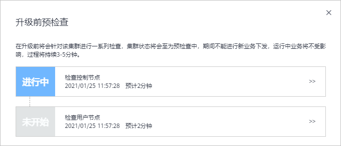
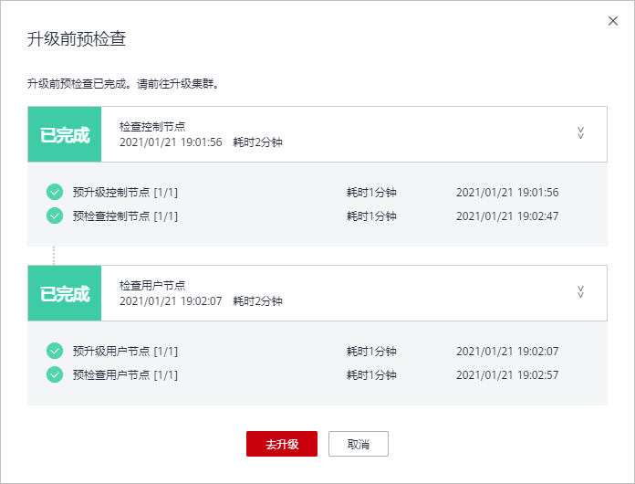
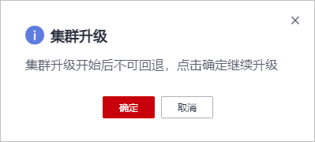
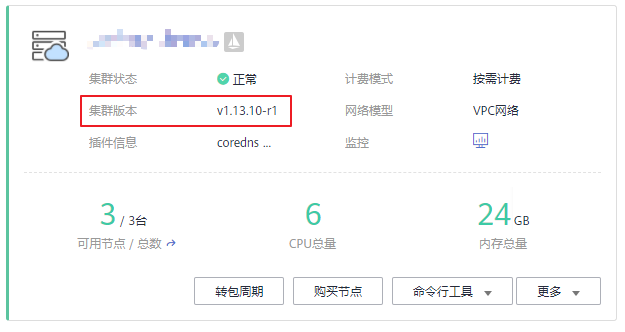

# 升级集群<a name="cce_01_0120"></a>

-   [操作场景](#section10924122311617)
-   [注意事项](#section4557144475115)
-   [前提条件](#section9871020102918)
-   [集群升级前排查项](#section14190181819293)
-   [操作步骤](#section9456205813519)

## 操作场景<a name="section10924122311617"></a>

您可以通过云容器引擎管理控制台快速升级到Kubernetes最新版本或者bugfix版本，以支持新特性的使用。

升级前，请先了解CCE各集群版本能够升级到的目标版本，以及升级方式和升级影响，详情请参见[集群版本升级说明](集群版本升级说明.md)。

## 注意事项<a name="section4557144475115"></a>

-   **集群升级属于不可逆操作，升级后无法回滚到之前版本，请谨慎进行。**
-   请在升级集群前，请查看集群状态是否均为健康状态。若集群不正常，您可以自行修复，若仍有问题请[提交工单](https://console.huaweicloud.com/ticket/#/ticketindex/createIndex)联系我们协助您进行修复。
-   为了您的数据安全，强烈建议您先备份数据然后再升级，升级过程中不建议对集群进行任何操作。
-   升级前，请在CCE控制台中确认您的集群是否可以进行升级操作，**确认方法：**单击“资源管理 \> 集群管理“，查看待升级集群右上角是否存在“可升级“提示，若存在则该集群支持升级，若不存在，则该集群不支持升级。更多详细信息请参见[集群版本升级说明](集群版本升级说明.md)。

    **图 1**  集群-可升级<a name="fig1221889111912"></a>  
    


## 前提条件<a name="section9871020102918"></a>

请在集群升级前检查集群和节点的健康状况，确保集群和节点正常可用。

**检查方式一：控制台查看**

在CC控制台中，单击左侧栏目树的“资源管理“，分别单击“集群管理“和“节点管理“，查看集群和节点的状态是否正常。

**检查方式二：Kubectl命令查看**

1.  配置Kubectl命令，具体请参见[通过Kubectl连接集群](通过kubectl或web-terminal插件操作CCE集群.md)。
2.  执行如下命令，确保集群的所有模块都处于健康状态。

    **kubectl get cs**

    命令行终端显示如下信息：

    ```
     NAME                 STATUS    MESSAGE              ERROR
     scheduler            Healthy   ok
     controller-manager   Healthy   ok
     etcd-0               Healthy   {"health": "true"}
     etcd-1               Healthy   {"health": "true"}
     etcd-2               Healthy   {"health": "true"}
    ```

3.  执行如下命令，确保所有节点都处于Ready状态。

    **kubectl get nodes**

    > **说明：** 
    >所有节点只能Ready状态，不能包含其他状态。

    ```
     NAME                   STATUS    ROLES     AGE       VERSION
     cn-north-4a-xxx   Ready     master    38d       v1.9.7-r1
     cn-north-4a-xxx   Ready     <none>    38d       v1.9.7-r1
     cn-north-4a-xxx   Ready     <none>    38d       v1.9.7-r1
     cn-north-4a-xxx   Ready     <none>    38d       v1.9.7-r1
     cn-north-4a-xxx   Ready     master    38d       v1.9.7-r1
     cn-north-4a-xxx   Ready     master    38d       v1.9.7-r1
    ```


## 集群升级前排查项<a name="section14190181819293"></a>

在集群升级前，请根据如下Checklist进行排查，以便提前发现风险和问题。

**表 1**  集群升级排查项

<a name="table1238111218323"></a>
<table><thead align="left"><tr id="row132391129329"><th class="cellrowborder" valign="top" width="16.91%" id="mcps1.2.3.1.1"><p id="p1423913122324"><a name="p1423913122324"></a><a name="p1423913122324"></a>类别</p>
</th>
<th class="cellrowborder" valign="top" width="83.09%" id="mcps1.2.3.1.2"><p id="p18239161220325"><a name="p18239161220325"></a><a name="p18239161220325"></a>检查项</p>
</th>
</tr>
</thead>
<tbody><tr id="row424018124321"><td class="cellrowborder" rowspan="2" valign="top" width="16.91%" headers="mcps1.2.3.1.1 "><p id="p1524071220320"><a name="p1524071220320"></a><a name="p1524071220320"></a>集群</p>
</td>
<td class="cellrowborder" valign="top" width="83.09%" headers="mcps1.2.3.1.2 "><p id="p1324061214324"><a name="p1324061214324"></a><a name="p1324061214324"></a>确认当前集群的Node IP（包括EIP），是否有作为其他的配置或者白名单等。</p>
</td>
</tr>
<tr id="row824016123329"><td class="cellrowborder" valign="top" headers="mcps1.2.3.1.1 "><p id="p20240812143219"><a name="p20240812143219"></a><a name="p20240812143219"></a>执行升级前预检查功能。</p>
</td>
</tr>
<tr id="row924013120321"><td class="cellrowborder" rowspan="2" valign="top" width="16.91%" headers="mcps1.2.3.1.1 "><p id="p1724021216325"><a name="p1724021216325"></a><a name="p1724021216325"></a>工作负载</p>
</td>
<td class="cellrowborder" valign="top" width="83.09%" headers="mcps1.2.3.1.2 "><p id="p1424041263216"><a name="p1424041263216"></a><a name="p1424041263216"></a>记录工作负载的数量、工作负载状态，便于升级后对比。</p>
</td>
</tr>
<tr id="row1296933813911"><td class="cellrowborder" valign="top" headers="mcps1.2.3.1.1 "><p id="p59693385919"><a name="p59693385919"></a><a name="p59693385919"></a>针对您使用的数据库（例如云专线Redis、Mongdb等），要提前考虑白名单、路由或安全组策略变化等问题。</p>
</td>
</tr>
<tr id="row15579521103820"><td class="cellrowborder" valign="top" width="16.91%" headers="mcps1.2.3.1.1 "><p id="p12579172163813"><a name="p12579172163813"></a><a name="p12579172163813"></a>存储</p>
</td>
<td class="cellrowborder" valign="top" width="83.09%" headers="mcps1.2.3.1.2 "><p id="p257992123818"><a name="p257992123818"></a><a name="p257992123818"></a>记录存储状态，保证升级后存储不丢失。</p>
</td>
</tr>
<tr id="row1740471712383"><td class="cellrowborder" rowspan="2" valign="top" width="16.91%" headers="mcps1.2.3.1.1 "><p id="p640513174387"><a name="p640513174387"></a><a name="p640513174387"></a>网络</p>
</td>
<td class="cellrowborder" valign="top" width="83.09%" headers="mcps1.2.3.1.2 "><p id="p340521718381"><a name="p340521718381"></a><a name="p340521718381"></a>检查使用的负载均衡服务、Ingress，并做好备份。</p>
</td>
</tr>
<tr id="row1178610472077"><td class="cellrowborder" valign="top" headers="mcps1.2.3.1.1 "><p id="p1478694720715"><a name="p1478694720715"></a><a name="p1478694720715"></a>针对使用云专线的业务场景，需重点关注业务所在节点或实例IP发生变化时，应提前在云专线开通路由。</p>
</td>
</tr>
<tr id="row146320432505"><td class="cellrowborder" valign="top" width="16.91%" headers="mcps1.2.3.1.1 "><p id="p7631443125015"><a name="p7631443125015"></a><a name="p7631443125015"></a>插件</p>
</td>
<td class="cellrowborder" valign="top" width="83.09%" headers="mcps1.2.3.1.2 "><p id="p106364317505"><a name="p106364317505"></a><a name="p106364317505"></a>社区Kubernetes 1.9版本升级1.11版本时，集群的kube-dns会被卸载并替换为CoreDNS，请备份您配置在kube-dns中的DNS地址，以便在域名解析异常时重新在CoreDNS中进行配置。</p>
</td>
</tr>
<tr id="row96853135389"><td class="cellrowborder" rowspan="2" valign="top" width="16.91%" headers="mcps1.2.3.1.1 "><p id="p46861813153810"><a name="p46861813153810"></a><a name="p46861813153810"></a>运维</p>
</td>
<td class="cellrowborder" valign="top" width="83.09%" headers="mcps1.2.3.1.2 "><p id="p868691311386"><a name="p868691311386"></a><a name="p868691311386"></a>私有配置：在升级前的集群中检查是否在节点或容器中放置了数据面密码、证书、环境变量等配置，当容器重启（例如节点异常重新调度pod），会导致配置丢失，业务异常。</p>
</td>
</tr>
<tr id="row202401212143211"><td class="cellrowborder" valign="top" headers="mcps1.2.3.1.1 "><p id="p142408126323"><a name="p142408126323"></a><a name="p142408126323"></a>检查并备份内核参数或者系统配置。</p>
</td>
</tr>
</tbody>
</table>

## 操作步骤<a name="section9456205813519"></a>

本章节以将混合集群v1.11.7-r2升级到v1.13.10-r1版本为例进行说明，其他集群操作请参考本例。

1.  登录[云容器引擎管理控制台](https://console.huaweicloud.com/cce2.0/)，单击左侧导航栏的“资源管理 \> 集群管理“，在集群列表页面查看您的集群版本，本例以v1.11.7-r2版本的集群为例。

    **图 2**  升级集群<a name="fig1685315116"></a>  
    

2.  <a name="li13509123212283"></a>单击待升级集群右下角的“更多 \> 集群升级“。

    > **说明：** 
    >若您的集群当前已是最新版本，则“集群升级“按钮为灰色不可用状态。

3.  在弹出的“升级前预检查“对话框中，单击“开始检查“。

    **图 3**  升级前预检查<a name="fig74511535153719"></a>  
    

4.  升级前预检查开始启动，在此过程中集群状态将显示为“预检查中“，期间该集群不能进行新业务下发，运行中的业务不受影响，该过程将持续3-5分钟。

    **图 4**  升级前预检查-进行中<a name="fig14749145115373"></a>  
    

5.  待升级前预检查的状态显示为“已完成“时，单击“去升级“。

    **图 5**  升级前预检查-完成<a name="fig11859512123816"></a>  
    

6.  进入集群升级页面，参照[表2](#table924319911495)确认或配置基本信息。

    **表 2**  基本信息确认与配置

    <a name="table924319911495"></a>
    <table><thead align="left"><tr id="row42442974913"><th class="cellrowborder" valign="top" width="24%" id="mcps1.2.3.1.1"><p id="p17244793496"><a name="p17244793496"></a><a name="p17244793496"></a>参数</p>
    </th>
    <th class="cellrowborder" valign="top" width="76%" id="mcps1.2.3.1.2"><p id="p42441596495"><a name="p42441596495"></a><a name="p42441596495"></a>参数说明</p>
    </th>
    </tr>
    </thead>
    <tbody><tr id="row1137014404511"><td class="cellrowborder" valign="top" width="24%" headers="mcps1.2.3.1.1 "><p id="p11370134095120"><a name="p11370134095120"></a><a name="p11370134095120"></a>集群名称</p>
    </td>
    <td class="cellrowborder" valign="top" width="76%" headers="mcps1.2.3.1.2 "><p id="p937064085113"><a name="p937064085113"></a><a name="p937064085113"></a>请确认您要升级的集群名称。</p>
    </td>
    </tr>
    <tr id="row83701240105118"><td class="cellrowborder" valign="top" width="24%" headers="mcps1.2.3.1.1 "><p id="p3370040165116"><a name="p3370040165116"></a><a name="p3370040165116"></a>当前版本</p>
    </td>
    <td class="cellrowborder" valign="top" width="76%" headers="mcps1.2.3.1.2 "><p id="p93701640145120"><a name="p93701640145120"></a><a name="p93701640145120"></a>请确认待升级集群的版本。</p>
    </td>
    </tr>
    <tr id="row4370840165119"><td class="cellrowborder" valign="top" width="24%" headers="mcps1.2.3.1.1 "><p id="p937054045117"><a name="p937054045117"></a><a name="p937054045117"></a>升级后版本</p>
    </td>
    <td class="cellrowborder" valign="top" width="76%" headers="mcps1.2.3.1.2 "><p id="p1268812588913"><a name="p1268812588913"></a><a name="p1268812588913"></a>请确认升级后的目标版本。</p>
    </td>
    </tr>
    <tr id="row524420346511"><td class="cellrowborder" valign="top" width="24%" headers="mcps1.2.3.1.1 "><p id="p112449344512"><a name="p112449344512"></a><a name="p112449344512"></a>节点升级策略</p>
    </td>
    <td class="cellrowborder" valign="top" width="76%" headers="mcps1.2.3.1.2 "><p id="p17476164421118"><a name="p17476164421118"></a><a name="p17476164421118"></a><strong id="b1243162591216"><a name="b1243162591216"></a><a name="b1243162591216"></a>重置升级：</strong>控制节点采用平滑升级方式，而用户节点采用重置安装方式，节点操作系统将会被重装，系统盘和数据盘的数据均会被清空，请谨慎使用。</p>
    <div class="note" id="note121926482167"><a name="note121926482167"></a><a name="note121926482167"></a><span class="notetitle"> 说明： </span><div class="notebody"><a name="ul149475619164"></a><a name="ul149475619164"></a><ul id="ul149475619164"><li>本集群的节点及工作负载生命周期管理功能暂不可用。</li><li>API访问功能暂不可用。</li><li>由于升级过程节点进行重置安装，用户已运行的工作负载业务将会中断。</li><li>用户节点的系统盘和数据盘将会被清空，升级前请事先备份重要数据。</li><li>用户节点上挂载的非LVM管理的数据盘，升级后需要重新挂载，盘中数据不会丢失。</li><li>云硬盘的配额需大于0。</li><li>容器的IP地址会发生变化，但是不影响容器间的网络通信。</li><li>用户节点的自定义标签将不会保留。</li><li>集群升级时间约为12分钟。</li></ul>
    </div></div>
    <p id="p238563821112"><a name="p238563821112"></a><a name="p238563821112"></a><strong id="b19987172861214"><a name="b19987172861214"></a><a name="b19987172861214"></a>滚动升级：</strong>控制节点采用平滑升级方式，用户节点采用节点池滚动升级，适用于集群下节点均采用节点池创建的场景。</p>
    <div class="note" id="note21953471716"><a name="note21953471716"></a><a name="note21953471716"></a><span class="notetitle"> 说明： </span><div class="notebody"><a name="ul1819517471712"></a><a name="ul1819517471712"></a><ul id="ul1819517471712"><li>本集群的节点及工作负载生命周期管理功能暂不可用。</li><li>API访问功能暂不可用。</li><li>用户已运行的工作负载业务不会中断。</li><li>集群升级时间约为12分钟。</li></ul>
    </div></div>
    </td>
    </tr>
    <tr id="row1624493410514"><td class="cellrowborder" valign="top" width="24%" headers="mcps1.2.3.1.1 "><p id="p824503418518"><a name="p824503418518"></a><a name="p824503418518"></a>登录方式</p>
    </td>
    <td class="cellrowborder" valign="top" width="76%" headers="mcps1.2.3.1.2 "><div class="p" id="p10185117111414"><a name="p10185117111414"></a><a name="p10185117111414"></a>支持密码和密钥对。<a name="ul10227542183218"></a><a name="ul10227542183218"></a><ul id="ul10227542183218"><li>选择<span class="uicontrol" id="uicontrol162223420321"><a name="uicontrol162223420321"></a><a name="uicontrol162223420321"></a>“密码”</span>：用户名默认为“root”，请输入登录节点的密码，并确认密码。<p id="p822284263215"><a name="p822284263215"></a><a name="p822284263215"></a>登录节点时需要使用该密码，请妥善管理密码，系统无法获取您设置的密码内容。</p>
    </li><li>选择<span class="uicontrol" id="uicontrol14222154273210"><a name="uicontrol14222154273210"></a><a name="uicontrol14222154273210"></a>“密钥对”</span>：选择用于登录本节点的密钥对，支持选择共享密钥。<p id="p102267427326"><a name="p102267427326"></a><a name="p102267427326"></a>密钥对用于远程登录节点时的身份认证。若没有密钥对，可单击选项框右侧的“创建密钥对”来新建，创建密钥对操作步骤请参见<a href="https://support.huaweicloud.com/usermanual-ecs/zh-cn_topic_0014250631.html" target="_blank" rel="noopener noreferrer">创建密钥对</a>。</p>
    </li></ul>
    </div>
    </td>
    </tr>
    <tr id="row224517348516"><td class="cellrowborder" valign="top" width="24%" headers="mcps1.2.3.1.1 "><p id="p162453345514"><a name="p162453345514"></a><a name="p162453345514"></a>节点升级优先级</p>
    </td>
    <td class="cellrowborder" valign="top" width="76%" headers="mcps1.2.3.1.2 "><p id="p192451534175116"><a name="p192451534175116"></a><a name="p192451534175116"></a>可选择优先升级的节点。</p>
    </td>
    </tr>
    </tbody>
    </table>

7.  完成后单击“下一步“，在弹出的“集群升级“对话框中单击“确定“。

    根据您选择的“节点升级策略“，对话框中会有如下两种不同的提示： 

    -   重置升级：升级后的集群版本将使用更高版本操作系统，升级将会重启节点并升级操作系统版本，升级过程中运行的业务会暂时中断。
    -   滚动升级：滚动升级后，需要用户重置节点（同时去除不可调度标签）或新建节点才能完成升级。

8.  进入“升级插件“步骤，如有需要升级的插件会有红色圆点提示，请单击插件卡片左下角的“升级“按钮，完成后单击页面右下角的“升级“。

    > **说明：** 
    >-   集群将依次升级控制节点，然后并发升级用户节点。用户节点较多时，节点将分批升级。
    >-   请选择合适的时间段进行升级，以减少升级对业务的影响。
    >-   单击“升级“会立刻开始执行升级操作，并且无法撤销。升级过程中请勿对节点执行关机、重启等操作。

9.  在弹出的“集群升级“对话框中阅读提示信息，确认后单击“确定“，注意集群升级后不可回退。

    **图 6**  集群升级确认<a name="fig14877829193812"></a>  
    

10. 在集群列表页面中可以看到集群的状态为“升级中“，升级过程需要一定的时间，请耐心等待升级完成。
    -   升级成功后，您可以在集群列表或集群详情页面查看升级后的集群状态和版本。

        **图 7**  确认升级成功<a name="fig152121651854"></a>  
        

    -   如果升级失败，请参考[2](#li13509123212283)\~[\#cce\_01\_0120/li774145312614](#li774145312614)重新进行升级集群操作，若仍有问题请[提交工单](https://console.huaweicloud.com/ticket/#/ticketindex/createIndex)联系我们协助您进行修复。


