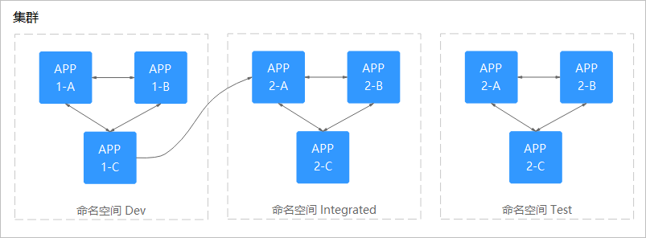
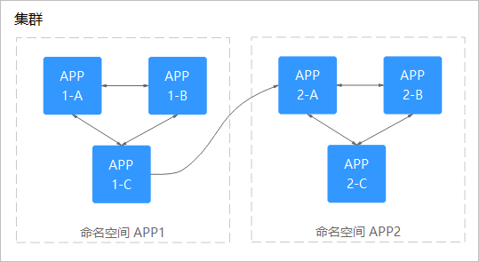

# 命名空间使用指引

命名空间（Namespace）是对一组资源和对象的抽象整合。在同一个集群内可创建不同的命名空间，不同命名空间中的数据彼此隔离。使得它们既可以共享同一个集群的服务，也能够互不干扰。

例如可以将开发环境、测试环境的业务分别放在不同的命名空间。

## 前提条件

至少已创建一个集群，请参见[创建虚拟机集群](创建虚拟机集群.md)。

## 使用约束

每个命名空间下，创建的服务数量不能超过6000个。此处的服务对应kubernetes的service资源，即工作负载所添加的服务。

## 命名空间类别

命名空间按创建类型分为两大类：集群默认创建的、用户创建的。

-   集群默认创建的：集群在启动时会默认创建default、kube-public、kube-system命名空间。
    -   在不指定命名空间时，默认使用default。
    -   kube-public：用来部署公共插件、容器模板等。
    -   kube-system：部署kubernetes系统组件。

-   用户创建的：用户可以按照需要创建命名空间，例如开发环境、联调环境和测试环境分别创建对应的命名空间。或者按照不同的业务创建对应的命名空间，例如系统分为登录和游戏服，可以分别创建对应命名空间。

## 创建命名空间

1.  登录CCE控制台，在左侧导航栏中选择“资源管理 \> 命名空间“。单击“创建命名空间”。
2.  参照[表1](#table5523151617575)设置命名空间参数，其中带“\*”标志的参数为必填参数。

    **表 1**  命名空间基本信息

    
    <table><thead align="left"><tr id="row145240162572"><th class="cellrowborder" valign="top" width="28.000000000000004%" id="mcps1.2.3.1.1">
参数

    </th>
    <th class="cellrowborder" valign="top" width="72%" id="mcps1.2.3.1.2">
参数说明

    </th>
    </tr>
    </thead>
    <tbody><tr id="row835519426223"><td class="cellrowborder" valign="top" width="28.000000000000004%" headers="mcps1.2.3.1.1 ">
* 命名空间

    </td>
    <td class="cellrowborder" valign="top" width="72%" headers="mcps1.2.3.1.2 ">
新建命名空间的名称，命名必须唯一。

    </td>
    </tr>
    <tr id="row20525816195710"><td class="cellrowborder" valign="top" width="28.000000000000004%" headers="mcps1.2.3.1.1 ">
* 集群名称

    </td>
    <td class="cellrowborder" valign="top" width="72%" headers="mcps1.2.3.1.2 ">
新建命名空间属于哪个集群。

    </td>
    </tr>
    <tr id="row75251516185711"><td class="cellrowborder" valign="top" width="28.000000000000004%" headers="mcps1.2.3.1.1 ">
命名空间描述

    </td>
    <td class="cellrowborder" valign="top" width="72%" headers="mcps1.2.3.1.2 ">
输入对命名空间的描述信息。

    </td>
    </tr>
    <tr id="row18506114684111"><td class="cellrowborder" valign="top" width="28.000000000000004%" headers="mcps1.2.3.1.1 ">
资源配额设置

    </td>
    <td class="cellrowborder" valign="top" width="72%" headers="mcps1.2.3.1.2 ">
限制命名空间下资源的使用量。

    </td>
    </tr>
    </tbody>
    </table>

3.  配置完成后，单击“确定”。

## 使用命名空间

1.  创建工作负载时，选择对应的命名空间。
2.  查询工作负载时，选择对应的命名空间，查看对应命名空间下的所有工作负载。

## 命名空间使用实践

-   **按照不同环境划分命名空间**

    一般情况下，工作负载发布会经历开发环境、联调环境、测试环境，最后到生产环境的过程。这个过程中不同环境部署的工作负载相同，只是在逻辑上进行了定义。分为两种做法：

    -   分别创建不同集群。

        不同集群之间，资源不能共享。同时，不同环境中的服务互访需要通过负载均衡才能实现。

    -   不同环境创建对应命名空间。

        同个命名空间下，通过服务名称（Service name）可直接访问。跨命名空间的可以通过服务名称、命名空间名称访问。

        例如下图，开发环境/联调环境/测试环境分别创建了命名空间。

        **图 1**  不同环境创建对应命名空间  
        

-   **按照应用划分命名空间**

    对于同个环境中，应用数量较多的情况，建议进一步按照工作负载类型划分命名空间。例如下图中，按照APP1和APP2划分不同命名空间，将不同工作负载在逻辑上当做一个工作负载组进行管理。且同一个命名空间内的工作负载可以通过服务名称访问，不同命名空间下的通过服务名称、命名空间名称访问。

    **图 2**  按照工作负载划分命名空间  
    

## 设置命名空间级的网络策略

您可以通过网络隔离开关，设置命名空间层面的网络策略。

例如命名空间default，网络隔离的默认状态为“命名空间网络隔离状态未开启”，表示“当前集群下的所有工作负载“都可以访问“命名空间default下的工作负载“。

若您需要设置其它工作负载不可以访问“命名空间default下的工作负载“，请参照以下步骤设置。

1.  登录CCE控制台，选择左侧导航栏的“资源管理 \> 命名空间“。
2.  在待设置命名空间（例如default）后，将网络隔离一栏的“命名空间网络隔离状态未开启”改为“命名空间网络隔离状态已开启”。

    设置完成后，当前集群内的其它工作负载都不能访问default下的工作负载。

    **图 3**  命名空间网络策略  
    

## 设置命名空间级别的资源配额

通过设置命名空间级别的资源配额，实现多团队或多用户在共享集群资源的情况下限制团队、用户可以使用的资源总量，包括限制命名空间下创建某一类型对象的数量以及对象消耗计算资源（CPU、内存）的总量。

> **说明：**   
>集群为1.9及以上版本时，才支持此功能。  

1.  登录CCE控制台，选择左侧导航栏的“资源管理 \> 命名空间”。
2.  单击对应命名空间后的“配额管理”，单击“编辑配额”。

    系统级别的命名空间kube-system、kube-public默认不支持设置资源配额。

3.  设置资源配额，单击“确定”。

    -   CPU（Core）：限制命名空间下工作负载实例（Pod）能申请CPU资源的最大值。单位为“核”。
    -   内存（MiB）：限制命名空间下工作负载实例能申请内存资源的最大值。单位为MiB。
    -   有状态工作负载（StatefulSet）：限制命名空间下能创建有状态负载的最大数量。
    -   无状态工作负载（Deployment）：限制命名空间下能创建无状态负载的最大数量。
    -   普通任务（Job）：限制命名空间下能创建普通任务的最大数量。
    -   定时任务（CronJob）：限制命名空间下能创建定时任务的最大数量。
    -   实例（Pod）：限制命名空间下能创建实例的最大数量。
    -   服务（Service）：限制命名空间下能创建服务的最大数量。

    > **注意：**   
    >-   命名空间设置了CPU或内存资源配额后，创建工作负载时，必须指定CPU或内存的请求值（request）和约束值（limit），否则CCE将拒绝创建实例。若设置资源配额值为0，则不限制该资源的使用。  
    >-   配额累计使用量包含CCE系统默认创建的资源，如default命名空间下系统默认创建的kubernetes服务（该服务可通过后端kubectl工具查看）等，故建议命名空间下的资源配额略大于实际期望值以去除系统默认创建资源的影响。  

## 删除命名空间

删除命名空间会删除该命名空间下所有的资源（如：工作负载，短任务或者配置项等），请谨慎操作。

1.  在主菜单中选择“ 资源管理 \> 命名空间”。
2.  在“集群”下拉框中，选择命名空间所在的集群。
3.  选中待删除的命名空间，单击“删除“。

    根据系统提示进行删除操作。系统内置的命名空间不支持删除。

