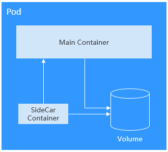

# 存储基础知识<a name="cce_01_0307"></a>

## Volume（存储卷）<a name="section5296105719142"></a>

容器中的文件在磁盘上是临时存放的，当容器重建时，容器中的文件将会丢失，另外当在一个Pod中同时运行多个容器时，常常需要在这些容器之间共享文件，这也是容器不好解决的问题。 Kubernetes抽象出了Volume来解决这两个问题，也就是存储卷，Kubernetes的Volume是Pod的一部分，Volume不是单独的对象，不能独立创建，只能在Pod中定义。

Pod中的所有容器都可以访问Volume，但必须要挂载，且可以挂载到容器中任何目录。

实际中使用容器存储如下图所示，将容器的内容挂载到Volume中，通过Volume两个容器间实现了存储共享。



Volume的生命周期与挂载它的Pod相同，但是Volume里面的文件可能在Volume消失后仍然存在，这取决于Volume的类型。

## 存储卷类型说明<a name="section16559121287"></a>

Volume可分为本地磁盘存储和云存储两大类。

-   本地磁盘存储

    本地磁盘存储可以使用如下四种类型，具体使用请参见[本地磁盘存储](本地磁盘存储.md)。

    -   emptyDir：一种简单的空目录，主要用于临时存储。
    -   hostPath：将主机（节点）某个目录挂载到容器中，适用于读取主机上的数据。
    -   ConfigMap：特殊类型，将Kubernetes特定的对象类型挂载到容器。
    -   Secret：特殊类型，将Kubernetes特定的对象类型挂载到容器。

-   云存储：

    CCE支持使用云存储有如下几种。

    -   云硬盘EVS：具体使用请参见[云硬盘存储卷](云硬盘存储卷.md)。
    -   极速文件存储SFS Trubo：具体使用请参见[极速文件存储卷](极速文件存储卷.md)。
    -   对象存储OBS：具体使用请参见[对象存储卷](对象存储卷.md)。
    -   弹性文件存储SFS：具体使用请参见[文件存储卷](文件存储卷.md)。


## CSI<a name="section187922219447"></a>

Kubernetes提供了CSI接口（Container Storage Interface，容器存储接口），基于CSI这套接口，可以开发定制出CSI插件，从而支持特定的存储，达到解耦的目的。

CCE开发了存储插件[Everest](Everest（系统资源插件-必装）.md)，在创建集群时必须安装，安装了插件就可以使用的EVS、SFS Trubo等云存储。CSI详细信息请参见[存储CSI概述](存储CSI概述.md)。

## PV与PVC<a name="section1181185971610"></a>

Kubernetes抽象了PV（PersistentVolume）和PVC（PersistentVolumeClaim）来定义和使用存储，从而让使用者不用关心具体的基础设施，当需要存储资源的时候，只要像CPU和内存一样，声明要多少即可。

-   PV：PV描述的是一个集群里的持久化存储卷，和节点一样，属于集群级别资源。在新版控制台中（需要将集群升级到1.19.10并且everest存储插件升级到1.2.10）PV资源已经正式开放给用户管理；旧版控制台仍保持导入使用或者是通过动态创建方式进行创建，用户无法通过控制台对PV资源进行生命周期管理。
-   PVC：PVC描述的是负载对存储的申领，PVC的申领会消耗集群中存量的PV资源，若集群中无存量PV资源，会动态创建底层存储及PV资源；创建PVC时，需描述请求的持久化存储的属性，比如，Volume存储的大小、可读写权限等等。

在Pod中可以使用Volume关联PVC，即可让Pod使用到存储资源，它们之间的关系如下图所示。

**图 1**  PVC绑定PV<a name="fig149881117222"></a>  


通常在使用时，可以使用PV描述已有的存储资源，然后创建PVC使用存储。具体使用可参见后续各章节中使用kubectl对接存储资源的内容。

而新创建存储资源时，可以使用一种更为方便的方法，可以跳过PV直接使用PVC，这就是[StorageClass](#section19926174743310)。

## StorageClass<a name="section19926174743310"></a>

StorageClass描述了集群中的存储类型“分类”，在创建PVC/PV均需要指定StorageClass。目前CCE默认提供csi-disk、csi-nas、csi-obs等StorageClass，在声明PVC时使用对应StorageClassName，就可以创建对应类型PV，并自动创建底层的存储资源。

执行如下命令即可查询CCE提供的默认StorageClass。您可以使用CCE提供的CSI插件自定义创建StorageClass，但从功能角度与CCE提供的默认StorageClass并无区别，这里不做过多描述。

```
# kubectl get sc
NAME                PROVISIONER                     AGE
csi-disk            everest-csi-provisioner         17d          # 云硬盘 StorageClass
csi-disk-topology   everest-csi-provisioner         17d          # 延迟绑定的云硬盘 StorageClass
csi-nas             everest-csi-provisioner         17d          # 文件存储 StorageClass
csi-obs             everest-csi-provisioner         17d          # 对象存储 StorageClass
csi-sfsturbo        everest-csi-provisioner         17d          # 极速文件存储 StorageClass
```

定义了StorageClass后，就可以减少创建并维护PV的工作，PV变成了自动创建，作为使用者，只需要在声明PVC时指定StorageClassName即可，这就大大减少工作量。

