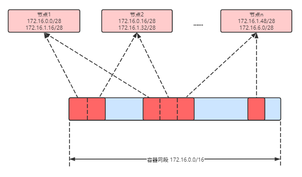
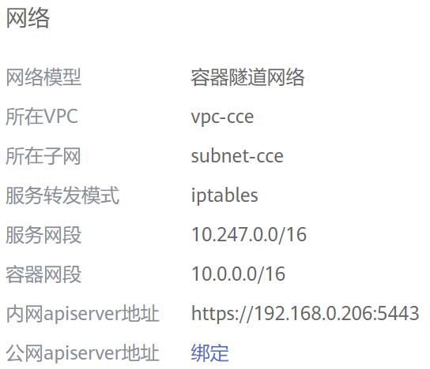

# 容器隧道网络<a name="cce_01_0282"></a>

## 容器隧道网络模型<a name="section12281724511"></a>

**容器隧道网络**在节点网络基础上通过隧道封装另构建的独立于节点网络平面的容器网络平面，CCE集群容器隧道网络使用的封装协议为VXLAN，后端虚拟交换机采用的是openvswitch，VXLAN是将以太网报文封装成UDP报文进行隧道传输。容器隧道网络具有付出少量隧道封装性能损耗，即可获得通用性强、互通性强、高级特性支持全面（例如NetworkPolicy网络隔离）的优势，可以满足大多数性能要求不高的场景。

**图 1**  容器隧道网络<a name="zh-cn_topic_0146398798_fig119421248102318"></a>  


**说明如下：**

-   节点内Pod间通信：同节点的Pod间通信直接通过本节点的ovs网桥直接转发。
-   跨节点Pod间通信：所有跨节点Pod间的通信通过ovs隧道网桥进行封装后，转发到对端节点上。

## 容器IP地址管理<a name="section182851515105616"></a>

容器隧道网络按如下规则分配容器IP：

-   容器网段需单独分配，与节点网段
-   节点维度划分地址段，集群的所有节点从容器网段中分配一个或多个固定大小（默认16）的IP网段
-   当节点上的IP地址使用完后，可再次申请分配一个新的IP网段
-   容器网段依次循环分配IP网段给新增节点或存量节点
-   调度到节点上的Pod依次循环从分配给节点的一个或多个IP网段内分配IP地址

**图 2**  容器隧道网络IP地址分配<a name="fig964351910578"></a>  


按如上IP分配，容器隧道网络的集群最多能创建节点数量 = 容器网段IP数量 ÷ 节点从容器网段中一次分配的IP网段大小（默认为16）

比如容器网段为172.16.0.0/16，则IP数量为65536，一次分配16，则最多可创建节点数量为65536/16=4096。当然，这是一种极端情况，如果创建4096个节点，则每个节点最多只能创建16个Pod，因为给每个节点只分配了16个IP的网段。另外集群能创建多少节点，还受节点网络和集群规模的影响。

**图 3**  网络模型选择<a name="fig4482134263418"></a>  


## 优缺点<a name="section207316301745"></a>

**优点**

-   容器网络和节点网络解耦，不受VPC配额规格、响应速度的限制（如VPC路由条目数、弹性网卡数、创建速度限制）
-   支持网络隔离，具体请参见[NetworkPolicy](NetworkPolicy.md)
-   支持带宽限制
-   支持大规模组网

**缺点**

-   由于隧道封装，网络问题排查难度较大，整体性能较低
-   无法直接利用VPC提供的负载均衡、安全组等能力
-   不支持外部网络与容器IP直通

## 应用场景<a name="section474217381446"></a>

-   对性能要求不高：由于需要额外的VXLAN隧道封装，相对于另外两种容器网络模式，性能存在一定的损耗。大概有5%-15%的性能损失。所以容器隧道网络适用于对性能要求不是特别高的业务场景，比如：web应用、访问量不大的数据中台、后台服务等。
-   大规模组网：相比VPC路由网络受限于VPC路由条目配额的限制，容器隧道网络没有网络基础设施的任何限制；同时容器隧道网络把广播域控制到了节点级别，容器隧道网络最大可支持2000节点规模。

## 容器隧道网络访问示例<a name="section10441454192410"></a>

创建一个容器隧道网络的集群。

**图 4**  集群网络<a name="fig17902202283516"></a>  


在集群中创建一个Deployment。

```
kind: Deployment
apiVersion: apps/v1
metadata:
  name: example
  namespace: default
spec:
  replicas: 4
  selector:
    matchLabels:
      app: example
  template:
    metadata:
      labels:
        app: example
    spec:
      containers:
        - name: container-0
          image: 'nginx:perl'
          resources:
            limits:
              cpu: 250m
              memory: 512Mi
            requests:
              cpu: 250m
              memory: 512Mi
      imagePullSecrets:
        - name: default-secret
```

创建后查看Pod。

```
$ kubectl get pod -owide
NAME                       READY   STATUS    RESTARTS   AGE     IP          NODE           NOMINATED NODE   READINESS GATES
example-5bdc5699b7-5rvq4   1/1     Running   0          3m28s   10.0.0.20   192.168.0.42   <none>           <none>
example-5bdc5699b7-984j9   1/1     Running   0          3m28s   10.0.0.21   192.168.0.42   <none>           <none>
example-5bdc5699b7-lfxkm   1/1     Running   0          3m28s   10.0.0.22   192.168.0.42   <none>           <none>
example-5bdc5699b7-wjcmg   1/1     Running   0          3m28s   10.0.0.52   192.168.0.64   <none>           <none>
```

此时如果在集群同VPC下集群外部直接访问Pod的IP，会发现访问不通，这就是容器隧道网络的特性，不支持外部网络与容器IP直通。

而在集群内部节点或Pod内，都能正常访问Pod，如下进入到容器中直接访问Pod能够正常访问。

```
$ kubectl exec -it example-5bdc5699b7-5rvq4 -- curl 10.0.0.21
<!DOCTYPE html>
<html>
<head>
<title>Welcome to nginx!</title>
<style>
    body {
        width: 35em;
        margin: 0 auto;
        font-family: Tahoma, Verdana, Arial, sans-serif;
    }
</style>
</head>
<body>
<h1>Welcome to nginx!</h1>
<p>If you see this page, the nginx web server is successfully installed and
working. Further configuration is required.</p>

<p>For online documentation and support please refer to
<a href="http://nginx.org/">nginx.org</a>.<br/>
Commercial support is available at
<a href="http://nginx.com/">nginx.com</a>.</p>

<p><em>Thank you for using nginx.</em></p>
</body>
</html>
```

