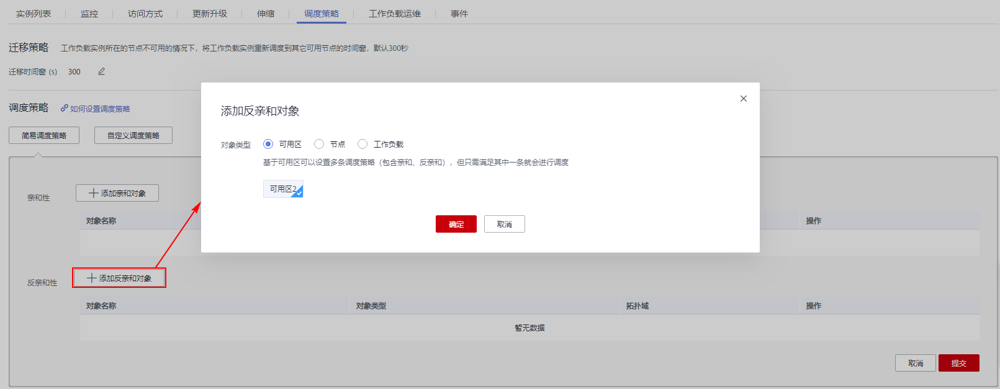

# 工作负载和可用区的反亲和性<a name="cce_01_0229"></a>

## 通过控制台设置<a name="section13854613443"></a>

1.  参照[创建无状态负载\(Deployment\)](创建无状态负载(Deployment).md)或[创建有状态负载\(StatefulSet\)](创建有状态负载(StatefulSet).md)，在“高级设置“的“调度策略“下，单击“工作负载和可用区的亲和性 \> 与可用区的反亲和性“前的。

    **图 1**  调度策略<a name="fig15240556122815"></a>  
    

2.  单击工作负载不希望部署到的可用区。

    当前创建的工作负载不会部署到已选择的可用区中。


## 通过kubectl命令行设置<a name="section102822029173111"></a>

本节以nginx为例，说明kubectl命令创建工作负载的方法。

**前提条件**

请参见[通过kubectl或web-terminal插件连接CCE集群](通过kubectl或web-terminal插件连接CCE集群.md)配置kubectl命令，使弹性云服务器连接集群。

**操作步骤**

参见[通过kubectl命令行创建无状态工作负载](创建无状态负载(Deployment).md#section155246177178)或[通过kubectl命令行创建有状态工作负载](创建有状态负载(StatefulSet).md#section113441881214)，工作负载和可用区反亲和性的yaml示例如下：

```
apiVersion: extensions/v1beta1
kind: Deployment
metadata:
  name: nginx
spec:
  replicas: 1
  selector:
    matchLabels:
      app: nginx
  strategy:
    type: RollingUpdate
  template:
    metadata:
      labels:
        app: nginx
    spec:
      containers:
      - image: nginx 
        imagePullPolicy: Always
        name: nginx
      imagePullSecrets:
      - name: default-secret
      affinity:
        nodeAffinity:
          requiredDuringSchedulingIgnoredDuringExecution:
            nodeSelectorTerms:
            - matchExpressions:
              - key: failure-domain.beta.kubernetes.io/zone       #node中label的key   
                operator: NotIn        
                values:
                - az1                                   #node中对应key的value
```

## 工作负载创建完成后设置<a name="section1914684415"></a>

1.  登录[CCE控制台](https://console.huaweicloud.com/cce2.0/?utm_source=helpcenter)，在左侧导航栏中选择“工作负载 \> 无状态负载 Deployment”或“工作负载 \> 有状态负载 StatefulSet”。
2.  单击工作负载名称进入详情页，单击“调度策略 \> 简易调度策略 \> 添加反亲和对象”。

    **图 2**  添加反亲和对象<a name="fig2029255193016"></a>  
    

3.  对象类型选为“可用区”，单击工作负载不希望部署到的可用区，当前创建的工作负载不会部署到已选择的可用区中。

    > **说明：** 
    >该方法可新增、编辑和删除调度策略。


