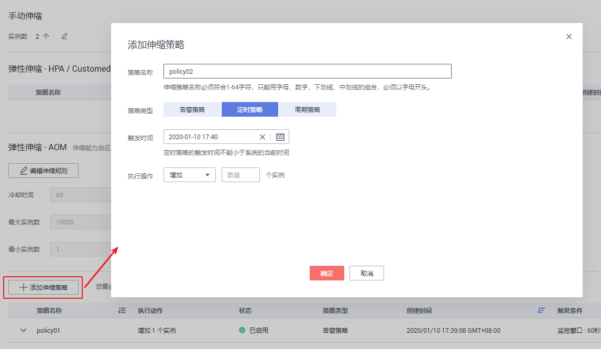
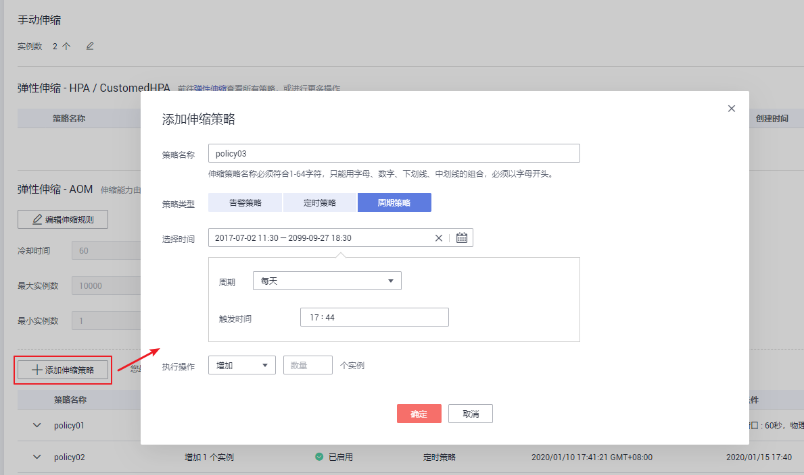

# 工作负载弹性伸缩

伸缩策略定义后，可基于资源变化、固定时间、固定周期自动触发实例的增减，从而降低人为反复调整资源以应对业务变化和高峰压力的工作量，帮助您节约资源和人力成本。

-   弹性伸缩：支持告警、定时、周期三种策略。配置完成后可基于资源变化、固定时间、固定周期自动触发实例的增减。
-   手动伸缩：配置完成后立即触发实例的增减。

> **说明：**   
>**伸缩策略优先级：**手动伸缩和自动伸缩同时配置的情况下，在不执行手动伸缩时，资源调度以自动伸缩为准，伸缩按照监控信息自动触发，如果使用[手动伸缩](工作负载弹性伸缩.md#section1050418516503)，自动伸缩会暂时失效。  

## 弹性伸缩-HPA/CustomedHPA

该弹性伸缩能力通过创建HPA或CustomedHPA策略实现，**您可以前往[弹性伸缩](创建工作负载伸缩策略.md)查看所有策略，或进行更多操作。**

## 弹性伸缩-AOM

您可以根据业务需求自行定义伸缩策略，降低人为反复调整资源以应对业务变化和高峰压力的工作量，帮助您节约资源和人力成本。

该伸缩能力由[应用运维管理AOM](https://support.huaweicloud.com/aom/index.html)服务提供，当前支持三种弹性伸缩策略：

[告警策略](#li16804196913)：支持根据CPU/内存的设置，进行工作负载的自动伸缩。工作负载创建完成后即可设置，在CPU/内存超过或少于一定值时，自动增减实例。

[定时策略](#li1595211281895)：支持在特定时间点进行工作负载的自动伸缩。适用于秒杀周年庆等活动，例如在秒杀这个时间点增加一定数量的实例个数。

[周期策略](#li35861531491)：支持以天、周、月为周期的伸缩策略。适用于周期性的流量变化。

-   **告警策略**：支持根据CPU/内存的设置，进行工作负载的自动伸缩。
    1.  登录[CCE控制台](https://console.huaweicloud.com/cce2.0/?utm_source=helpcenter)，在左侧导航栏中选择“工作负载 \> 无状态负载 Deployment/有状态负载 StatefulSet”，单击工作负载名称后的“更多 \> 伸缩“。
    2.  在弹性伸缩下，单击“添加伸缩策略“。

        **图 1**  添加告警策略  
        

    3.  参照[表1](#table297454613303)设置伸缩策略参数：

        **表 1**  添加告警策略

        
        <table><thead align="left"><tr id="row1897304663020"><th class="cellrowborder" valign="top" width="23%" id="mcps1.2.3.1.1">
参数

        </th>
        <th class="cellrowborder" valign="top" width="77%" id="mcps1.2.3.1.2">
参数说明

        </th>
        </tr>
        </thead>
        <tbody><tr id="row17973746163017"><td class="cellrowborder" valign="top" width="23%" headers="mcps1.2.3.1.1 ">
策略名称

        </td>
        <td class="cellrowborder" valign="top" width="77%" headers="mcps1.2.3.1.2 ">
请输入伸缩策略的名称。

        
伸缩策略名称必须符合1-64字符，只能用字母、数字、下划线、中划线的组合，必须以字母开头。

        </td>
        </tr>
        <tr id="row997320460302"><td class="cellrowborder" valign="top" width="23%" headers="mcps1.2.3.1.1 ">
策略类型

        </td>
        <td class="cellrowborder" valign="top" width="77%" headers="mcps1.2.3.1.2 ">
选择“告警策略”。

        
告警策略基于历史数据进行判断触发，以<strong id="b14705122843213">1分钟</strong>为周期去判断监控窗口时间内用户设定的指标是否满足触发条件，若连续n个周期都满足触发条件，将会执行操作。

        </td>
        </tr>
        <tr id="row29735463308"><td class="cellrowborder" valign="top" width="23%" headers="mcps1.2.3.1.1 ">
指标

        </td>
        <td class="cellrowborder" valign="top" width="77%" headers="mcps1.2.3.1.2 ">
指标是对资源性能的数据描述或状态描述。

        <ul id="ul18973184614308"><li>CPU使用率：该指标用于统计测量对象的CPU使用率。工作负载实际使用的与申请的CPU核数量比率。</li><li>数据发送速率：该指标用于统计测量对象每秒钟发送的数据量。</li><li>磁盘写入速率：该指标用于统计每秒写入磁盘的数据量。</li><li>物理内存使用率：该指标用于统计测量对象已使用内存占申请物理内存总量的百分比。</li><li>物理内存总量：该指标用于统计测量对象申请的物理内存总量。</li><li>数据接收速率：该指标用于统计测量对象每秒钟接收的数据量。</li><li>CPU内核总量：该指标用于统计测量对象申请的CPU核总量。</li><li>物理内存使用量：该指标用于统计测量对象实际已经使用的物理内存（Resident Set Size）。</li><li>磁盘读取速率：该指标用于统计每秒从磁盘读出的数据量。</li><li>CPU内核占用：该指标用于统计测量对象已经使用的CPU核个数。</li><li>容器错包个数：该指标用于统计测量对象收到错误包的数量。</li></ul>
        </td>
        </tr>
        <tr id="row197324610309"><td class="cellrowborder" valign="top" width="23%" headers="mcps1.2.3.1.1 ">
触发条件

        </td>
        <td class="cellrowborder" valign="top" width="77%" headers="mcps1.2.3.1.2 ">
可选“&gt;”或“&lt;”，支持以上指标的使用量达到设定值时触发伸缩策略。

        
如：指标选择“CPU使用率”，此处选择“&gt;”70%，表示在CPU使用率超过70%时触发伸缩策略。

        </td>
        </tr>
        <tr id="row3973144603014"><td class="cellrowborder" valign="top" width="23%" headers="mcps1.2.3.1.1 ">
监控窗口

        </td>
        <td class="cellrowborder" valign="top" width="77%" headers="mcps1.2.3.1.2 ">
指数据的汇聚窗口大小。

        
若设置为60秒，表示每60秒统计一次。

        </td>
        </tr>
        <tr id="row19973104613011"><td class="cellrowborder" valign="top" width="23%" headers="mcps1.2.3.1.1 ">
连续周期

        </td>
        <td class="cellrowborder" valign="top" width="77%" headers="mcps1.2.3.1.2 ">
指监控窗口内连续触发阈值的次数，计算周期固定一分钟。

        
若设置为3，则表示指标数据连续三个统计周期达到了设定的阈值，则触发策略动作。

        </td>
        </tr>
        <tr id="row69742462306"><td class="cellrowborder" valign="top" width="23%" headers="mcps1.2.3.1.1 ">
执行操作

        </td>
        <td class="cellrowborder" valign="top" width="77%" headers="mcps1.2.3.1.2 ">
策略触发后执行的动作，可增加或减少实例个数。

        </td>
        </tr>
        </tbody>
        </table>

    4.  单击“确定“。
    5.  在弹性伸缩下，可看到策略已启动。

        **图 2**  查看告警策略  
        

        待到触发条件发生时，弹性伸缩策略会自动启动。

-   **定时策略**：支持在特定时间点进行工作负载的自动伸缩。
    1.  在弹性伸缩下，单击“添加伸缩策略“，选择“定时策略“。

        **图 3**  定时策略  
        

        **表 2**  添加定时策略

        
        <table><thead align="left"><tr id="row1428011412512"><th class="cellrowborder" valign="top" width="26%" id="mcps1.2.3.1.1">
参数

        </th>
        <th class="cellrowborder" valign="top" width="74%" id="mcps1.2.3.1.2">
参数说明

        </th>
        </tr>
        </thead>
        <tbody><tr id="row1728054182516"><td class="cellrowborder" valign="top" width="26%" headers="mcps1.2.3.1.1 ">
策略名称

        </td>
        <td class="cellrowborder" valign="top" width="74%" headers="mcps1.2.3.1.2 ">
请输入伸缩策略的名称。

        
伸缩策略名称必须符合1-64字符，只能用字母、数字、下划线、中划线的组合，必须以字母开头。

        </td>
        </tr>
        <tr id="row5280154182518"><td class="cellrowborder" valign="top" width="26%" headers="mcps1.2.3.1.1 ">
策略类型

        </td>
        <td class="cellrowborder" valign="top" width="74%" headers="mcps1.2.3.1.2 ">
选择定时策略。

        </td>
        </tr>
        <tr id="row1728113415258"><td class="cellrowborder" valign="top" width="26%" headers="mcps1.2.3.1.1 ">
触发时间

        </td>
        <td class="cellrowborder" valign="top" width="74%" headers="mcps1.2.3.1.2 ">
策略触发时间。

        </td>
        </tr>
        <tr id="row112811346259"><td class="cellrowborder" valign="top" width="26%" headers="mcps1.2.3.1.1 ">
执行操作

        </td>
        <td class="cellrowborder" valign="top" width="74%" headers="mcps1.2.3.1.2 ">
策略触发后执行的动作，可增加、减少或设置实例个数。

        </td>
        </tr>
        </tbody>
        </table>

    2.  单击“确定“。
    3.  在弹性伸缩下，可看到策略已启动。

        **图 4**  查看定时策略  
        

        待到触发时间时，可查看到实例列表页签中，弹性伸缩已生效。

        **图 5**  弹性伸缩已生效  
        

-   **周期策略**：支持以天、周、月为周期的伸缩策略。
    1.  在弹性伸缩下，单击“添加伸缩策略“，选择“周期策略“

        **图 6**  周期策略  
        

        **表 3**  添加周期策略

        
        <table><thead align="left"><tr id="row13407141620275"><th class="cellrowborder" valign="top" width="26%" id="mcps1.2.3.1.1">
参数

        </th>
        <th class="cellrowborder" valign="top" width="74%" id="mcps1.2.3.1.2">
参数说明

        </th>
        </tr>
        </thead>
        <tbody><tr id="row10407101652718"><td class="cellrowborder" valign="top" width="26%" headers="mcps1.2.3.1.1 ">
策略名称

        </td>
        <td class="cellrowborder" valign="top" width="74%" headers="mcps1.2.3.1.2 ">
请输入伸缩策略的名称。

        
伸缩策略名称必须符合1-64字符，只能用字母、数字、下划线、中划线的组合，必须以字母开头。

        </td>
        </tr>
        <tr id="row3409316102719"><td class="cellrowborder" valign="top" width="26%" headers="mcps1.2.3.1.1 ">
策略类型

        </td>
        <td class="cellrowborder" valign="top" width="74%" headers="mcps1.2.3.1.2 ">
选择周期策略。

        </td>
        </tr>
        <tr id="row1940915163272"><td class="cellrowborder" valign="top" width="26%" headers="mcps1.2.3.1.1 ">
选择时间

        </td>
        <td class="cellrowborder" valign="top" width="74%" headers="mcps1.2.3.1.2 ">
选择策略触发的时间。

        </td>
        </tr>
        <tr id="row154091616182715"><td class="cellrowborder" valign="top" width="26%" headers="mcps1.2.3.1.1 ">
执行操作

        </td>
        <td class="cellrowborder" valign="top" width="74%" headers="mcps1.2.3.1.2 ">
策略触发后执行的动作，可增加、减少或设置实例个数。

        </td>
        </tr>
        </tbody>
        </table>

    2.  单击“确定“。
    3.  在弹性伸缩下，可看到策略已启动。

        **图 7**  查看周期策略  
        

        待触发条件生效时，弹性伸缩策略会自动启动。

## 手动伸缩

1.  登录[CCE控制台](https://console.huaweicloud.com/cce2.0/?utm_source=helpcenter)，在左侧导航栏中选择“工作负载 \> 无状态负载 Deployment/有状态负载 StatefulSet”，单击工作负载名称后的“伸缩“。
2.  在“手动伸缩“策略下，单击修改实例数量，例如修改为“3“，单击“保存“后实例伸缩操作即可生效。

    **图 8**  修改实例数  
    

3.  在“实例列表“页签下，可查看到新的实例在创建中，待状态为运行中时，表示已成功完成实例伸缩操作。

    **图 9**  手动伸缩  
    

