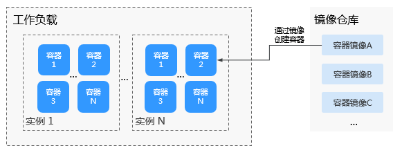

# 工作负载概述

工作负载即Kubernetes对一组Pod的抽象模型，用于描述业务的运行载体，包括Deployment、Statefulset、Job、Deamonset等。

在CCE最新版本中，原先的“应用管理“名称改为“工作负载“，提供基于Kubernetes原生的Deployment，StatefulSet等负载创建、配置、删除等生命周期管理。

## 基本概念

-   无状态工作负载（即kubernetes中的Deployments）：实例之间完全独立、功能相同，具有弹性伸缩、滚动升级等特性。如：nginx、wordpress，创建无状态工作负载请参见[创建无状态工作负载](创建无状态工作负载.md)。
-   有状态工作负载（即kubernetes中的StatefulSets）：实例之间不完全独立，具有稳定的持久化存储和网络标示，以及有序的部署、收缩和删除等特性。如：mysql-HA、etcd，创建有状态工作负载请参见[创建有状态工作负载](创建有状态工作负载.md)。

## 工作负载与容器间的关系

如[图1](#fig1801862479)所示，一个工作负载由一个或多个实例（Pod）组成。一个实例由一个或多个容器组成，每个容器都对应一个容器镜像。对于无状态工作负载，实例都是完全相同的。

**图 1**  工作负载与容器的关系  

## 工作负载生命周期说明

**表 1**  状态说明

<table><thead align="left"><tr id="row13888105212343"><th class="cellrowborder" valign="top" width="25%" id="mcps1.2.3.1.1">
状态

</th>
<th class="cellrowborder" valign="top" width="75%" id="mcps1.2.3.1.2">
说明

</th>
</tr>
</thead>
<tbody><tr id="row14889152173415"><td class="cellrowborder" valign="top" width="25%" headers="mcps1.2.3.1.1 ">
运行中

</td>
<td class="cellrowborder" valign="top" width="75%" headers="mcps1.2.3.1.2 ">
所有实例都处于运行中才是运行中。

</td>
</tr>
<tr id="row12889195263417"><td class="cellrowborder" valign="top" width="25%" headers="mcps1.2.3.1.1 ">
未就绪

</td>
<td class="cellrowborder" valign="top" width="75%" headers="mcps1.2.3.1.2 ">
所有容器处于pending状态。

</td>
</tr>
<tr id="row12889195213419"><td class="cellrowborder" valign="top" width="25%" headers="mcps1.2.3.1.1 ">
升级中

</td>
<td class="cellrowborder" valign="top" width="75%" headers="mcps1.2.3.1.2 ">
触发升级动作后，工作负载会处于升级中。

</td>
</tr>
<tr id="row2088975211346"><td class="cellrowborder" valign="top" width="25%" headers="mcps1.2.3.1.1 ">
已停止

</td>
<td class="cellrowborder" valign="top" width="75%" headers="mcps1.2.3.1.2 ">
触发停止操作后，工作负载会处于停止状态，把实例数变为0。

</td>
</tr>
<tr id="row172011222121114"><td class="cellrowborder" valign="top" width="25%" headers="mcps1.2.3.1.1 ">
可用

</td>
<td class="cellrowborder" valign="top" width="75%" headers="mcps1.2.3.1.2 ">
当无状态工作负载多实例工作负载运行过程中部分实例异常，可用实例不为0，工作负载会处于可用。

</td>
</tr>
<tr id="row1280465420481"><td class="cellrowborder" valign="top" width="25%" headers="mcps1.2.3.1.1 ">
删除中

</td>
<td class="cellrowborder" valign="top" width="75%" headers="mcps1.2.3.1.2 ">
触发删除操作后，工作负载会处于删除状态。

</td>
</tr>
</tbody>
</table>

