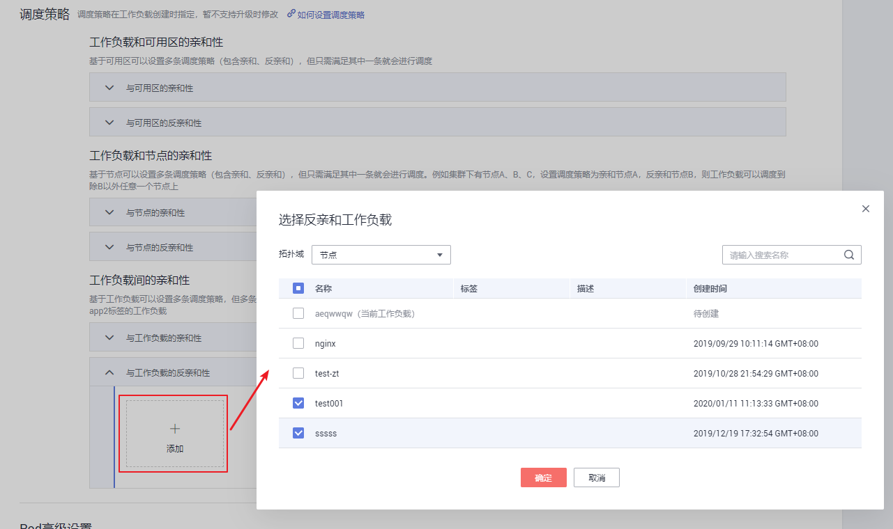

# 工作负载间的反亲和性<a name="cce_01_0227"></a>

-   [通过控制台设置](#section189731748476)
-   [通过kubectl命令行设置](#section1894310152317)
-   [工作负载创建完成后设置](#section097418414472)

## 通过控制台设置<a name="section189731748476"></a>

1.  参照[创建无状态负载\(Deployment\)](创建无状态负载(Deployment).md)或[创建有状态负载\(StatefulSet\)](创建有状态负载(StatefulSet).md)，在“高级设置“的“调度策略“下，单击“工作负载间的亲和性 \> 与工作负载的反亲和性“下的“添加“。

    **图 1**  与工作负载的反亲和性<a name="fig5547125112312"></a>  
    

2.  勾选不希望部署到相同节点的工作负载，单击“确定“。

    当前创建的工作负载会和已勾选的工作负载部署在不同节点上。


## 通过kubectl命令行设置<a name="section1894310152317"></a>

本节以nginx为例，说明kubectl命令创建工作负载的方法。

**前提条件**

请参见[通过kubectl或web-terminal插件操作CCE集群](通过kubectl或web-terminal插件操作CCE集群.md)配置kubectl命令，使弹性云服务器连接集群。

**操作步骤**

参见[通过kubectl命令行创建无状态工作负载](创建无状态负载(Deployment).md#section155246177178)或[通过kubectl命令行创建有状态工作负载](创建有状态负载(StatefulSet).md#section113441881214)，工作负载间反亲和性的yaml示例如下：

```
apiVersion: extensions/v1beta1
kind: Deployment
metadata:
  name: nginx
spec:
  replicas: 1
  selector:
    matchLabels:
      app: nginx
  strategy:
    type: RollingUpdate
  template:
    metadata:
      labels:
        app: nginx
    spec:
      containers:
      - image: nginx 
        imagePullPolicy: Always
        name: nginx
      imagePullSecrets:
      - name: default-secret
      affinity:
        podAffinity:
          requiredDuringSchedulingIgnoredDuringExecution:
            nodeSelectorTerms:
            - matchExpressions:
              - key: app          #工作负载中lable的key
                operator: NotIn        
                values:
                - test     #工作负载中对应lable的value
```

## 工作负载创建完成后设置<a name="section097418414472"></a>

1.  登录[CCE控制台](https://console.huaweicloud.com/cce2.0/?utm_source=helpcenter)，在左侧导航栏中选择“工作负载 \> 无状态负载 Deployment”或“工作负载 \> 有状态负载 StatefulSet”。
2.  单击工作负载名称进入详情页，单击“调度策略 \> 简易调度策略 \> 添加反亲和对象”。
3.  对象类型选择“工作负载”，勾选希望部署到不同节点上的工作负载，设置完成后当前的工作负载会和已勾选的工作负载部署在不同节点上。

    **图 2**  添加反亲和对象-工作负载<a name="fig251616282249"></a>  
    

    > **说明：** 
    >该方法可新增、编辑和删除调度策略。


