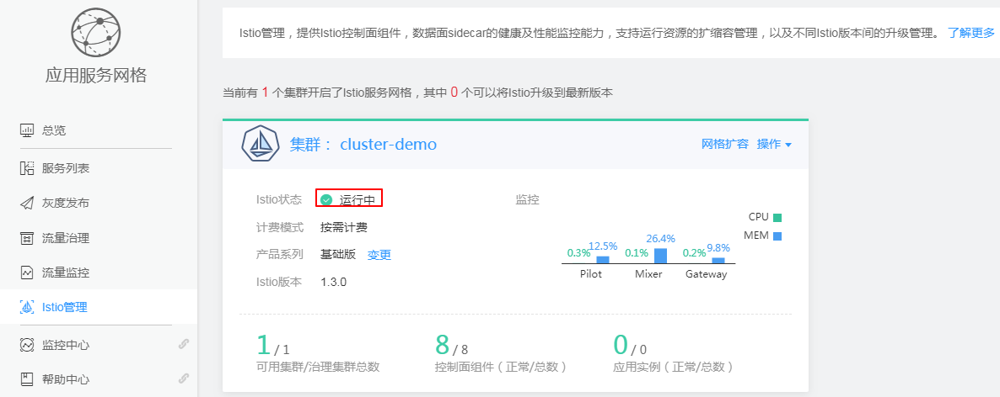

# 应用服务网格\(Istio\)

应用服务网格是华为云基于开源Istio推出的服务网格平台，它深度、无缝对接了华为云的企业级Kubernetes集群服务云容器引擎（Cloud Container Engine，简称CCE），在易用性、可靠性、可视化等方面进行了一系列增强，可为客户提供开箱即用的上手体验。

应用服务网格提供非侵入式的微服务治理解决方案，支持完整的生命周期管理和流量治理，兼容Kubernetes和Istio生态，其功能包括负载均衡、熔断、限流等多种治理能力。应用服务网格内置金丝雀、蓝绿、A/B Test等多种灰度发布流程，提供一站式自动化的发布管理。应用服务网格基于无侵入的监控数据采集，提供实时流量拓扑、调用链等服务性能监控和运行诊断，构建全景的服务运行视图。

更多信息请参见[启用应用服务网格](https://support.huaweicloud.com/usermanual-istio/istio_01_0002.html)。

## 操作步骤

1.  登录[CCE控制台](https://console.huaweicloud.com/cce2.0/?utm_source=helpcenter)，单击左侧导航栏的“资源管理 \> 集群管理”。
2.  在集群列表页面中，单击对应集群后的“更多 \> 启用Istio“。
3.  进入启用Istio服务网格页面，设置相关参数。
    -   **集群**

        选择要启用Istio服务网格功能的集群。

    -   **部署模式**

        不同的部署模式，待配置的参数也有所不同，请以界面实际展示的参数为准。

        -   独享模式（推荐使用）：将为您纳管专属节点，用于部署Istio控制面组件，非Istio控制面负载将无法调度到该专属节点上。

            独享模式的Istio控制面与数据面资源相互隔离。

            独享模式需要您有充足的节点配额和磁盘配额，一个节点需要配备40G系统盘及100G数据盘。高可用模式，要求独享节点个数不少于2，非高可用模式，要求独享节点个数只能为1。

        -   共享模式：会将Istio控制面组件部署在您的集群节点上，请确保集群内有可用节点，否则无法启用共享模式Istio服务网格。

            共享模式的Istio控制面与数据面未做隔离，可能产生未知问题，生产环境建议您使用独享模式。

    -   **计费模式**

        支持“按需计费“和“包年/包月“模式。包年/包月模式的节点创建后不能删除，如需停止使用，请到[费用中心](https://account.huaweicloud.com/usercenter/#/userindex/retreatManagement)执行退订操作。

    -   **Istio版本**

        指定Istio版本，该版本支持Dubbo协议服务治理。

    -   **产品系列**

        当前支持基础版、专业版、企业版三种系列。不同产品系列在支持管理的网格实例规模和功能上存在差异，请根据业务诉求按需选择。

    -   **当前区域**

        指节点实例所在的物理位置。请就近选择靠近您业务的区域，可减少网络时延，提高访问速度；不同区域的云服务产品之间内网互不相通。

    -   **可用区**&**节点规格**

        指在同一区域下，电力、网络隔离的物理区域，可用区之间内网互通，不同可用区之间物理隔离。如果您需要提高工作负载的高可靠性，建议您将云服务器创建在不同的可用区。

        选择所需的规格。为确保Istio控制面运行稳定，推荐您使用 8U 16G 或以上规格控制面节点，详情请参见[规格推荐](https://support.huaweicloud.com/productdesc-istio/istio_productdesc_0006.html)。

    -   **集群管理规模**

        服务网格内治理的实例数量，管理规模大小与[产品系列](#zh-cn_topic_0137962680_li10988165115388)中所选的版本有关。

    -   **应用性能规格**

        集群下应用单Pod实例QPS流量预估值，默认值为50，服务网格会根据需要管理的应用规模和性能诉求给出资源建议。

    -   **高可用**

        Istio启用后，高可用模式与普通模式不可切换，请根据实际使用情况选择。

        -   是：高可用模式要求独享节点个数不少于2，用于Istio控制面多实例部署，多实例能大大的提高Istio控制面可靠性，推荐使用。
        -   否：非高可用模式为单点模式，Istio控制面组件均为单实例，无法提供更高的可靠性保证。

    -   **节点数量**

        高可用模式下，要求独享节点个数不少于2；非高可用模式下，要求独享节点个数只能为1。

    -   **控制面实例数量**

        控制面实例数必须和独享节点数相同，每个独享节点上运行控制面的一个实例副本。

    -   **登录方式**

        支持密码和密钥两种方式。

        -   选择“密码“：用户名默认为“root”，请输入登录节点的密码，并确认密码。

            登录节点时需要使用该密码，请妥善管理密码，系统无法获取您设置的密码内容。

        -   选择“密钥对“：在选项框中选择用于登录本节点的密钥对，并单击勾选确认信息。

            密钥对用于远程登录节点时的身份认证。若没有密钥对，可单击选项框右侧的“创建密钥对”来新建，创建密钥对操作步骤请参见[创建密钥对](https://support.huaweicloud.com/usermanual-ecs/zh-cn_topic_0014250631.html)。

    -   **节点配额**

        此处为节点配额提示，如需申请更多配额，请单击申请扩大配额。

    -   **购买时长**

        若选择创建“包年/包月”的集群，请设置购买时长。

4.  设置完成后，单击“立即购买”。确认订单无误后，单击“提交”。

    启用时间预计需要5分钟，您可以单击请求提交页面的“返回Istio管理“或“前往CCE集群管理“查看Istio运行状态。

    > **说明：** 
    >选择“立即购买”后，会进行启用Istio的操作，期间会操作如下资源：
    >-   若为高可用独享型，则创建需要至少2个ECS节点，作为Istio控制面运行节点。
    >-   创建一个Helm应用编排release对象，作为Istio控制面的资源 。
    >-   开通ECS节点的安全组，允许7443端口的入流量，使其支持对Pod进行自动注入。
    >-   为该集群的default的命名空间打上inject=true标签。

5.  Istio服务网格启用成功后，可在“Istio管理“或CCE的集群列表中查看Istio启用状态。
    -   **方式一：**登录[应用服务网格控制台](https://console.huaweicloud.com/istio/?locale=zh-cn)，单击“Istio管理“，在右侧卡片列表中查看Istio状态，若为运行中则说明集群启用Istio成功。

        **图 1**  Istio服务网格启用成功  
        

    -   **方式二：**登录[云容器引擎](https://console.huaweicloud.com/cce2.0/?locale=zh-cn)控制台，单击“资源管理 \> 集群管理”，在右侧集群卡片列表中查看Istio状态。
        -   若集群名称右侧显示，则Istio启用成功。
        -   若集群名称右侧显示，则Istio启用失败。

