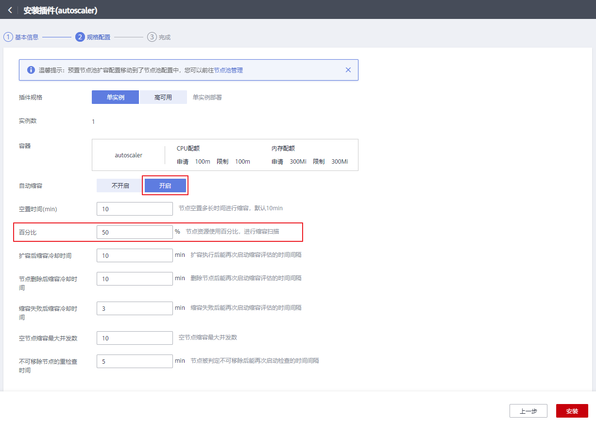

# 弹性伸缩概述

-   [基于CCE提供的K8S插件（autoscaler/hpa）实现弹性伸缩](#section138188718250)
-   [基于AOM服务实现弹性伸缩](#section1030324132715)

**CCE提供如下弹性伸缩功能：**

1.  [基于CCE提供的K8S插件（autoscaler/hpa）实现弹性伸缩](#section138188718250)（**推荐使用该类弹性伸缩**）。
2.  [基于AOM服务实现弹性伸缩](#section1030324132715)（伸缩指标和触发伸缩均由AOM服务提供）。

## 基于CCE提供的K8S插件（autoscaler/hpa）实现弹性伸缩

**使用入口：**

1.  工作负载伸缩
    1.  在左侧导航栏中选择“弹性伸缩”，进入“工作负载伸缩”。
    2.  在左侧导航栏中选择“工作负载 \> 无状态负载 Deployment/有状态负载 StatefulSet”，进入工作负载详情页，在“伸缩”页签下“弹性伸缩 - HPA”。

2.  节点伸缩

    在左侧导航栏中选择“弹性伸缩”，进入“节点伸缩”。

**约束与限制**：

-   请在使用的集群中安装对应的插件，详情请参见[创建工作负载伸缩策略](创建工作负载伸缩策略.md)、[创建节点伸缩策略](创建节点伸缩策略.md)。
-   节点伸缩仅针对节点池下的节点，使用弹性伸缩的节点池需开启弹性扩缩容功能（在创建/编辑节点池时指定）。

**使用须知**：

-   支持监控指标伸缩和定时伸缩两种策略的负载伸缩。
-   支持调度扩容（在负载实例无法调度时自动从节点池中扩容节点）、监控指标扩容、定时扩容三种节点扩容策略。
-   节点缩容仅支持资源分配率缩容机制，当集群下CPU和内存分配率低于用户设置的门限（在安装/编辑[autoscaler插件](autoscaler.md)时设置）时将对节点池下节点启动缩容（该功能可以关闭），如[图1](#fig9643195391116)。

    **图 1**  自动缩容设置  
    

-   defaultpool仅用于兼容非节点池创建的节点。

## 基于AOM服务实现弹性伸缩

**使用入口**：

1.  工作负载伸缩：在左侧导航栏中选择“工作负载 \> 无状态负载 Deployment/有状态负载 StatefulSet”，单击工作负载名称进入工作负载详情页，在“伸缩”页签下选择“弹性伸缩 - AOM”。详情请参见[弹性伸缩-AOM](工作负载弹性伸缩.md#section1656965814562)。
2.  节点扩容：在左侧导航栏中选择“资源管理 \> 集群管理”，进入集群详情页，选择“弹性扩容”页签。详情请参见[集群弹性扩容](集群弹性扩容.md)。

**约束与限制**：

当前区域的AOM服务支持伸缩功能，并且CCE集群版本低于v1.17。

**使用须知**：

-   支持监控指标伸缩和定时伸缩两种策略的负载伸缩。
-   支持监控指标和定时两种策略的节点扩容，不支持节点缩容。
-   节点仅支持设置一个节点配置（在集群详情页的“弹性扩容”页签下进行设置），且节点模板支持的节点可配参数较少。

