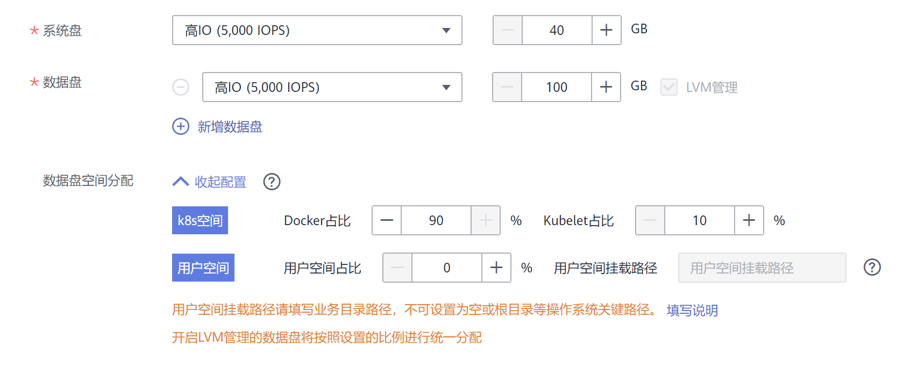

# 数据盘空间分配说明

在创建节点时，您需要配置节点数据盘。

数据盘的空间分成k8s空间和用户空间，而k8s空间包含如下两部分。

-   Docker空间（默认占90%）：用于Docker工作目录、存储Docker镜像数据以及镜像元数据。
-   Kubelet空间（默认占10%）：用于存储Pod配置文件、密钥以及临时存储EmptyDir等挂载数据。

Docker空间的大小会影响镜像下载和容器的启动和运行。本章节将详细介绍节点Docker存储空间占用情况，以便您根据业务实际情况配置Docker盘大小。

## Docker空间大小说明

数据盘根据容器存储Rootfs不同，默认划分如下（以100G大小为例）。

-   DeviceMapper类型存储Rootfs

    -   其中/var/lib/docker用于Docker工作目录，默认占Docker空间的20%，其空间大小 =  **数据盘空间 \* 90% \* 20%**
    -   thinpool用于存储Docker镜像数据、镜像元数据以及容器使用的磁盘空间，默认占Docker空间的80%，其空间大小 =  **数据盘空间 \* 90% \* 80%**

        thinpool是动态挂载，在节点上使用**df -h**命令无法查看到，使用**lsblk**命令可以查看到。

    

-   OverlayFS类型存储Rootfs：相比DeviceMapper存储引擎，没有单独划分thinpool，Docker空间都在/var/lib/docker目录下。

    

容器存储Rootfs情况如下：

-   CCE集群：EulerOS 2.5和CentOS 7.6操作系统使用DeviceMapper，Ubuntu 18.04使用OverlayFS。
-   CCE Turbo集群：BMS节点使用DeviceMapper，ECS节点（CentOS 7.6和Ubuntu 18.04）使用OverlayFS。

## Docker空间与容器数量的关系

节点实例数配置和单容器空间配置，影响当前节点是否会导致docker空间不足。

理想情况下，Docker空间需要大于容器使用的磁盘总空间，即：**Docker空间**  \>  **容器数量 \* 单容器可用数据空间（basesize）**

**Devicemapper模式下**，尽管可以限制单个容器的主目录大小（默认为10GB），但节点上的所有容器还是共用节点的thinpool磁盘空间，并不是完全隔离，当一些容器使用大量thinpool空间且总和达到节点thinpool空间上限时，也会影响其他容器正常运行。

另外，在容器的主目录中创删文件后，其占用的thinpool空间不会立即释放，因此即使basesize已经配置为10GB，而容器中不断创删文件时，占用的thinpool空间会不断增加一直到10GB为止，后续才会复用这10GB空间。如果节点上的容器数量\*basesize \> 节点thinpool空间大小，理论上有概率出现节点thinpool空间耗尽的场景。

## 镜像回收策略说明

当Docker空间不足时，会触发镜像垃圾回收。

镜像垃圾回收策略只考虑两个因素：HighThresholdPercent 和 LowThresholdPercent。 磁盘使用率超过上限阈值（HighThresholdPercent，默认值为85%）将触发垃圾回收。 垃圾回收将删除最近最少使用的镜像，直到磁盘使用率满足下限阈值（LowThresholdPercent，默认值为80%）。

## Docker空间大小配置建议

-   Docker空间需要大于容器使用的磁盘总空间，即：**Docker空间**  \>  **容器数量 \* 单容器可用数据空间（basesize）**
-   容器业务的创删文件操作建议在容器挂载的本地存储（如emptyDir、hostPath）或云存储的目录中进行，这样不会占用thinpool空间。其中Emptydir使用的是kubelet空间，需要规划好kubelet空间的大小。本地存储和云存储操作详见[存储管理-CSI](存储管理-CSI.md)。
-   Docker使用overlayfs存储模式，当前CCE Turbo集群中ECS节点（CentOS 7.6和Ubuntu 18.04），以及CCE集群中Ubuntu 18.04节点容器已默认使用overlayfs存储模式，可将业务部署在此类节点上，避免容器内创删文件后占用的磁盘空间不立即释放问题。

## 常见问题

[如何扩容容器的存储空间？](https://support.huaweicloud.com/cce_faq/cce_faq_00224.html)

[CCE集群中的节点磁盘扩容](https://support.huaweicloud.com/bestpractice-cce/cce_bestpractice_00198.html)

