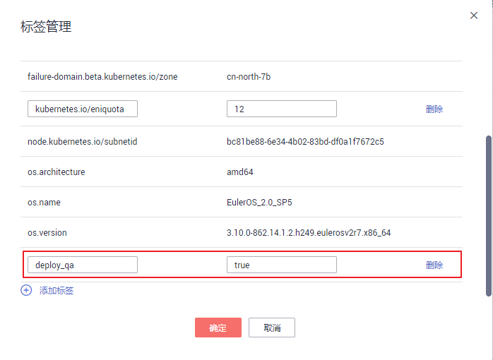

# 管理节点标签

节点标签可以给节点打上不同的标签，给节点定义不同的属性，通过这些标签可以快速的了解各个节点的特点。

## 节点标签使用场景

节点标签的主要使用场景有两类。

-   节点管理：通过节点标签管理节点，给节点分类。
-   工作负载与节点的亲和与反亲和：
    -   有的工作负载需要的CPU大，有的工作负载需要的内存大，有的工作负载需要IO大、可能会影响其他工作负载正常工作等等，此时建议给节点添加不同标签。在部署工作负载的时候，就可以选择相应标签的节点亲和部署，保证系统正常工作；反之，可以使用节点的反亲和部署。
    -   一个系统可以分为多个模块，每个模块由多个微服务组成，为保证后期运维的高效，可以将节点打上对应模块的标签，让各模块部署到各自的节点模块上，互不干扰、方便开发到各自节点上去维护。

## 节点固有标签

节点创建出来会存在一些固有的标签，并且是无法删除的，这些标签的含义请参见[表1](#table83962234533)。

**表 1**  节点固有标签

<table><thead align="left"><tr id="row941112314533"><th class="cellrowborder" valign="top" width="34%" id="mcps1.2.3.1.1">
键

</th>
<th class="cellrowborder" valign="top" width="66%" id="mcps1.2.3.1.2">
值

</th>
</tr>
</thead>
<tbody><tr id="row186452248235"><td class="cellrowborder" valign="top" width="34%" headers="mcps1.2.3.1.1 ">
failure-domain.beta.kubernetes.io/is-baremetal

</td>
<td class="cellrowborder" valign="top" width="66%" headers="mcps1.2.3.1.2 ">
表示是否为裸金属节点。

例如： false，表示非裸金属节点

</td>
</tr>
<tr id="row1441182305312"><td class="cellrowborder" valign="top" width="34%" headers="mcps1.2.3.1.1 ">
failure-domain.beta.kubernetes.io/region

</td>
<td class="cellrowborder" valign="top" width="66%" headers="mcps1.2.3.1.2 ">
表示节点当前所在区域。

例如：cn-south-1，表示中国华南区1

</td>
</tr>
<tr id="row11411923145318"><td class="cellrowborder" valign="top" width="34%" headers="mcps1.2.3.1.1 ">
failure-domain.beta.kubernetes.io/zone

</td>
<td class="cellrowborder" valign="top" width="66%" headers="mcps1.2.3.1.2 ">
表示节点所在区域的可用区。

例如：cn-south-1a，表示中国华南区1可用区1

</td>
</tr>
<tr id="row85011821447"><td class="cellrowborder" valign="top" width="34%" headers="mcps1.2.3.1.1 ">
node.kubernetes.io/subnetid

</td>
<td class="cellrowborder" valign="top" width="66%" headers="mcps1.2.3.1.2 ">
表示子网的ID。

</td>
</tr>
<tr id="row15411523165312"><td class="cellrowborder" valign="top" width="34%" headers="mcps1.2.3.1.1 ">
os.architecture

</td>
<td class="cellrowborder" valign="top" width="66%" headers="mcps1.2.3.1.2 ">
表示节点处理器架构。

例如：amd64，表示AMD64位的处理器

</td>
</tr>
<tr id="row17411162365318"><td class="cellrowborder" valign="top" width="34%" headers="mcps1.2.3.1.1 ">
os.name

</td>
<td class="cellrowborder" valign="top" width="66%" headers="mcps1.2.3.1.2 ">
表示节点的操作系统名称。

例如：EulerOS_2.0_SP5，表示欧拉2.5的版本

</td>
</tr>
<tr id="row1041115238531"><td class="cellrowborder" valign="top" width="34%" headers="mcps1.2.3.1.1 ">
os.version

</td>
<td class="cellrowborder" valign="top" width="66%" headers="mcps1.2.3.1.2 ">
表示节点内核版本。

例如：3.10.0-862.14.0.1.h147.eulerosv2r7.x86_64

</td>
</tr>
</tbody>
</table>

## 添加节点标签

1.  登录[CCE控制台](https://console.huaweicloud.com/cce2.0/?utm_source=helpcenter)，在左侧导航栏中选择“资源管理 \> 节点管理“。
2.  在节点列表中，单击“操作“栏的“标签管理“。
3.  在弹出的“标签管理“窗口中，单击标签列表下方的“添加标签“，填写需要增加标签的“键”和“值”，单击“确定”。

    例如，填写的键为“deploy\_qa”，值为“true”，就可以从逻辑概念表示该节点是用来部署QA（测试）环境使用。

    **图 1**  添加标签  
    

4.  标签添加成功后，再次单击“标签管理“，可查看到已经添加的标签。

    **图 2**  标签已添加成功  
    

## 删除节点标签

删除标签只能够删除用户添加的标签，节点固有的标签不能删除。

1.  登录[CCE控制台](https://console.huaweicloud.com/cce2.0/?utm_source=helpcenter)，在左侧导航栏中选择“资源管理 \> 节点管理“。
2.  在节点列表中，单击“操作“栏的“标签管理“。
3.  单击“删除“，单击“确定“，删除标签。

    可查看到“标签变更成功“。

    **图 3**  变更标签成功  
    

