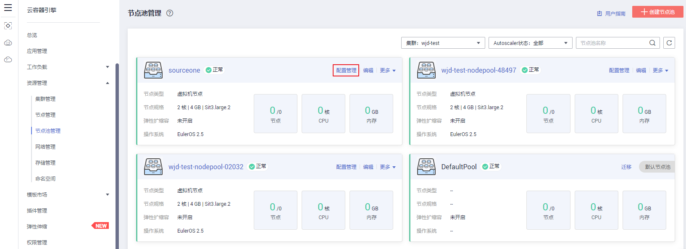

# 管理节点池

## 配置管理

为方便对CCE集群中的kubernetes配置参数进行管理，华为云开发了配置管理功能，通过该功能您可以对核心组件进行深度配置。

本文将介绍集群创建后对节点池的“配置管理“功能。

**限制条件：**

-   本功能仅支持在**v1.15及以上版本**的集群中对节点池进行配置。
-   默认节点池DefaultPool不支持修改该类配置。

**操作步骤：**

1.  登录[CCE控制台](https://console.huaweicloud.com/cce2.0/?utm_source=helpcenter)，在左侧导航栏中选择“资源管理 \> 节点池管理”。
2.  在集群选择框中，选择集群，可查看到当前集群下所有的节点池。
3.  单击节点池名称后的“配置管理“。

    **图 1**  节点池配置管理  
    

4.  在侧边栏滑出的“配置管理“窗口中，根据业务需求修改Kubernetes的参数值：

    **表 1**  配置管理参数

    
    <table><thead align="left"><tr id="row1653411231576"><th class="cellrowborder" valign="top" width="15.548445155484453%" id="mcps1.2.5.1.1">
组件

    </th>
    <th class="cellrowborder" valign="top" width="30.486951304869514%" id="mcps1.2.5.1.2">
参数

    </th>
    <th class="cellrowborder" valign="top" width="40.925907409259075%" id="mcps1.2.5.1.3">
详情

    </th>
    <th class="cellrowborder" valign="top" width="13.03869613038696%" id="mcps1.2.5.1.4">
默认

    </th>
    </tr>
    </thead>
    <tbody><tr id="row1263172411426"><td class="cellrowborder" rowspan="2" valign="top" width="15.548445155484453%" headers="mcps1.2.5.1.1 ">
docker

    </td>
    <td class="cellrowborder" valign="top" width="30.486951304869514%" headers="mcps1.2.5.1.2 ">
native-umask

    </td>
    <td class="cellrowborder" valign="top" width="40.925907409259075%" headers="mcps1.2.5.1.3 ">
`--exec-opt native.umask

    </td>
    <td class="cellrowborder" valign="top" width="13.03869613038696%" headers="mcps1.2.5.1.4 ">
normal

    </td>
    </tr>
    <tr id="row1573182115424"><td class="cellrowborder" valign="top" headers="mcps1.2.5.1.1 ">
docker-base-size

    </td>
    <td class="cellrowborder" valign="top" headers="mcps1.2.5.1.2 ">
`--storage-opts dm.basesize

    </td>
    <td class="cellrowborder" valign="top" headers="mcps1.2.5.1.3 ">
10G

    </td>
    </tr>
    <tr id="row19537923371"><td class="cellrowborder" rowspan="6" valign="top" width="15.548445155484453%" headers="mcps1.2.5.1.1 ">
kubelet

    </td>
    <td class="cellrowborder" valign="top" width="30.486951304869514%" headers="mcps1.2.5.1.2 ">
cpu-manager-policy

    </td>
    <td class="cellrowborder" valign="top" width="40.925907409259075%" headers="mcps1.2.5.1.3 ">
`--cpu-manager-policy

    </td>
    <td class="cellrowborder" valign="top" width="13.03869613038696%" headers="mcps1.2.5.1.4 ">
none

    </td>
    </tr>
    <tr id="row28854872119"><td class="cellrowborder" valign="top" headers="mcps1.2.5.1.1 ">
kube-api-qps

    </td>
    <td class="cellrowborder" valign="top" headers="mcps1.2.5.1.2 ">
与kube-apiserver通信的qps

    </td>
    <td class="cellrowborder" valign="top" headers="mcps1.2.5.1.3 ">
100

    </td>
    </tr>
    <tr id="row1935322432113"><td class="cellrowborder" valign="top" headers="mcps1.2.5.1.1 ">
kube-api-burst

    </td>
    <td class="cellrowborder" valign="top" headers="mcps1.2.5.1.2 ">
与kube-apiserver通信的burst

    </td>
    <td class="cellrowborder" valign="top" headers="mcps1.2.5.1.3 ">
100

    </td>
    </tr>
    <tr id="row13388338216"><td class="cellrowborder" valign="top" headers="mcps1.2.5.1.1 ">
max-pods

    </td>
    <td class="cellrowborder" valign="top" headers="mcps1.2.5.1.2 ">
kubelet管理的pod上限

    </td>
    <td class="cellrowborder" valign="top" headers="mcps1.2.5.1.3 ">
110

    </td>
    </tr>
    <tr id="row1628862115212"><td class="cellrowborder" valign="top" headers="mcps1.2.5.1.1 ">
with-local-dns

    </td>
    <td class="cellrowborder" valign="top" headers="mcps1.2.5.1.2 ">
是否使用本地IP作为该节点的ClusterDNS

    </td>
    <td class="cellrowborder" valign="top" headers="mcps1.2.5.1.3 ">
false

    </td>
    </tr>
    <tr id="row1438531895214"><td class="cellrowborder" valign="top" headers="mcps1.2.5.1.1 ">
allowed-unsafe-sysctls

    </td>
    <td class="cellrowborder" valign="top" headers="mcps1.2.5.1.2 ">
允许使用的不安全系统配置

    </td>
    <td class="cellrowborder" valign="top" headers="mcps1.2.5.1.3 ">
[]

    </td>
    </tr>
    <tr id="row1324313510019"><td class="cellrowborder" rowspan="2" valign="top" width="15.548445155484453%" headers="mcps1.2.5.1.1 ">
kube-proxy

    </td>
    <td class="cellrowborder" valign="top" width="30.486951304869514%" headers="mcps1.2.5.1.2 ">
conntrack-min

    </td>
    <td class="cellrowborder" valign="top" width="40.925907409259075%" headers="mcps1.2.5.1.3 ">
sysctl -w net.nf_conntrack_max

    </td>
    <td class="cellrowborder" valign="top" width="13.03869613038696%" headers="mcps1.2.5.1.4 ">
131072

    </td>
    </tr>
    <tr id="row578913135520"><td class="cellrowborder" valign="top" headers="mcps1.2.5.1.1 ">
conntrack-tcp-timeout-close-wait

    </td>
    <td class="cellrowborder" valign="top" headers="mcps1.2.5.1.2 ">
sysctl -w net.netfilter.nf_conntrack_tcp_timeout_clouse_wait

    </td>
    <td class="cellrowborder" valign="top" headers="mcps1.2.5.1.3 ">
1h0m0s

    </td>
    </tr>
    </tbody>
    </table>

5.  单击“确定“，完成配置操作。

**参考链接：**

-   [kubelet](https://v1-15.docs.kubernetes.io/docs/reference/command-line-tools-reference/kubelet)
-   [docker](https://docs.docker.com/engine/reference/commandline/dockerd)

## 编辑节点池

1.  登录[CCE控制台](https://console.huaweicloud.com/cce2.0/?utm_source=helpcenter)，在左侧导航栏中选择“资源管理 \> 节点池管理“。
2.  在集群选择框中，选择集群，可查看到当前集群下所有的节点池。
3.  单击节点池名称后的“编辑“，在弹出的“编辑节点池“中，配置以下参数：

    **表 2**  配置节点池参数

    
    <table><thead align="left"><tr id="row173212251235"><th class="cellrowborder" valign="top" width="28.000000000000004%" id="mcps1.2.3.1.1">
参数

    </th>
    <th class="cellrowborder" valign="top" width="72%" id="mcps1.2.3.1.2">
参数说明

    </th>
    </tr>
    </thead>
    <tbody><tr id="row163229255313"><td class="cellrowborder" valign="top" width="28.000000000000004%" headers="mcps1.2.3.1.1 ">
节点池名称

    </td>
    <td class="cellrowborder" valign="top" width="72%" headers="mcps1.2.3.1.2 ">
自定义节点池名称。

    </td>
    </tr>
    <tr id="row6334727910"><td class="cellrowborder" valign="top" width="28.000000000000004%" headers="mcps1.2.3.1.1 ">
节点个数

    </td>
    <td class="cellrowborder" valign="top" width="72%" headers="mcps1.2.3.1.2 ">
请根据业务需求调整节点个数。

    </td>
    </tr>
    <tr id="row111551253912"><td class="cellrowborder" valign="top" width="28.000000000000004%" headers="mcps1.2.3.1.1 ">
弹性扩缩容

    </td>
    <td class="cellrowborder" valign="top" width="72%" headers="mcps1.2.3.1.2 ">
默认不开启。

    
单击开启后，节点池将根据业务需求自动创建或删除节点池内的节点，参数设置如下：

    <ul id="ul15733045165119"><li>节点数上限和节点数下限：您可设置节点数的上限和下限，保证节点数在合理的范围内伸缩。</li><li>优先级：节点池之间进行弹性扩缩容的优先级，请根据业务需要进行设置。值为0时不做设置，若有多个平级时，将按最小资源浪费原则进行伸缩。</li><li>弹性缩容冷却时间：请设置时间，单位为分钟。弹性缩容冷却时间是指当前节点池扩容出的节点多长时间不能被缩容。</li></ul>
    
为保证功能的正常使用，节点池开启弹性扩缩容功能后，请务必安装<a href="autoscaler.md">AutoScaler插件</a>。

    </td>
    </tr>
    <tr id="row875985975311"><td class="cellrowborder" valign="top" width="28.000000000000004%" headers="mcps1.2.3.1.1 ">
编辑密钥对

    
（仅新加坡Region可用）

    </td>
    <td class="cellrowborder" valign="top" width="72%" headers="mcps1.2.3.1.2 ">
默认不开启。

    
单击开启后，可选择已有密钥对或创建密钥。密钥对用于远程登录节点时的身份认证。

    </td>
    </tr>
    <tr id="row1535723154615"><td class="cellrowborder" valign="top" width="28.000000000000004%" headers="mcps1.2.3.1.1 ">
Taints

    </td>
    <td class="cellrowborder" valign="top" width="72%" headers="mcps1.2.3.1.2 "><ul id="ul1414103745816"><li>默认为空。支持给该节点池扩容出来的节点加Taints来设置反亲和性，每个节点池最多配置10条Taints，每条Taints包含以下3个参数：<ul id="ul17274222121015"><li>Key：必须以字母或数字开头，可以包含字母、数字、连字符、下划线和点，最长63个字符；另外可以使用DNS子域作为前缀。</li><li>Value：必须以字符或数字开头，可以包含字母、数字、连字符、下划线和点，最长63个字符。</li><li>Effect：只可选NoSchedule，PreferNoSchedule或NoExecute。</li></ul>
    
 须知： 
<ul id="ul104271158181515"><li>Taints配置时需要配合Pod的toleration使用，否则可能导致扩容失败或者Pod无法调度到扩容节点。</li><li>配置后无法修改，请您谨慎配置，错误的配置可能会导致扩容失败或pod无法调度。</li></ul>
    

    </li></ul>
    </td>
    </tr>
    <tr id="row133224252315"><td class="cellrowborder" valign="top" width="28.000000000000004%" headers="mcps1.2.3.1.1 ">
K8S标签

    </td>
    <td class="cellrowborder" valign="top" width="72%" headers="mcps1.2.3.1.2 ">
K8S标签是附加到 Kubernetes 对象（比如 Pods）上的键值对，旨在用于指定对用户有意义且相关的对象的标识属性，但不直接对核心系统有语义含义。 详细请参见<a href="https://kubernetes.io/docs/concepts/overview/working-with-objects/labels/" target="_blank" rel="noopener noreferrer">Labels and Selectors</a>。

    </td>
    </tr>
    <tr id="row85016262545"><td class="cellrowborder" valign="top" width="28.000000000000004%" headers="mcps1.2.3.1.1 ">
资源标签

    </td>
    <td class="cellrowborder" valign="top" width="72%" headers="mcps1.2.3.1.2 ">
如果您需要使用同一标签标识多种云资源，即所有服务均可在标签输入框下拉选择同一标签，建议在TMS中创建“预定义标签”。

    
预定义标签对所有支持标签功能的服务资源可见，通过使用预定义标签可以提升标签创建和迁移效率。具体请参见<a href="https://support.huaweicloud.com/usermanual-tms/zh-cn_topic_0144368884.html" target="_blank" rel="noopener noreferrer">创建预定义标签</a>。

    
标签更改不会影响原有节点。

    </td>
    </tr>
    </tbody>
    </table>

4.  配置完成后，单击“保存”。

    在节点池列表中可查看到节点池状态为“伸缩中“，待状态变为“完成“，节点池参数编辑成功。

## 删除节点池

删除节点池，会先删除节点池中的节点，节点删除后，原有节点上的工作负载实例会自动迁移至其他节点池的可用节点。如果工作负载实例具有特定的节点选择器，且如果集群中的其他节点均不符合标准，则工作负载实例可能仍处于无法安排的状态。

1.  登录[CCE控制台](https://console.huaweicloud.com/cce2.0/?utm_source=helpcenter)，在左侧导航栏中选择“资源管理 \> 节点池管理“。
2.  在集群选择框中，选择集群，可查看到当前集群下所有的节点池。
3.  单击节点池名称后的“更多 \> 删除“。
4.  在弹出的“删除节点池“窗口中，请仔细阅读界面提示。
5.  确定要对节点池进行删除操作后，请在输入框中输入  **DELETE **并单击“是“，即可完成节点池的删除。

## 拷贝节点池

通过CCE控制台可以方便的拷贝现有节点池的配置，从而创建新的节点池。

1.  登录[CCE控制台](https://console.huaweicloud.com/cce2.0/?utm_source=helpcenter)，在左侧导航栏中选择“资源管理 \> 节点池管理“。
2.  在集群选择框中，选择集群，可查看到当前集群下所有的节点池。
3.  单击节点池名称后的“更多 \> 拷贝“。
4.  在弹出的“创建节点池“窗口中，可以看到拷贝的节点池配置，您可以根据需要进行修改，确定配置后单击“立即购买“。
5.  在“规格确认“步骤中再次确认规格并单击“提交“，即可完成节点池的拷贝并创建新的节点池。

## 迁移节点

您可以在CCE控制台中方便的迁移某个集群下节点池中的节点到其他节点池，从而实现节点在节点池间的灵活调配。

1.  登录[CCE控制台](https://console.huaweicloud.com/cce2.0/?utm_source=helpcenter)，在左侧导航栏中选择“资源管理 \> 节点池管理“。
2.  在集群选择框中，选择集群，可查看到当前集群下所有的节点池。
3.  单击待迁移的节点池名称后的“更多 \> 迁移“。（DefaultPool的“迁移“链接在节点池名称后直接显示）
4.  在弹出的“节点迁移“窗口中，选择目标节点池和待迁移节点。

    > **说明：**   
    >-   请确认待迁移节点与目标节点池的磁盘规格是否相同。  
    >-   迁移完成后，节点原有资源标签、K8S标签、Taints不受影响，并将为其打上未拥有的目标节点池的K8S标签、Taints。  

5.  单击“确定“，即可完成节点迁移。

