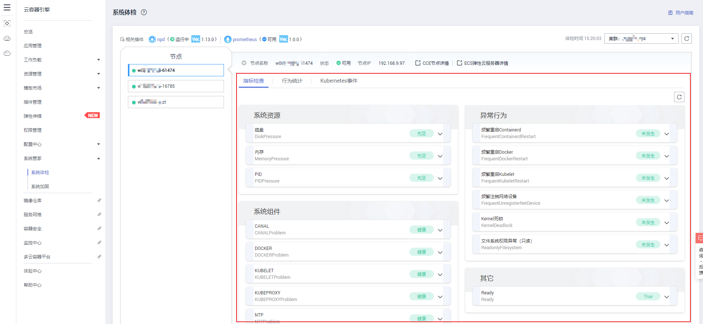

# 系统体检

系统管家主要分为两部分：系统体检和系统加固，本章节主要介绍系统体检。

系统体检主要用于实时检测并发现节点上的一些故障或者异常情况。

## 前提条件

-   使用系统体检功能前需安装[npd插件](npd.md)，该插件用于检测节点异常。
-   使用系统体检功能前需安装[prometheus插件](prometheus.md)，使用该插件可以获取npd上报的异常指标。

## 操作步骤

1.  登录[CCE控制台](https://console.huaweicloud.com/cce2.0/?utm_source=helpcenter)，在左侧导航栏中选择“系统管家  \>  系统体检“。
2.  在系统体检页面左侧“节点“区域单击需要进行系统体检的节点，可以看到指标检查、行为统计和Kubernetes事件三个页签，有如下两种情况：

    **未安装插件：**若未安装[npd](npd.md)和[prometheus](prometheus.md)插件，请按照页签下的提示进行安装。插件安装完成后，单击“系统管家  \>  系统体检“返回系统体检页面查看体检信息。

    **图 1**  安装系统体检所需插件  
    

    **已安装插件：**若已安装插件，单击指标检查、行为统计和Kubernetes事件三个页签后可直接查看体检信息。

    **图 2**  查看体检信息  
    

3.  单击“指标检查“页签，可以查看系统资源、系统组件、异常行为和其他信息，并根据体检信息提示进行相应操作。

    **表 1**  创建集群须知

    
    <table><thead align="left"><tr id="row20811252105914"><th class="cellrowborder" valign="top" width="20.03%" id="mcps1.2.4.1.1">
检查名称

    </th>
    <th class="cellrowborder" valign="top" width="38.65%" id="mcps1.2.4.1.2">
检查项

    </th>
    <th class="cellrowborder" valign="top" width="41.32%" id="mcps1.2.4.1.3">
描述

    </th>
    </tr>
    </thead>
    <tbody><tr id="row88111652155915"><td class="cellrowborder" rowspan="3" valign="top" width="20.03%" headers="mcps1.2.4.1.1 ">
系统资源

    </td>
    <td class="cellrowborder" valign="top" width="38.65%" headers="mcps1.2.4.1.2 ">
磁盘

    </td>
    <td class="cellrowborder" valign="top" width="41.32%" headers="mcps1.2.4.1.3 ">
节点磁盘使用情况

    </td>
    </tr>
    <tr id="row1040679473"><td class="cellrowborder" valign="top" headers="mcps1.2.4.1.1 ">
内存

    </td>
    <td class="cellrowborder" valign="top" headers="mcps1.2.4.1.2 ">
节点内存使用情况

    </td>
    </tr>
    <tr id="row94371418277"><td class="cellrowborder" valign="top" headers="mcps1.2.4.1.1 ">
PID

    </td>
    <td class="cellrowborder" valign="top" headers="mcps1.2.4.1.2 ">
节点PID进程使用情况

    </td>
    </tr>
    <tr id="row981135210590"><td class="cellrowborder" rowspan="5" valign="top" width="20.03%" headers="mcps1.2.4.1.1 ">
系统组件

    </td>
    <td class="cellrowborder" valign="top" width="38.65%" headers="mcps1.2.4.1.2 ">
CANAL

    </td>
    <td class="cellrowborder" valign="top" width="41.32%" headers="mcps1.2.4.1.3 ">
Canal组件运行情况

    </td>
    </tr>
    <tr id="row10303103591119"><td class="cellrowborder" valign="top" headers="mcps1.2.4.1.1 ">
DOCKER

    </td>
    <td class="cellrowborder" valign="top" headers="mcps1.2.4.1.2 ">
Docker组件运行情况

    </td>
    </tr>
    <tr id="row1430443511120"><td class="cellrowborder" valign="top" headers="mcps1.2.4.1.1 ">
KUBELET

    </td>
    <td class="cellrowborder" valign="top" headers="mcps1.2.4.1.2 ">
Kubelet组件运行情况

    </td>
    </tr>
    <tr id="row173042355118"><td class="cellrowborder" valign="top" headers="mcps1.2.4.1.1 ">
KUBEPROXY

    </td>
    <td class="cellrowborder" valign="top" headers="mcps1.2.4.1.2 ">
Kubeproxy组件运行情况

    </td>
    </tr>
    <tr id="row4304133571118"><td class="cellrowborder" valign="top" headers="mcps1.2.4.1.1 ">
NTP

    </td>
    <td class="cellrowborder" valign="top" headers="mcps1.2.4.1.2 ">
NTP组件运行情况

    </td>
    </tr>
    <tr id="row6811952165919"><td class="cellrowborder" rowspan="6" valign="top" width="20.03%" headers="mcps1.2.4.1.1 ">
异常行为

    </td>
    <td class="cellrowborder" valign="top" width="38.65%" headers="mcps1.2.4.1.2 ">
频繁重启Containerd

    </td>
    <td class="cellrowborder" valign="top" width="41.32%" headers="mcps1.2.4.1.3 ">
Containerd频繁重启

    </td>
    </tr>
    <tr id="row193915486126"><td class="cellrowborder" valign="top" headers="mcps1.2.4.1.1 ">
频繁重启Docker

    </td>
    <td class="cellrowborder" valign="top" headers="mcps1.2.4.1.2 ">
Docker频繁重启

    </td>
    </tr>
    <tr id="row2039118484122"><td class="cellrowborder" valign="top" headers="mcps1.2.4.1.1 ">
频繁重启Kuberlet

    </td>
    <td class="cellrowborder" valign="top" headers="mcps1.2.4.1.2 ">
Kubelet频繁重启

    </td>
    </tr>
    <tr id="row63911648101219"><td class="cellrowborder" valign="top" headers="mcps1.2.4.1.1 ">
频繁注销网络设备

    </td>
    <td class="cellrowborder" valign="top" headers="mcps1.2.4.1.2 ">
网络设备比如网卡，频繁注销

    </td>
    </tr>
    <tr id="row43911148101214"><td class="cellrowborder" valign="top" headers="mcps1.2.4.1.1 ">
Kernel死锁

    </td>
    <td class="cellrowborder" valign="top" headers="mcps1.2.4.1.2 ">
os 内核死锁

    </td>
    </tr>
    <tr id="row133183448122"><td class="cellrowborder" valign="top" headers="mcps1.2.4.1.1 ">
文件系统权限异常（只读）

    </td>
    <td class="cellrowborder" valign="top" headers="mcps1.2.4.1.2 ">
文件系统是否变成了只读

    </td>
    </tr>
    <tr id="row7811135245911"><td class="cellrowborder" valign="top" width="20.03%" headers="mcps1.2.4.1.1 ">
其他

    </td>
    <td class="cellrowborder" valign="top" width="38.65%" headers="mcps1.2.4.1.2 ">
Ready

    </td>
    <td class="cellrowborder" valign="top" width="41.32%" headers="mcps1.2.4.1.3 ">
节点状态是否ready

    </td>
    </tr>
    </tbody>
    </table>

4.  单击“行为统计“页签，可以查看行为信息和行为发生的次数。使用功能，需要安装prometheus插件。
5.  单击“Kubernetes事件“页签，可以查看该节点的事件名称、事件类型、发生次数、Kubernetes事件、首次和最近发生的时间。

    > **说明：**   
    >事件保存时间为1小时，1小时后自动清除数据。  

## 恢复建议

-   对于系统资源不足，可以到节点上对系统资源进行扩容，或者调整内核参数调大上限。若还是无法恢复节点，可以给节点打上污点标记，使得pod不在调度到该节点，或者驱逐节点上的pod，隔离该节点。
-   对于系统组件异常或者其他异常行为发生也可以采取给节点打上污点标记进行处理。

## 相关参考

-   为节点打污点标记：[Taints and Tolerations](https://kubernetes.io/docs/concepts/configuration/taint-and-toleration/)
-   主动驱逐：[Safely Drain a Node while Respecting the PodDisruptionBudget](https://kubernetes.io/docs/tasks/administer-cluster/safely-drain-node/)
-   如下三个命令可以保证维护节点时，平滑的将被维护节点上的业务迁移到其他节点上，保证业务不受影响：

    **表 2**  标记节点为可调度或不可调度

    
    <table><thead align="left"><tr id="row184431333184719"><th class="cellrowborder" valign="top" width="20.732073207320735%" id="mcps1.2.4.1.1">
命令

    </th>
    <th class="cellrowborder" valign="top" width="39.64396439643964%" id="mcps1.2.4.1.2">
功能

    </th>
    <th class="cellrowborder" valign="top" width="39.62396239623963%" id="mcps1.2.4.1.3">
用法

    </th>
    </tr>
    </thead>
    <tbody><tr id="row444323344714"><td class="cellrowborder" valign="top" width="20.732073207320735%" headers="mcps1.2.4.1.1 ">
cordon

    </td>
    <td class="cellrowborder" valign="top" width="39.64396439643964%" headers="mcps1.2.4.1.2 ">
标记节点为不可调度

    </td>
    <td class="cellrowborder" valign="top" width="39.62396239623963%" headers="mcps1.2.4.1.3 ">
kubectl cordon {{node-name }}

    </td>
    </tr>
    <tr id="row9443123319472"><td class="cellrowborder" valign="top" width="20.732073207320735%" headers="mcps1.2.4.1.1 ">
uncordon

    </td>
    <td class="cellrowborder" valign="top" width="39.64396439643964%" headers="mcps1.2.4.1.2 ">
标记节点为可调度

    </td>
    <td class="cellrowborder" valign="top" width="39.62396239623963%" headers="mcps1.2.4.1.3 ">
kubectl uncordon {{node-name }}

    </td>
    </tr>
    <tr id="row194441733104720"><td class="cellrowborder" valign="top" width="20.732073207320735%" headers="mcps1.2.4.1.1 ">
drain

    </td>
    <td class="cellrowborder" valign="top" width="39.64396439643964%" headers="mcps1.2.4.1.2 ">
标记节点为不可调度，并驱逐节点上的pod

    </td>
    <td class="cellrowborder" valign="top" width="39.62396239623963%" headers="mcps1.2.4.1.3 ">
kubectl drain {{node-name }}

    </td>
    </tr>
    </tbody>
    </table>

