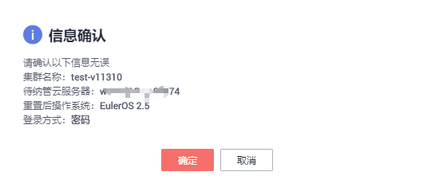

# 纳管已有节点（虚拟机集群）<a name="cce_01_0034"></a>

CCE当前支持两种添加节点的方式，本节指导用户纳管已有节点。纳管节点是指将“已购买的弹性云服务器（ECS）加入到CCE虚拟机集群中“。

## 前提条件<a name="section4156147355"></a>

已购买符合如下条件的弹性云服务器：

-   弹性云服务器购买成功，且必须状态为“运行中“。
-   弹性云服务器需与CCE集群在同一虚拟私有云和子网，且未被CCE集群所使用。
-   弹性云服务器需挂载数据盘，数据盘需满足有且仅有1块，且容量不少于100GB，多余的数据盘请先卸载。
-   弹性云服务器规格至少为CPU必须2核及以上，内存必须2GB及以上。

> **注意：**   
>-   纳管时，会将所选弹性云服务器的操作系统重置为CCE提供的标准镜像，以确保节点的稳定性，请选择操作系统及重置后的登录方式。  
>-   所选弹性云服务器挂载的系统盘、数据盘都会在纳管时被格式化，请确保信息已备份。  
>-   纳管过程中，请勿在弹性云服务器控制台对所选虚拟机做任何操作。  

## 纳管已有节点<a name="section443142094715"></a>

1.  登录CCE控制台，单击左侧导航栏的“资源管理 \> 集群管理”，单击待纳管集群下的“新增节点  \>  纳管节点“，或单击左侧导航栏的资源管理 \> 节点管理，单击页面顶部中纳管节点。
2.  在打开的界面中展示了当前符合要求的弹性云服务器。如果不符合纳管要求时会显示相应的红色提示图标，列表下方会有被过滤的弹性云服务器数量，鼠标移动到后方的可以查看具体原因。

    **图 1**  纳管已有节点<a name="fig536411548218"></a>  
    

3.  勾选需要纳管的弹性云服务器，单击“下一步“。
4.  在“待纳管节点“页面中，按照界面提示选择“登录方式“，点击“高级配置“后的按钮，设置“最大实例数“和“资源分配“，然后点击“提交“。

    **图 2**  待纳管节点设置<a name="fig194961548175118"></a>  
    

5.  在弹出的“信息确认“页面中确认信息无误后，单击“确定“。

    **图 3**  信息确认<a name="fig282931555510"></a>  
    

    系统将提示节点纳管请求提交成功。


## docker挂载磁盘高级设置<a name="section059123814313"></a>

在为docker挂载磁盘时，支持如下高级选项：

-   dockerBlockDevices：为 docker（使用direct-lvm模式存储驱动）挂载块存储，支持裸盘和Linux LVM型分区。

    示例：

    ```
    user:
      domainName: test
      username: test
      password: ""
      projectName: southchina
    apiGatewayIp: 10.125.*.*
    iamHostname: iam.cn-north-1.myhuaweicloud.com
    serverEndpoint: 10.125.*.*:*
    clusterID: 87b87621-2c4a-11e8-9c6f-0255ac180ce6
    hosts:
      - host: 10.0.*.*
        user: root
        password: "******"  #root用户密码
        nodeConfig:
          dockerBlockDevices: "/dev/xvdb1,/dev/xvdb2" #指定docker使用的块设备并以‘,’隔开，不填时使用默认第一块可用裸盘
    ```

    参数说明如下：

    -   dockerBlockDevices：块存储设备路径，有多个块存储时，以“,”分割。不配置该参数时，系统默认使用待纳管节点上的第一个块存储设备。
    -   其余参数请与界面操作步骤 5“install.yaml“中的参数值保持一致。

-   dockerThinpool和kubernetesLV：

    dockerThinpool主要为docker（使用direct-lvm模式存储驱动）指定卷组和使用量。kubernetesLV为纳管节点上kubernetes组件kubelet指定卷组和使用量。

    > **注意：**   
    >dockerThinpool与kubernetesLV参数需同时配置使用，不能与dockerBlockDevices同时使用。  

    示例：

    ```
    user:
      domainName: test
      username: test
      password: ""
      projectName: southchina
    apiGatewayIp: 10.125.*.*
    iamHostname: iam.cn-north-1.myhuaweicloud.com
    serverEndpoint: 10.125.*.*:*
    clusterID: 87b87621-2c4a-11e8-9c6f-0255ac180ce6
    hosts:
      - host: 10.0.*.*
        user: root
        password: "******"  #root用户密码
        nodeConfig:
           dockerThinpool: "vgdocker/100G"
           kubernetesLV: "vgdocker/100%FREE"
    ```

    参数说明如下：

    -   dockerThinpool：用于纳管节点时为docker创建thinpool进行数据存储，取值格式为“卷组名/使用量“，其中“使用量“支持使用单位有M、G、T表示或%VG（使用该卷组总量的百分比）、%FREE（使用该卷组剩余总量的百分比）表示。
    -   kubernetesLV：用于纳管节点上工作负载的临时数据存储，取值格式为“卷组名/使用量“，其中“使用量“支持使用单位有M、G、T表示或%VG（使用该卷组总量的百分比）、%FREE（使用该卷组剩余总量的百分比）表示。

    -   其余参数请与界面操作步骤 5“install.yaml“中的参数值保持一致。


## 移除节点<a name="section885345071917"></a>

移除节点指从集群中移除“弹性云服务器（简称ECS）“，并不会删除ECS和卸载已安装的CCE相关组件。仅纳管的节点支持移除操作。

> **说明：**   
>仅纳管的节点支持移除操作，新增节点请选择删除。  

1.  在CCE控制台中，选择导航栏的“资源管理 \> 节点管理“，勾选需要移除的节点名称，单击“移除纳管节点“。
2.  在弹出的卸载节点弹框中，输入**REMOVE**，确认删除该节点，单击“确定“。
3.  在弹出的“提示“页面中，按照参考步骤清理CCE相关资源后，点击“我知道了”即可移除纳管节点。

    > **说明：**   
    >以上步骤仅从集群中移除了节点（即弹性云服务器ECS），并不会删除节点和已安装的CCE相关组件。请根据界面中展示的步骤清理CCE相关资源。  
    >若未按照界面提示清理CCE相关资源，后续需要清理资源时请参照[如何快速清理CCE节点组件？](如何快速清理CCE节点组件.md)中操作处理。  


