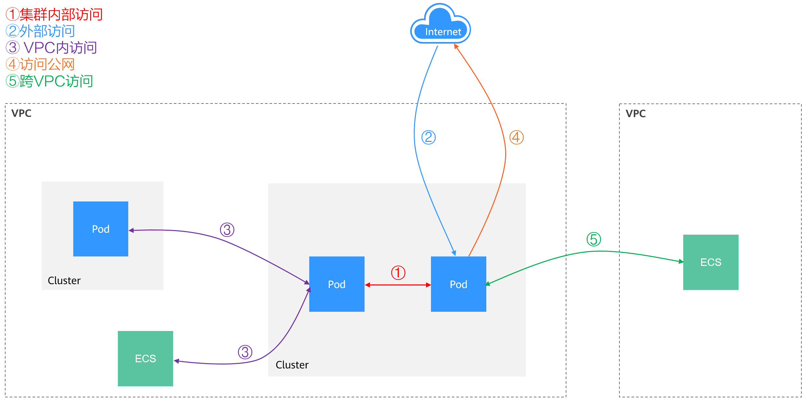

# 网络概述

关于集群的网络，可以从如下两个角度进行了解：

-   集群网络是什么样的：集群由多个节点构成，集群中又运行着Pod（容器），每个Pod都需要访问，节点与节点、节点与Pod、Pod与Pod都需要访问。那集群中包含有哪些网络，各自的用处是什么，具体请参见[集群网络构成](#section1131733719195)。
-   集群中的Pod如如何访问的：访问Pod就是访问容器，也就是访问用户的业务，Kubernetes提供[Service](#section1860619221134)和[Ingress](#section1248852094313)来解决Pod的访问问题。根据用户使用场景总结了常见的[网络访问场景](#section1286493159)，让您能够在不同使用场景下选择合适的使用方法。

## 集群网络构成

在创建集群的时候，需要配置网络相关信息，如下图所示。这里包含三类信息，节点网络、容器网络和服务网络。

**图 1**  集群网络配置  

-   **节点网络**

    为集群内主机分配IP地址，您需要选择VPC中的子网用于CCE集群的节点网络。子网的可用IP数量决定了集群中可以创建节点数量的上限（包括Master节点和Node节点），集群中可创建节点数量还受容器网络的影响，在容器网络模型中会进一步说明。

-   **容器网络**

    为集群内容器分配IP地址。CCE继承Kubernetes的IP-Per-Pod-Per-Network的容器网络模型，即每个Pod在每个网络平面下都拥有一个独立的IP地址，Pod内所有容器共享同一个网络命名空间，集群内所有Pod都在一个直接连通的扁平网络中，无需NAT可直接通过Pod的IP地址访问。Kubernetes只提供了如何为Pod提供网络的机制，并不直接负责配置Pod网络；Pod网络的具体配置操作交由具体的容器网络插件实现。容器网络插件负责为Pod配置网络并管理容器IP地址。

    当前CCE支持如下容器网络模型。

    -   容器隧道网络：容器隧道网络在节点网络基础上通过隧道封装另构建的独立于节点网络平面的容器网络平面，CCE集群容器隧道网络使用的封装协议为VXLAN，后端虚拟交换机采用的是openvswitch，VXLAN是将以太网报文封装成UDP报文进行隧道传输。
    -   VPC网络：VPC网络采用VPC路由方式与底层网络深度整合，适用于高性能场景，节点数量受限于虚拟私有云VPC的路由配额。每个节点将会被分配固定大小的IP地址段。VPC网络由于没有隧道封装的消耗，容器网络性能相对于容器隧道网络有一定优势。VPC网络集群由于VPC路由中配置有容器网段与节点IP的路由，可以支持集群外直接访问容器实例等特殊场景。
    -   云原生2.0网络：云原生网络2.0是自研的新一代容器网络模型，深度整合了虚拟私有云VPC的弹性网卡（Elastic Network Interface，简称ENI）和辅助弹性网卡（Sub Network Interface，简称Sub-ENI）的能力，直接从VPC网段内分配容器IP地址，支持ELB直通容器，绑定安全组，绑定弹性公网IP，享有高性能。

    不同容器网络模型，容器网络的性能、组网规模、适用场景各不相同，在[容器网络模型概述](容器网络模型概述.md)章节，将会详细介绍不同容器网络模型的功能特性，了解这些有助于您选择容器网络模型。

-   **服务网络**

    服务（Service）是Kubernetes内的概念，Service是用来解决访问容器的Kubernetes对象，每个Service都有一个固定的IP地址，在CCE上创建集群时，可以指定Service的地址段（即服务网段）。服务网段也不能和节点网段重合，也不能和容器网段重叠。服务网段只在集群内使用，不能在集群外使用。

## Service

Service是用来解决Pod访问问题的。每个Service有一个固定IP地址，Service将访问流量转发给Pod，而且Service可以给这些Pod做负载均衡。

**图 2**  通过Service访问Pod  

根据创建Service的type类型不同，可分成如下模式：

-   ClusterIP：用于在集群内部互相访问的场景，通过ClusterIP访问Service。
-   NodePort：用于从集群外部访问的场景，通过节点上的端口访问Service。
-   LoadBalancer：用于从集群外部访问的场景，其实是NodePort的扩展，通过一个特定的LoadBalancer访问Service，这个LoadBalancer将请求转发到节点的NodePort，而外部只需要访问LoadBalancer。

Service的详细介绍请参见[Service概述](Service概述.md)。

## Ingress

Service是基于四层TCP和UDP协议转发的，而Ingress可以基于七层的HTTP和HTTPS协议转发，可以通过域名和路径做到更细粒度的划分，如下图所示。

**图 3**  Ingress-Service  

Ingress的详细介绍请参见[Ingress概述](Ingress概述.md)。

## 网络访问场景

负载网络访问可以分为如下几种场景。

-   集群内部访问：创建ClusterIP类型的Service，通过Service访问负载。
-   外部访问负载：从外部访问负载推荐使用Service（NodePort类型后LoadBalancer类型）或Ingress访问。
    -   公网访问负载需要使用公网IP。
    -   内网访问负载使用内网IP。如果跨VPC需要通过对等连接等手段打通不同VPC网络。

-   负载访问外部：
    -   负载访问内网：负载访问内网地址，在不同容器网络模型下有不同的表现，需要注意在对端安全组放通容器网段，具体请参见[容器如何访问VPC内部网络](容器如何访问VPC内部网络.md)。
    -   负载访问公网：访问公网有两种方法可以实现，一是容器所在节点拥有公网IP，另一个是通过NAT网关配置SNAT规则，具体请参见[从容器访问公网](从容器访问公网.md)。

**图 4**  网络访问示意图  

