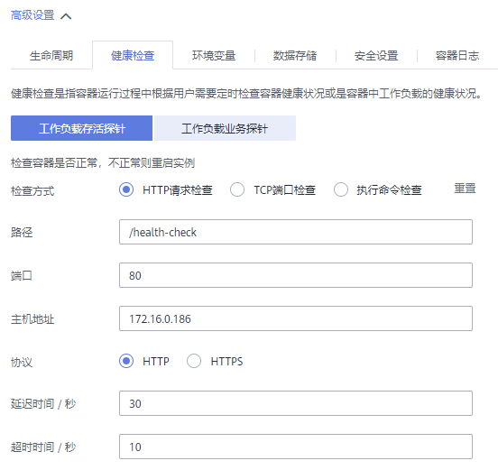
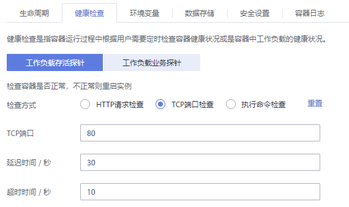
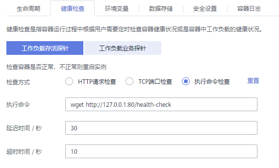

# 设置容器健康检查

-   [操作场景](#section1731112174912)
-   [检查方式](#section476025319384)
-   [公共参数说明](#section2050653544516)

## 操作场景

健康检查是指容器运行过程中，根据用户需要，定时检查容器健康状况。若不配置健康检查，如果服务出现业务异常，pod将无法感知，也不会自动重启去恢复业务。最终导致虽然pod状态显示正常，但pod中的业务异常的情况。

CCE提供了两种健康检查的探针：

-   **工作负载存活探针：**用于检测容器是否正常，类似于我们执行ps命令检查进程是否存在。如果容器的存活检查失败，集群会对该容器执行重启操作；若容器的存活检查成功则不执行任何操作。
-   **工作负载业务探针：**用于检查用户业务是否就绪，不就绪则不转发流量到当前实例。一些程序的启动时间可能很长，比如要加载磁盘数据或者要依赖外部的某个模块启动完成才能提供服务。这时候程序进程在，但是并不能对外提供服务。这种场景下该检查方式就非常有用。如果容器的就绪检查失败，集群会屏蔽请求访问该容器；若检查成功，则会开放对该容器的访问。

## 检查方式

-   **HTTP 请求检查**

    HTTP 请求方式针对的是提供HTTP/HTTPS服务的容器，集群周期性地对该容器发起HTTP/HTTPS GET请求，如果HTTP/HTTPS response返回码属于200\~399范围，则证明探测成功，否则探测失败。使用HTTP请求探测必须指定容器监听的端口和HTTP/HTTPS的请求路径。

    例如：提供HTTP服务的容器，HTTP检查路径为：/health-check；端口为：80；主机地址可不填，默认为容器实例IP，此处以172.16.0.186为例。那么集群会周期性地对容器发起如下请求：GET http://172.16.0.186:80/health-check。

    **图 1**  HTTP请求检查  
    

-   **TCP 端口检查**

    对于提供TCP通信服务的容器，集群周期性地对该容器建立TCP连接，如果连接成功，则证明探测成功，否则探测失败。选择TCP端口探测方式，必须指定容器监听的端口。

    例如：我们有一个nginx容器，它的服务端口是80，我们对该容器配置了TCP端口探测，指定探测端口为80，那么集群会周期性地对该容器的80端口发起TCP连接，如果连接成功则证明检查成功，否则检查失败。如下图：

    **图 2**  TCP 端口检查  
    

-   **执行命令检查**

    命令检查是一种强大的检查方式，该方式要求用户指定一个容器内的可执行命令，集群会周期性地在容器内执行该命令，如果命令的返回结果是0则检查成功，否则检查失败。

    对于上面提到的TCP端口检查和HTTP请求检查，都可以通过执行命令检查的方式来替代：

    -   对于TCP端口探测，我们可以写一个程序来对容器的端口进行connect，如果connect成功，脚本返回0，否则返回-1。
    -   对于HTTP请求探测，我们可以写一个脚本来对容器进行wget。

        **wget http://127.0.0.1:80/health-check**

        并检查response 的返回码，如果返回码在200\~399 的范围，脚本返回0，否则返回-1。如下图：

        **图 3**  执行命令检查  
        

        > **须知：** 
        >-   必须把要执行的程序放在容器的镜像里面，否则会因找不到程序而执行失败。
        >-   如果执行的命令是一个shell脚本，由于集群在执行容器里的程序时，不在终端环境下，因此不能直接指定脚本为执行命令，需要加上脚本解决器。比如脚本是**/data/scripts/health\_check.sh**，那么我们使用执行命令检查时，指定的程序应该是**sh /data/scripts/health\_check.sh**。究其原因是集群在执行容器里的程序时，不在终端环境下。

## 公共参数说明

**表 1**  公共参数说明

<table><thead align="left"><tr id="re3891f83a0b242b1bf3f178042398166"><th class="cellrowborder" valign="top" width="27%" id="mcps1.2.3.1.1">
参数

</th>
<th class="cellrowborder" valign="top" width="73%" id="mcps1.2.3.1.2">
参数说明

</th>
</tr>
</thead>
<tbody><tr id="r82f45c7641534b8d80da858ce9ce9be7"><td class="cellrowborder" valign="top" width="27%" headers="mcps1.2.3.1.1 ">
延迟时间

</td>
<td class="cellrowborder" valign="top" width="73%" headers="mcps1.2.3.1.2 ">
延迟检查时间，单位为秒，此设置与业务程序正常启动时间相关。

例如，设置为30，表明容器启动后30秒才开始健康检查，该时间是预留给业务程序启动的时间。

</td>
</tr>
<tr id="rf8dd0b9b29af4b96bcf3efaecb0c4bb2"><td class="cellrowborder" valign="top" width="27%" headers="mcps1.2.3.1.1 ">
超时时间

</td>
<td class="cellrowborder" valign="top" width="73%" headers="mcps1.2.3.1.2 ">
超时时间，单位为秒。

例如，设置为10，表明执行健康检查的超时等待时间为10秒，如果超过这个时间，本次健康检查就被视为失败。若设置为0或不设置，默认超时等待时间为1秒。

</td>
</tr>
</tbody>
</table>

