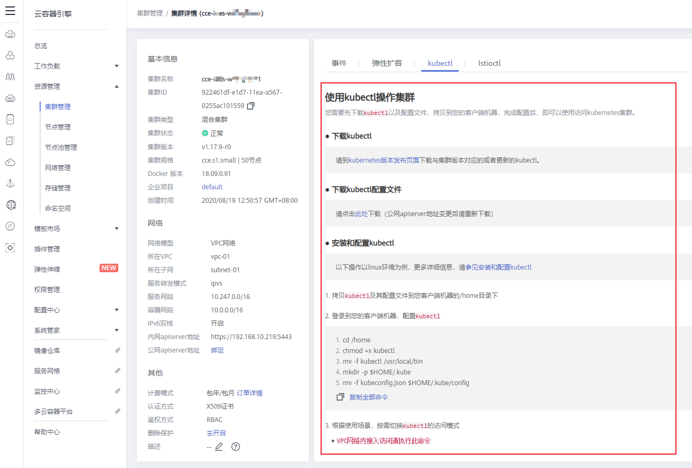

# 通过kubectl连接集群

## 操作场景

本文将以CCE集群为例，介绍如何通过kubectl或CloudShell连接CCE集群。

## 权限说明

kubectl访问CCE集群是通过集群上生成的配置文件（kubeconfig.json）进行认证，kubeconfig.json文件内包含用户信息，CCE根据用户信息的权限判断kubectl有权限访问哪些Kubernetes资源。即哪个用户获取的kubeconfig.json文件，kubeconfig.json就拥有哪个用户的信息，这样使用kubectl访问时就拥有这个用户的权限。

用户拥有的权限请参见[集群权限（IAM授权）与命名空间权限（Kubernetes RBAC授权）的关系](CCE权限概述.md#section1464135853519)。

在CloudShell中使用kubectl是由登录用户的权限决定kubectl的权限。

## 使用CloudShell连接集群

CloudShell是一款用于管理与运维云资源的网页版Shell工具，CCE支持使用CloudShell连接集群，在CloudShell中可以使用kubectl访问集群。

> **说明：** 
>CloudShell中kubectl证书有效期为1天，从云容器引擎重新跳转可以重置有效期。

**图 1**  CloudShell  

**图 2**  在CloudShell中使用kubectl  

## 使用kubectl连接集群

**背景信息**

若您需要从客户端计算机连接到kubernetes集群，请使用kubernetes命令行客户端kubectl，使用方法请参见[安装并配置 kubectl](https://kubernetes.io/docs/tasks/tools/)。

**前提条件**

CCE支持“VPC网络内访问“和“互联网访问“两种方式访问集群。

-   VPC网络内访问：与当前集群相同VPC内访问集群。
-   互联网访问：您需要准备一台能连接公网的云服务器。

> **须知：** 
>通过“互联网访问”方式访问集群，集群的kube-apiserver将会暴露到互联网，存在被攻击的风险，建议对kube-apiserver所在节点的EIP配置DDoS高防服务。

**下载kubectl**

您需要先下载kubectl以及配置文件，拷贝到您的客户端机器，完成配置后，即可以使用访问kubernetes集群。

请到[kubernetes版本发布页面](https://github.com/kubernetes/kubernetes/blob/master/CHANGELOG/README.md)下载与集群版本对应的或者更新的kubectl。

**安装和配置kubectl**

1.  登录CCE控制台，在左侧导航栏中选择“资源管理 \> 集群管理”，单击待连接集群下的“命令行工具 \>  kubectl”。
2.  在集群详情页中的“kubectl“页签下，请参照界面中的提示信息完成集群连接。

    > **说明：** 
    >-   您可以在“kubectl“页签下方便的**下载kubectl配置文件**（kubeconfig.json）。该文件用于对接认证用户集群，请用户妥善保存该认证凭据，防止文件泄露后，集群有被攻击的风险。如果不幸泄露，可以通过证书更新的方式，替换认证凭据。
    >-   由于EIP无法固定，所以服务器端证书无法预置EIP，若从互联网访问则无法开启客户端校验服务器端。如需开启客户端校验服务器端，请使用VPC访问方式。
    >-   IAM用户下载的配置文件所拥有的Kubernetes权限与CCE控制台上IAM用户所拥有的权限一致。
    >-   下载kubectl时请下载client文件。

    **图 3**  通过kubectl连接集群  
    

## 常见问题（Error from server Forbidden）

使用kubectl在创建或查询Kubernetes资源时，显示如下内容。

\# kubectl get deploy Error from server \(Forbidden\): deployments.apps is forbidden: User "0c97ac3cb280f4d91fa7c0096739e1f8" cannot list resource "deployments" in API group "apps" in the namespace "default"

原因是用户没有操作该Kubernetes资源的权限，请参见[命名空间权限（Kubernetes RBAC授权）](命名空间权限（Kubernetes-RBAC授权）.md)为用户授权。

## 相关操作

连接集群后，您可以使用Kubernetes管理工作负载，具体请参见[Kubectl使用指南](Kubectl使用指南.md)。

