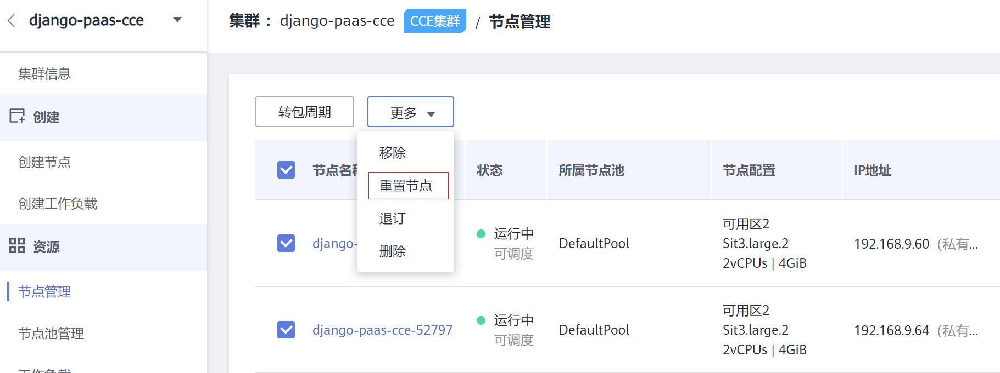

# 重置节点

## 操作场景

您可以通过重置节点修改节点的配置，比如修改节点操作系统、登录方式等。

重置节点会重装节点操作系统，并重新安装节点上Kubernetes软件。如果您在使用过程中修改了节点上的配置等操作导致节点不可用，可以通过重置节点进行修复。

## 约束与限制

-   v1.13及以上版本的CCE集群支持重置节点。
-   v1.15及以上版本的鲲鹏集群支持重置节点。

## 注意事项

-   重置节点功能不会重置控制节点，仅能对工作节点进行重置操作，如果重置后节点仍然不可用，请删除该节点重新购买。
-   **重置节点将对节点操作系统进行重置安装，节点上已运行的工作负载业务将会中断，请在业务低峰期操作。**
-   **节点重置后系统盘和docker数据盘将会被清空，重置前请事先备份重要数据。**
-   **用户节点如果有自行挂载了数据盘，重置完后会清除挂载信息，请事先备份重要数据，重置完成后请重新执行挂载行为，数据不会丢失。**
-   节点上的工作负载实例的IP会发生变化，但是不影响容器网络通信。
-   云硬盘必须有剩余配额。
-   操作过程中，后台会把当前节点设置为不可调度状态。

## 操作步骤

1.  登录CCE控制台，在左侧导航栏中选择“资源管理 \> 节点管理“，单击节点后的“更多 \> 重置节点“。

    **图 1**  重置节点  
    

2.  在弹出的“重置节点“窗口中输入**RESET**，同时重新配置密码或密钥登录方式。

    **图 2**  重置节点  
    

3.  单击“是“，等待完成节点重置。

    重置节点后，原有节点上的工作负载实例会自动迁移至其他可用节点。

## 操作步骤-新UI

新UI支持批量重置节点、支持使用私有镜像批量重置节点。

1.  登录CCE控制台。
2.  进入集群，在左侧选择“节点管理“，在右侧列表中选择要重置的节点，可以选多个。单击“更多 \> 重置节点“。

    **图 3**  重置节点  
    

3.  在弹出的窗口中单击“是“。跳转到参数配置界面。
    -   对于DefaultPool节点池下的节点，会跳转到配置参数界面，请参见[4](#li154411637155214)进行配置。
    -   对于用户创建的节点池下的节点，重置是不支持配置参数，直接使用节点池的配置镜像重置。

4.  配置参数。

    **容器引擎**

    仅CCE Turbo集群支持选择。支持选择Docker和Containerd，两者的比较请参见[安全容器与普通容器](节点概述.md#section7201124294111)。

    **操作系统**

    -   公共镜像：请选择节点对应的操作系统。

        公共镜像是常见的标准操作系统镜像，所有用户可见，包括操作系统以及预装的公共应用，更多介绍请参见[公共镜像概述](https://support.huaweicloud.com/productdesc-ecs/ecs_01_0049.html)。

    -   私有镜像（公测中）：包含操作系统或业务数据、预装的公共应用以及用户的私有应用的镜像，仅用户个人可见。**该功能仅支持v1.15及以上版本集群。**

        若没有私有镜像可选择，请参照[如何使用私有镜像制作工作节点镜像？（公测）](https://support.huaweicloud.com/bestpractice-cce/cce_bestpractice_00026.html)进行制作。

    **登录方式**

    -   选择“密码“：用户名默认为“root”，请输入登录节点的密码，并确认密码。

        登录节点时需要使用该密码，请妥善管理密码，系统无法获取您设置的密码内容。

    -   选择“密钥对“：选择用于登录本节点的密钥对，支持选择共享密钥。

        密钥对用于远程登录节点时的身份认证。若没有密钥对，可单击选项框右侧的“创建密钥对”来新建，创建密钥对操作步骤请参见[创建密钥对](https://support.huaweicloud.com/usermanual-ecs/zh-cn_topic_0014250631.html)。

    **存储配置**

    配置节点数据盘信息。

    **高级配置**

    -   **K8S标签**：K8S标签是Kubernetes自带的标签能力，可以通过kubectl命令使用标签过滤节点资源。
    -   **资源标签：**通过为资源添加标签，可以对资源进行自定义标记，实现资源的分类。

        您可以在TMS中创建“预定义标签“，预定义标签对所有支持标签功能的服务资源可见，通过使用预定义标签可以提升标签创建和迁移效率。具体请参见[创建预定义标签](https://support.huaweicloud.com/usermanual-tms/zh-cn_topic_0144368884.html)。

        CCE服务会自动帮您创建CCE-Dynamic-Provisioning-Node=节点id的标签，允许增加8个标签。

    -   **污点\(Taints\)**：使用污点\(Taints\)可优化容器在集群间的调度，结合工作负载的容忍能力可以避免容器Pod被分配到不合适的节点上。详细说明请参见[节点调度设置（污点taint）](节点调度设置（污点taint）.md)。
    -   **最大实例数**：节点上最多可以创建Pod的数量，是kubelet的maxPods配置项。节点上最多可以创建多少Pod还受其他参数影响，具体请参见[节点最多可以创建多少个Pod](节点最多可以创建多少个Pod.md)。
    -   **安装前执行脚本：**请输入脚本命令，大小限制为0\~1000字符。

        脚本将在Kubernetes软件安装前执行，可能导致Kubernetes软件无法正常安装，需谨慎使用。常用于格式化数据盘等场景。

    -   **安装后执行脚本：**请输入脚本命令，大小限制为0\~1000字符。

        脚本将在Kubernetes软件安装后执行，不影响Kubernetes软件安装。常用于修改Docker配置参数等场景。

5.  单击“下一步：规格确认“。
6.  单击“提交“。

