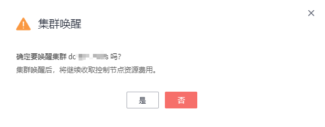

# 集群休眠与唤醒

-   [操作场景](#section4812101752820)
-   [集群休眠操作步骤](#section1033214207131)
-   [集群唤醒操作步骤](#section53339203136)

## 操作场景

暂时不需要使用集群时，为节省集群管理费用，建议您将集群设置为休眠状态。

集群休眠后，将无法在此集群上创建和管理工作负载等资源。

休眠中的集群可以快速唤醒，正常使用。

## 集群休眠操作步骤

1.  登录[CCE控制台](https://console.huaweicloud.com/cce2.0/?utm_source=helpcenter)，在左侧导航栏中选择“资源管理 \> 集群管理”。
2.  单击待休眠集群后的“更多 \> 集群休眠“。
3.  在弹出的集群休眠提示框中，查看风险提示，单击“是“，等待集群完成休眠。

    **图 1**  集群休眠提示  
    

    > **须知：** 
    >-   按需付费集群休眠后，将暂停收取控制节点资源费用。
    >-   集群休眠后，集群所属的工作节点（ECS）、绑定的弹性IP、带宽等资源仍将按各自的计费方式进行收费。如需关机节点，请在集群休眠提示框中勾选“关机集群下所有节点“或参见[节点关机](节点关机.md)。

4.  当集群状态由“休眠中“变为“休眠“时，即完成休眠操作。

## 集群唤醒操作步骤

1.  登录[CCE控制台](https://console.huaweicloud.com/cce2.0/?utm_source=helpcenter)，在左侧导航栏中选择“资源管理 \> 集群管理”。
2.  单击待唤醒集群后的“更多 \> 集群唤醒“。
3.  在弹出的集群唤醒提示框中，单击“是“，等待集群完成唤醒。

    **图 2**  集群唤醒提示  
    

4.  当集群状态由“唤醒中“变为“正常“时，即完成唤醒操作。

    > **说明：** 
    >集群唤醒后，将继续收取控制节点资源费用。

