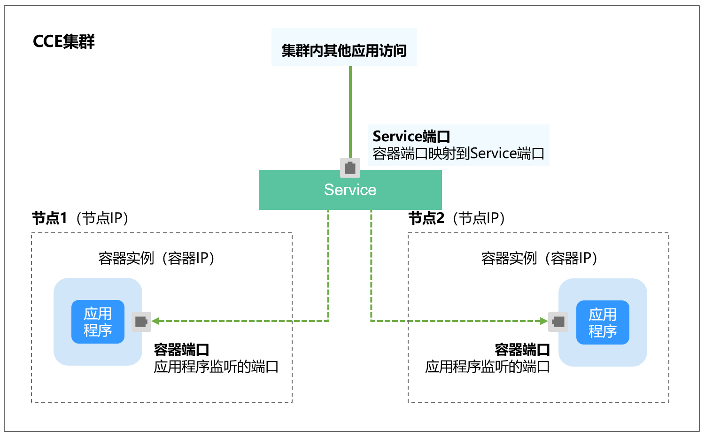

# 集群内访问\(ClusterIP\)<a name="cce_01_0011"></a>

-   [操作场景](#section13559184110492)
-   [工作负载创建时设置](#section363413419562)
-   [工作负载创建完成后设置](#section51925078171335)
-   [验证访问方式](#section127671412133313)
-   [更新Service](#section170649161816)
-   [通过kubectl命令行创建](#section9813121512319)

## 操作场景<a name="section13559184110492"></a>

集群内访问表示工作负载暴露给同一集群内其他工作负载访问的方式，可以通过“集群内部域名“访问。

集群内部域名格式为“<自定义的服务名称\>.<工作负载所在命名空间\>.svc.cluster.local:<端口号\>“，例如“nginx.default.svc.cluster.local:80“。

访问通道、容器端口与访问端口映射如[图1](#fig192245420557)所示。

**图 1**  集群内访问<a name="fig192245420557"></a>  


## 工作负载创建时设置<a name="section363413419562"></a>

您可以在创建工作负载时通过CCE控制台设置Service访问方式，如下：

1.  参考[创建无状态负载\(Deployment\)](创建无状态负载(Deployment).md)、[创建有状态负载\(StatefulSet\)](创建有状态负载(StatefulSet).md)或[创建守护进程集\(DaemonSet\)](创建守护进程集(DaemonSet).md)，在“工作负载访问设置“步骤，单击“添加服务“。

    -   **访问类型：**选择“集群内访问 \( ClusterIP \)“。
    -   **Service名称：**自定义服务名称，可与工作负载名称保持一致。
    -   **IPv6：**默认不开启，开启后服务的集群内IP地址（ClusterIP）变为IPv6地址，具体请参见[如何通过CCE搭建IPv4/IPv6双栈集群？](https://support.huaweicloud.com/bestpractice-cce/cce_bestpractice_00222.html)。**该功能仅在1.15及以上版本的集群创建时开启了IPv6功能才会显示。**
    -   **端口配置：**
        -   协议：请根据业务的协议类型选择。
        -   容器端口：工作负载程序实际监听的端口，需用户确定。nginx程序实际监听的端口为80。
        -   访问端口：容器端口映射到集群虚拟IP上的端口，用虚拟IP访问工作负载时使用，端口范围为1-65535，可任意指定。


    **图 2**  访问类型为集群内访问 \( ClusterIP \)<a name="fig56211834134312"></a>  
    .png "访问类型为集群内访问-(-ClusterIP-)")

2.  <a name="li090492615184"></a>单击“下一步“进入“高级设置“页面，直接单击“创建“。
3.  <a name="li16964121448"></a>单击“查看工作负载详情“，在“访问方式“页签下获取访问地址，例如10.247.74.100:8080。

## 工作负载创建完成后设置<a name="section51925078171335"></a>

您可以在工作负载创建完成后对Service进行配置，此配置对工作负载状态无影响，且实时生效。具体操作如下：

1.  登录[CCE控制台](https://console.huaweicloud.com/cce2.0/?utm_source=helpcenter)，在左侧导航栏中选择“工作负载 \> 无状态负载 Deployment”，在工作负载列表页单击要设置Service的工作负载名称。
2.  在“访问方式“页签，单击“添加Service”。
3.  在“添加Service“页面，访问类型选择“集群内访问 \( ClusterIP \)“。
4.  设置集群内访问参数。
    -   **Service名称：**自定义服务名称，可与工作负载名称保持一致。
    -   **集群名称：**工作负载所在集群的名称，此处不可修改。
    -   **命名空间：**工作负载所在命名空间，此处不可修改。
    -   **关联工作负载：**要添加Service的工作负载，此处不可修改。
    -   **IPv6：**默认不开启，开启后服务的集群内IP地址（ClusterIP）变为IPv6地址，具体请参见[如何通过CCE搭建IPv4/IPv6双栈集群？](https://support.huaweicloud.com/bestpractice-cce/cce_bestpractice_00222.html)。**该功能仅在1.15及以上版本的集群创建时开启了IPv6功能才会显示。**
    -   **端口配置：**
        -   协议：请根据业务的协议类型选择。
        -   容器端口：工作负载程序实际监听的端口，需用户确定。nginx程序实际监听的端口为80。
        -   访问端口：容器端口映射到集群虚拟IP上的端口，用虚拟IP访问工作负载时使用，端口范围为1-65535，可任意指定。


5.  单击“创建”。工作负载已添加“集群内访问 \( ClusterIP \)”的服务。

## 验证访问方式<a name="section127671412133313"></a>

1.  在管理控制台首页，单击“计算 \>  弹性云服务器“。
2.  在弹性云服务器页面，找到同一VPC内任意一台云服务器，并确认连接到访问地址中IP与端口的安全组是开放的。
3.  登录工作负载所在集群的任意节点，登录方法请参见[登录Linux弹性云服务器](https://support.huaweicloud.com/usermanual-ecs/zh-cn_topic_0013771089.html)。
4.  使用curl命令访问工作负载验证工作负载是否可以正常访问。您可以通过IP或者域名的方式来验证。

    **方式一：通过IP地址验证。**

    **curl **_10.247.74.100:8080_

    其中10.247.74.100:8080为[步骤3](#li090492615184)中获取的访问地址。

    回显如下表示工作负载可正常访问。

    ```
    <html>
    <head>
    <title>Welcome to nginx!</title>
    <style>
        body {
            width: 35em;
            margin: 0 auto;
            font-family: Tahoma, Verdana, Arial, sans-serif;
        }
    </style>
    </head>
    <body>
    <h1>Welcome to nginx!</h1>
    <p>If you see this page, the nginx web server is successfully installed and
    working. Further configuration is required.</p>
    
    <p>For online documentation and support please refer to
    <a href="http://nginx.org/">nginx.org</a>.<br/>
    Commercial support is available at
    <a href="http://nginx.com/">nginx.com</a>.</p>
    
    <p><em>Thank you for using nginx.</em></p>
    </body>
    </html>
    ```

    **方式二：进入容器，在容器内通过域名验证。**

    **curl **_nginx.default.svc.cluster.local:8080_

    其中_nginx.default.svc.cluster.local_为[步骤3](#li16964121448)中获取的域名访问地址。

    回显如下表示工作负载可正常访问。

    ```
    <html>
    <head>
    <title>Welcome to nginx!</title>
    <style>
        body {
            width: 35em;
            margin: 0 auto;
            font-family: Tahoma, Verdana, Arial, sans-serif;
        }
    </style>
    </head>
    <body>
    <h1>Welcome to nginx!</h1>
    <p>If you see this page, the nginx web server is successfully installed and
    working. Further configuration is required.</p>
    
    <p>For online documentation and support please refer to
    <a href="http://nginx.org/">nginx.org</a>.<br/>
    Commercial support is available at
    <a href="http://nginx.com/">nginx.com</a>.</p>
    
    <p><em>Thank you for using nginx.</em></p>
    </body>
    </html>
    ```


## 更新Service<a name="section170649161816"></a>

您可以在添加完Service后，更新此Service的端口配置，操作步骤如下：

1.  登录[CCE控制台](https://console.huaweicloud.com/cce2.0/?utm_source=helpcenter)，在左侧导航栏中选择“资源管理 \> 网络管理”，在**Service**页签下，选择对应的集群和命名空间，单击需要更新端口配置的Service后的“更新”。
2.  在“更新Service“页面，访问类型选择“集群内访问 \( ClusterIP \)“。
3.  更新集群内访问参数。
    -   **Service名称：**您创建的Service名称，此处不可修改。
    -   **集群名称：**工作负载所在集群的名称，此处不可修改。
    -   **命名空间：**工作负载所在命名空间，此处不可修改。
    -   **关联工作负载：**要添加Service的工作负载，此处不可修改。
    -   **IPv6：**该功能仅在1.15及以上版本的集群创建时开启了IPv6功能才会显示，此处不可修改。
    -   **端口配置：**
        -   协议：请根据业务的协议类型选择。
        -   容器端口：工作负载程序实际监听的端口，需用户确定。nginx程序实际监听的端口为80。
        -   访问端口：容器端口映射到集群虚拟IP上的端口，用虚拟IP访问工作负载时使用，端口范围为1-65535，可任意指定。


4.  单击“更新”，工作负载已更新Service。

## 通过kubectl命令行创建<a name="section9813121512319"></a>

您可以通过kubectl命令行设置Service访问方式。本节以nginx为例，说明kubectl命令实现集群内访问的方法。

**前提条件**

请参见[通过kubectl或web-terminal插件操作CCE集群](通过kubectl或web-terminal插件操作CCE集群.md)配置kubectl命令，使弹性云服务器连接集群。

**操作步骤**

1.  登录已配置好kubectl命令的弹性云服务器。登录方法请参见[登录Linux弹性云服务器](https://support.huaweicloud.com/usermanual-ecs/zh-cn_topic_0013771089.html)。
2.  创建并编辑nginx-deployment.yaml和nginx-clusterip-svc.yaml文件。

    其中，nginx-deployment.yaml和nginx-clusterip-svc.yaml为自定义名称，您可以随意命名。

    **vi nginx-deployment.yaml**

    ```
    apiVersion: apps/v1
    kind: Deployment
    metadata:
      name: nginx
    spec:
      replicas: 1
      selector:
        matchLabels:
          app: nginx
      strategy:
        type: RollingUpdate
      template:
        metadata:
          labels:
            app: nginx
        spec:
          containers:
          - image: nginx 
            imagePullPolicy: Always
            name: nginx
          imagePullSecrets:
          - name: default-secret
    ```

    **vi nginx-ClusterIp-svc.yaml**

    ```
    apiVersion: v1
    kind: Service
    metadata:
      labels:
        app: nginx
      name: nginx-clusterip
    spec:
      ports:
      - name: service0
        port: 8080
        protocol: TCP
        targetPort: 80
      selector:
        app: nginx
      type: ClusterIP
    ```

    **表 1**  关键参数说明

    <a name="table56443210447"></a>
    <table><thead align="left"><tr id="row157011325448"><th class="cellrowborder" valign="top" width="17.580000000000002%" id="mcps1.2.5.1.1"><p id="p127013213445"><a name="p127013213445"></a><a name="p127013213445"></a>参数</p>
    </th>
    <th class="cellrowborder" valign="top" width="16.27%" id="mcps1.2.5.1.2"><p id="p41549595118"><a name="p41549595118"></a><a name="p41549595118"></a>是否必填</p>
    </th>
    <th class="cellrowborder" valign="top" width="17.05%" id="mcps1.2.5.1.3"><p id="p070113234410"><a name="p070113234410"></a><a name="p070113234410"></a>参数类型</p>
    </th>
    <th class="cellrowborder" valign="top" width="49.1%" id="mcps1.2.5.1.4"><p id="p870832124415"><a name="p870832124415"></a><a name="p870832124415"></a>描述</p>
    </th>
    </tr>
    </thead>
    <tbody><tr id="row19708321446"><td class="cellrowborder" valign="top" width="17.580000000000002%" headers="mcps1.2.5.1.1 "><p id="p2705327445"><a name="p2705327445"></a><a name="p2705327445"></a>port</p>
    </td>
    <td class="cellrowborder" valign="top" width="16.27%" headers="mcps1.2.5.1.2 "><p id="p31545518517"><a name="p31545518517"></a><a name="p31545518517"></a>是</p>
    </td>
    <td class="cellrowborder" valign="top" width="17.05%" headers="mcps1.2.5.1.3 "><p id="p37133244415"><a name="p37133244415"></a><a name="p37133244415"></a>Integer</p>
    </td>
    <td class="cellrowborder" valign="top" width="49.1%" headers="mcps1.2.5.1.4 "><p id="p164654108492"><a name="p164654108492"></a><a name="p164654108492"></a>将由此服务公开的端口，对应界面上的访问端口。</p>
    </td>
    </tr>
    <tr id="row13718321449"><td class="cellrowborder" valign="top" width="17.580000000000002%" headers="mcps1.2.5.1.1 "><p id="p971532194415"><a name="p971532194415"></a><a name="p971532194415"></a>targetPort</p>
    </td>
    <td class="cellrowborder" valign="top" width="16.27%" headers="mcps1.2.5.1.2 "><p id="p41541517515"><a name="p41541517515"></a><a name="p41541517515"></a>是</p>
    </td>
    <td class="cellrowborder" valign="top" width="17.05%" headers="mcps1.2.5.1.3 "><p id="p127153274418"><a name="p127153274418"></a><a name="p127153274418"></a>Integer</p>
    </td>
    <td class="cellrowborder" valign="top" width="49.1%" headers="mcps1.2.5.1.4 "><p id="p571173210447"><a name="p571173210447"></a><a name="p571173210447"></a>对应界面上的容器端口。</p>
    </td>
    </tr>
    <tr id="row1671532144412"><td class="cellrowborder" valign="top" width="17.580000000000002%" headers="mcps1.2.5.1.1 "><p id="p127115322447"><a name="p127115322447"></a><a name="p127115322447"></a>type</p>
    </td>
    <td class="cellrowborder" valign="top" width="16.27%" headers="mcps1.2.5.1.2 "><p id="p81541516516"><a name="p81541516516"></a><a name="p81541516516"></a>否</p>
    </td>
    <td class="cellrowborder" valign="top" width="17.05%" headers="mcps1.2.5.1.3 "><p id="p1147421514515"><a name="p1147421514515"></a><a name="p1147421514515"></a>String</p>
    </td>
    <td class="cellrowborder" valign="top" width="49.1%" headers="mcps1.2.5.1.4 "><p id="p1962118433512"><a name="p1962118433512"></a><a name="p1962118433512"></a>对应界面上的访问类型，必须是：</p>
    <a name="ul1735917148524"></a><a name="ul1735917148524"></a><ul id="ul1735917148524"><li>ClusterIP</li><li>NodePort</li><li>LoadBalancer</li></ul>
    <p id="p1262218433513"><a name="p1262218433513"></a><a name="p1262218433513"></a>默认值：ClusterIP，表示“集群虚拟IP”。</p>
    </td>
    </tr>
    </tbody>
    </table>

3.  创建工作负载。

    **kubectl create -f nginx-deployment.yaml**

    回显如下，表示工作负载已开始创建。

    ```
    deployment "nginx" created
    ```

    **kubectl get po**

    回显如下，工作负载状态为Running，表示工作负载已处于运行中状态。

    ```
    NAME                     READY     STATUS             RESTARTS   AGE
    etcd-0                   0/1       ImagePullBackOff   0          27m
    icagent-m9dkt            0/0       Running            0          3d
    nginx-2601814895-znhbr   1/1       Running            0          15s
    ```

4.  创建服务。

    **kubectl create -f nginx-ClusterIp-svc.yaml**

    回显如下，表示服务已开始创建。

    ```
    service "nginx-clusterip" created
    ```

    **kubectl get svc**

    回显如下，表示服务已创建成功，CLUSTER-IP已生成。

    ```
    NAME              TYPE        CLUSTER-IP       EXTERNAL-IP   PORT(S)    AGE
    etcd-svc          ClusterIP   None             <none>        3120/TCP   30m
    kubernetes        ClusterIP   10.247.0.1       <none>        443/TCP    3d
    nginx-clusterip   ClusterIP   10.247.200.134   <none>        80/TCP     20s
    ```

5.  登录工作负载所在集群的任意节点，登录方法请参见[登录Linux弹性云服务器](https://support.huaweicloud.com/usermanual-ecs/zh-cn_topic_0013771089.html)。
6.  采用curl命令访问工作负载验证工作负载是否可以正常访问。您可以通过IP或者域名的方式来验证。

    **方式一：通过IP地址验证。**

    **curl **_10.247.200.134__:80_

    回显如下表示工作负载可正常访问。

    ```
    <html>
    <head>
    <title>Welcome to nginx!</title>
    <style>
        body {
            width: 35em;
            margin: 0 auto;
            font-family: Tahoma, Verdana, Arial, sans-serif;
        }
    </style>
    </head>
    <body>
    <h1>Welcome to nginx!</h1>
    <p>If you see this page, the nginx web server is successfully installed and
    working. Further configuration is required.</p>
    
    <p>For online documentation and support please refer to
    <a href="http://nginx.org/">nginx.org</a>.<br/>
    Commercial support is available at
    <a href="http://nginx.com/">nginx.com</a>.</p>
    
    <p><em>Thank you for using nginx.</em></p>
    </body>
    </html>
    ```

    **方式二：通过域名验证。**

    **curl **_nginx-_**clusterip.default.svc.cluster.local:**_8080_

    回显如下表示工作负载可正常访问。

    ```
    <html>
    <head>
    <title>Welcome to nginx!</title>
    <style>
        body {
            width: 35em;
            margin: 0 auto;
            font-family: Tahoma, Verdana, Arial, sans-serif;
        }
    </style>
    </head>
    <body>
    <h1>Welcome to nginx!</h1>
    <p>If you see this page, the nginx web server is successfully installed and
    working. Further configuration is required.</p>
    
    <p>For online documentation and support please refer to
    <a href="http://nginx.org/">nginx.org</a>.<br/>
    Commercial support is available at
    <a href="http://nginx.com/">nginx.com</a>.</p>
    
    <p><em>Thank you for using nginx.</em></p>
    </body>
    </html>
    ```


