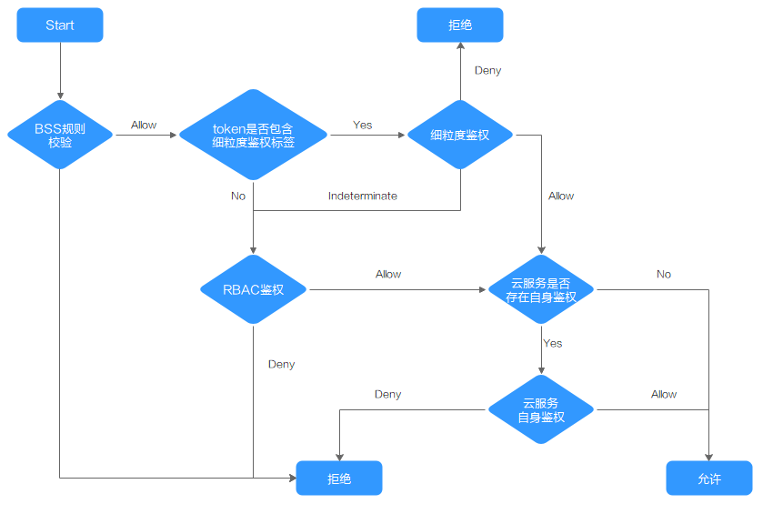

# 集群权限（IAM授权）<a name="cce_01_0188"></a>

CCE集群权限是基于IAM**系统策略**和**自定义策略**的授权，可以通过用户组功能实现IAM用户的授权。

> **注意：** 
>集群权限仅针对与集群相关的资源（如集群、节点等）有效，您必须确保同时配置了[命名空间权限](命名空间权限（Kubernetes-RBAC授权）.md)，才能有操作Kubernetes资源（如工作负载、Service等）的权限。

## 前提条件<a name="section16601203895318"></a>

-   给用户组授权之前，请您了解用户组可以添加的CCE系统策略，并结合实际需求进行选择，CCE支持的系统策略及策略间的对比，请参见[CCE系统权限](https://support.huaweicloud.com/productdesc-cce/cce_productdesc_0002.html)。若您需要对除CCE之外的其它服务授权，IAM支持服务的所有策略请参见[系统权限](https://support.huaweicloud.com/usermanual-permissions/iam_01_0001.html)。
-   拥有Security Administrator（IAM除切换角色外所有权限）权限的用户（如华为云账号默认拥有此权限），才能看见CCE控制台权限管理页面当前用户组及用户组所拥有的权限。

## 配置说明<a name="section638994317105"></a>

CCE控制台“权限管理 \> 集群权限“页面中创建用户组和具体权限设置均是跳转到IAM控制台进行具体操作，设置完后在集群权限页面能看到用户组所拥有的权限。本章节描述操作直接以IAM中操作为主，不重复介绍在CCE控制台如何跳转。

## 示例流程<a name="section1189416161520"></a>

**图 1**  给用户授予CCE权限流程<a name="fig1351611812271"></a>  


1.  <a name="li10176121316284"></a>[创建用户组并授权](https://support.huaweicloud.com/usermanual-iam/iam_03_0001.html)。

    在IAM控制台创建用户组，并授予CCE权限，例如CCEReadOnlyAccess。

    > **说明：** 
    >CCE服务按区域部署，在IAM控制台中授予CCE权限时请选择“区域级项目“。

2.  [创建用户并加入用户组](https://support.huaweicloud.com/usermanual-iam/iam_02_0001.html)。

    在IAM控制台创建用户，并将其加入[1](#li10176121316284)中创建的用户组。

3.  [用户登录](https://support.huaweicloud.com/usermanual-iam/iam_01_0552.html)并验证权限。

    新创建的用户登录控制台，切换至授权区域，验证权限：

    -   在“服务列表”中选择云容器引擎，进入CCE主界面，单击右上角“购买Kubernetes集群”，如果无法无法成功操作（假设当前权限仅包含CCEReadOnlyAccess），表示“CCEReadOnlyAccess”已生效。
    -   在“服务列表”中选择除云容器引擎外（假设当前策略仅包含CCEReadOnlyAccess）的任一服务，若提示权限不足，表示“CCEReadOnlyAccess”已生效。


## 自定义策略<a name="section1437818291149"></a>

如果系统预置的CCE策略，不满足您的授权要求，可以创建自定义策略。自定义策略中可以添加的授权项（Action）请参考[权限策略和授权项](https://support.huaweicloud.com/api-cce/cce_02_0327.html)。

目前华为云支持以下两种方式创建自定义策略：

-   可视化视图创建自定义策略：无需了解策略语法，按可视化视图导航栏选择云服务、操作、资源、条件等策略内容，可自动生成策略。
-   JSON视图创建自定义策略：可以在选择策略模板后，根据具体需求编辑策略内容；也可以直接在编辑框内编写JSON格式的策略内容。

具体创建步骤请参见：[创建自定义策略](https://support.huaweicloud.com/usermanual-iam/iam_01_0605.html)。本章为您介绍常用的CCE自定义策略样例。

**CCE自定义策略样例：**

-   示例1：创建一个名称为“test”的集群

    ```
    {
        "Version": "1.1",
        "Statement": [
            {
                "Effect": "Allow",
                "Action": [
                    "cce:cluster:create"
                ]
            }
        ]
    }
    ```

-   示例2：拒绝用户删除节点

    拒绝策略需要同时配合其他策略使用，否则没有实际作用。用户被授予的策略中，一个授权项的作用如果同时存在Allow和Deny，则遵循**Deny优先原则**。

    如果您给用户授予CCEFullAccess的系统策略，但不希望用户拥有CCEFullAccess中定义的删除节点权限（cce:node:delete），您可以创建一条相同Action的自定义策略，并将自定义策略的Effect设置为Deny，然后同时将CCEFullAccess和拒绝策略授予用户，根据Deny优先原则，则用户可以对CCE执行除了删除节点外的所有操作。拒绝策略示例如下：

    ```
    {
        "Version": "1.1",
        "Statement": [
            {
                "Effect": "Deny",
                "Action": [
                    "cce:node:delete"
                ]
            }
        ]
    }
    ```

-   示例3：多个授权项策略

    一个自定义策略中可以包含多个授权项，且除了可以包含本服务的授权项外，还可以包含其他服务的授权项，可以包含的其他服务必须跟本服务同属性，即都是项目级服务或都是全局级服务。多个授权语句策略描述如下：

    ```
    {
        "Version": "1.1",
        "Statement": [
            {
                "Action": [
                    "ecs:cloudServers:resize",
                    "ecs:cloudServers:delete",
                    "ecs:cloudServers:delete",
                    "ims:images:list",
                    "ims:serverImages:create"
                ],
                "Effect": "Allow"
            }
        ]
    }
    ```


## CCE集群权限与企业项目<a name="section2079185434619"></a>

CCE支持以集群为粒度，基于企业项目维度进行资源管理以及权限分配。

如下事项需特别注意：

-   IAM项目是基于资源的物理隔离进行管理，而企业项目则是提供资源的全局逻辑分组，更符合企业实际场景，并且支持基于企业项目维度的IAM策略管理，因此推荐您使用企业项目。详细信息请参见[如何创建企业项目](https://support.huaweicloud.com/usermanual-em/zh-cn_topic_0108763964.html)。
-   IAM项目与企业项目共存时，IAM将优先匹配IAM项目策略、未决则匹配企业项目策略。
-   CCE集群基于已有基础资源（VPC）创建集群、节点时，请确保IAM用户在已有资源的企业项目下有相关权限，否则可能导致集群或者节点创建失败。

## CCE集群权限与IAM RBAC<a name="section8718111816319"></a>

CCE兼容IAM传统的系统角色进行权限管理，建议您切换使用IAM的细粒度策略，避免设置过于复杂或不必要的权限管理场景。

CCE当前支持的角色如下：

-   IAM的基础角色：
    -   te\_admin（Tenant Administrator）：可以调用除IAM外所有服务的所有API。
    -   readonly（Tenant Guest）：可以调用除IAM外所有服务的只读权限的API。

-   CCE的自定义管理员角色：CCE Administrator。
-   由于历史原因，CCE的API中保留了对[应用管理与运维平台（ServiceStage）](https://support.huaweicloud.com/servicestage/index.html)的三个系统角色（SvcStg Administrator、SvcStg Developer、SvcStg Operator）的兼容，当前CCE和ServiceStage已经全面适配了IAM的细粒度策略进行权限管理，**不建议您继续使用该系统角色进行权限管理**。其在CCE侧的具体权限如下：

    -   SvcStg Administrator：拥有CCE Administrator相同权限，例外：拥有此角色的用户不默认具有命名空间的权限（Kubernetes RBAC）。
    -   SvcStg Developer：拥有CCE Administrator相同权限，例外：拥有此角色的用户不默认具有命名空间的权限（Kubernetes RBAC）。
    -   SvcStg Operator：拥有CCE的只读权限，但不默认具有命名空间的权限。

    了解更多ServiceStage和CCE的权限管理详情请参见：[ServiceStage权限管理介绍](https://support.huaweicloud.com/productdesc-servicestage/ss_productdesc_0006.html)、[CCE权限管理介绍](https://support.huaweicloud.com/productdesc-cce/cce_productdesc_0002.html)。


> **说明：** 
>-   Tenant Administrator、Tenant Guest是特殊的IAM系统角色，当配置任意系统或自定义策略后，Tenant Administrator、Tenant Guest将以系统策略形式生效，用于兼容IAM RBAC和ABAC场景。
>-   如果用户有Tenant Administrator或者CCE Administrator的系统角色，则此用户拥有Kubernetes RBAC的cluster-admin权限，在集群创建后不可移除。
>    如果用户为集群创建者，则默认被授权Kubernetes RBAC的cluster-admin权限，此项权限可以在集群创建后被手动移除:  
>    -   方式1：权限管理 - 命名空间权限 - 移除cluster-creator。
>    -   方式2：通过API或者kubectl删除资源，ClusterRoleBinding：cluster-creator。

RBAC与IAM策略共存时，CCE开放API或Console操作的后端鉴权逻辑如下：



> **注意：** 
>CCE部分接口由于涉及命名空间权限或关键操作，需要特殊权限：
>clusterCert获取集群k8s kubeconfig: cceadm/teadmin

